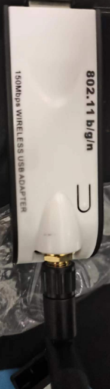
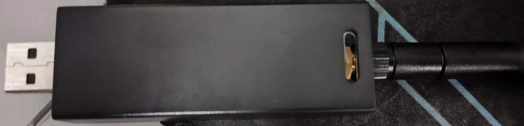
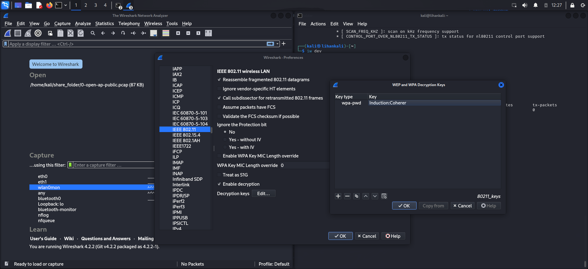
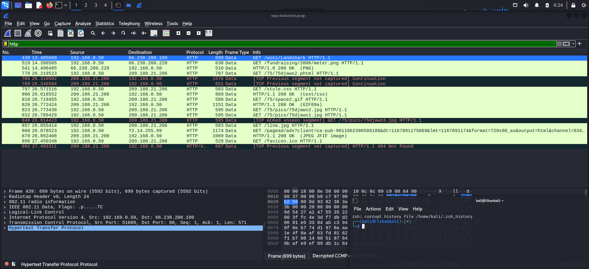
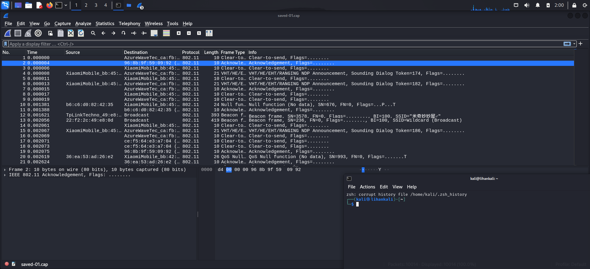
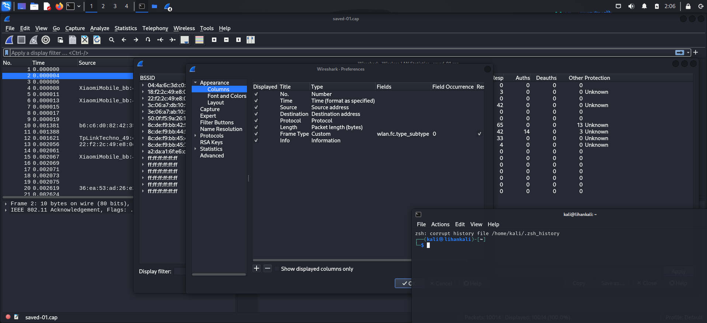
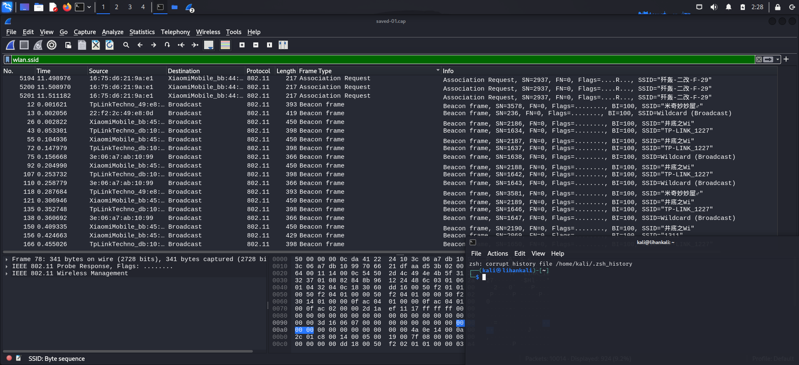

# 实验一

## 实验任务

- 1. 详细记录实验所使⽤的⽆线⽹卡基本信息；
- - ⽆线⽹卡正反⾯⾼清照⽚；
- - 该⽹卡的硬件和软件特性⽀持情况；
- 2. 使⽤ asciinema 记录⼀次典型的 airodump-ng ⽆线嗅探操作过程（限时 1
分钟之内），在 markdown 实验报告中附上 private 分享链接；
- - 开启监听模式；
- - channel hopping 模式抓包持续 10 秒左右；
- - 指定 channel 抓包持续 10 秒左右，并记录抓包结果到⽂件供后续分析；
- 3. 使⽤ Wireshark 的 802.11 PSK 解密功能解密分析⼀个包含「浏览器访问HTTP 明⽂通信⽹站的完整过程」的抓包结果⽂件；
- - SampleCaptures/wpa-Induction.pcap
- - - SSID “Coherer”
- - - password “Induction”

## 实验环境

- VMware® Workstation 17 Pro 17.5.1 build-23298084
- kali-linux-2024.1-vmware-amd64

## 实验步骤

### 详细记录实验所使⽤的⽆线⽹卡基本信息

- ⽆线⽹卡正反⾯⾼清照⽚





- 该⽹卡的硬件和软件特性⽀持情况

```shell
# 硬件信息
lsusb -v

Bus 001 Device 007: ID 148f:3070 Ralink Technology, Corp. RT2870/RT3070 Wireless Adapter
Couldn't open device, some information will be missing
Device Descriptor:
  bLength                18
  bDescriptorType         1
  bcdUSB               2.00
  bDeviceClass            0 [unknown]
  bDeviceSubClass         0 [unknown]
  bDeviceProtocol         0 
  bMaxPacketSize0        64
  idVendor           0x148f Ralink Technology, Corp.
  idProduct          0x3070 RT2870/RT3070 Wireless Adapter
  bcdDevice            1.01
  iManufacturer           1 Ralink
  iProduct                2 802.11 n WLAN
  iSerial                 3 1.0
  bNumConfigurations      1
  Configuration Descriptor:
    bLength                 9
    bDescriptorType         2
    wTotalLength       0x0043
    bNumInterfaces          1
    bConfigurationValue     1
    iConfiguration          0 
    bmAttributes         0x80
      (Bus Powered)
    MaxPower              450mA
    Interface Descriptor:
      bLength                 9
      bDescriptorType         4
      bInterfaceNumber        0
      bAlternateSetting       0
      bNumEndpoints           7
      bInterfaceClass       255 Vendor Specific Class
      bInterfaceSubClass    255 Vendor Specific Subclass
      bInterfaceProtocol    255 Vendor Specific Protocol
      iInterface              5 
      Endpoint Descriptor:
        bLength                 7
        bDescriptorType         5
        bEndpointAddress     0x81  EP 1 IN
        bmAttributes            2
          Transfer Type            Bulk
          Synch Type               None
          Usage Type               Data
        wMaxPacketSize     0x0200  1x 512 bytes
        bInterval               0
      Endpoint Descriptor:
        bLength                 7
        bDescriptorType         5
        bEndpointAddress     0x01  EP 1 OUT
        bmAttributes            2
          Transfer Type            Bulk
          Synch Type               None
          Usage Type               Data
        wMaxPacketSize     0x0200  1x 512 bytes
        bInterval               0
      Endpoint Descriptor:
        bLength                 7
        bDescriptorType         5
        bEndpointAddress     0x02  EP 2 OUT
        bmAttributes            2
          Transfer Type            Bulk
          Synch Type               None
          Usage Type               Data
        wMaxPacketSize     0x0200  1x 512 bytes
        bInterval               0
      Endpoint Descriptor:
        bLength                 7
        bDescriptorType         5
        bEndpointAddress     0x03  EP 3 OUT
        bmAttributes            2
          Transfer Type            Bulk
          Synch Type               None
          Usage Type               Data
        wMaxPacketSize     0x0200  1x 512 bytes
        bInterval               0
      Endpoint Descriptor:
        bLength                 7
        bDescriptorType         5
        bEndpointAddress     0x04  EP 4 OUT
        bmAttributes            2
          Transfer Type            Bulk
          Synch Type               None
          Usage Type               Data
        wMaxPacketSize     0x0200  1x 512 bytes
        bInterval               0
      Endpoint Descriptor:
        bLength                 7
        bDescriptorType         5
        bEndpointAddress     0x05  EP 5 OUT
        bmAttributes            2
          Transfer Type            Bulk
          Synch Type               None
          Usage Type               Data
        wMaxPacketSize     0x0200  1x 512 bytes
        bInterval               0
      Endpoint Descriptor:
        bLength                 7
        bDescriptorType         5
        bEndpointAddress     0x06  EP 6 OUT
        bmAttributes            2
          Transfer Type            Bulk
          Synch Type               None
          Usage Type               Data
        wMaxPacketSize     0x0200  1x 512 bytes
        bInterval               0

iw phy

Wiphy phy1
        wiphy index: 1
        max # scan SSIDs: 4
        max scan IEs length: 2257 bytes
        max # sched scan SSIDs: 0
        max # match sets: 0
        Retry short long limit: 2
        Coverage class: 0 (up to 0m)
        Device supports RSN-IBSS.
        Supported Ciphers:
                * WEP40 (00-0f-ac:1)
                * WEP104 (00-0f-ac:5)
                * TKIP (00-0f-ac:2)
                * CCMP-128 (00-0f-ac:4)
                * CCMP-256 (00-0f-ac:10)
                * GCMP-128 (00-0f-ac:8)
                * GCMP-256 (00-0f-ac:9)
                * CMAC (00-0f-ac:6)
                * CMAC-256 (00-0f-ac:13)
                * GMAC-128 (00-0f-ac:11)
                * GMAC-256 (00-0f-ac:12)
        Available Antennas: TX 0 RX 0
        Supported interface modes:
                 * IBSS
                 * managed
                 * AP
                 * AP/VLAN
                 * monitor
                 * mesh point
        Band 1:
                Capabilities: 0x17e
                        HT20/HT40
                        SM Power Save disabled
                        RX Greenfield
                        RX HT20 SGI
                        RX HT40 SGI
                        RX STBC 1-stream
                        Max AMSDU length: 3839 bytes
                        No DSSS/CCK HT40
                Maximum RX AMPDU length 32767 bytes (exponent: 0x002)
                Minimum RX AMPDU time spacing: 2 usec (0x04)
                HT TX/RX MCS rate indexes supported: 0-7, 32
                Bitrates (non-HT):
                        * 1.0 Mbps
                        * 2.0 Mbps (short preamble supported)
                        * 5.5 Mbps (short preamble supported)
                        * 11.0 Mbps (short preamble supported)
                        * 6.0 Mbps
                        * 9.0 Mbps
                        * 12.0 Mbps
                        * 18.0 Mbps
                        * 24.0 Mbps
                        * 36.0 Mbps
                        * 48.0 Mbps
                        * 54.0 Mbps
                Frequencies:
                        * 2412 MHz [1] (20.0 dBm)
                        * 2417 MHz [2] (20.0 dBm)
                        * 2422 MHz [3] (20.0 dBm)
                        * 2427 MHz [4] (20.0 dBm)
                        * 2432 MHz [5] (20.0 dBm)
                        * 2437 MHz [6] (20.0 dBm)
                        * 2442 MHz [7] (20.0 dBm)
                        * 2447 MHz [8] (20.0 dBm)
                        * 2452 MHz [9] (20.0 dBm)
                        * 2457 MHz [10] (20.0 dBm)
                        * 2462 MHz [11] (20.0 dBm)
                        * 2467 MHz [12] (20.0 dBm)
                        * 2472 MHz [13] (20.0 dBm)
                        * 2484 MHz [14] (disabled)
        Supported commands:
                 * new_interface
                 * set_interface
                 * new_key
                 * start_ap
                 * new_station
                 * new_mpath
                 * set_mesh_config
                 * set_bss
                 * authenticate
                 * associate
                 * deauthenticate
                 * disassociate
                 * join_ibss
                 * join_mesh
                 * remain_on_channel
                 * set_tx_bitrate_mask
                 * frame
                 * frame_wait_cancel
                 * set_wiphy_netns
                 * set_channel
                 * probe_client
                 * set_noack_map
                 * register_beacons
                 * start_p2p_device
                 * set_mcast_rate
                 * connect
                 * disconnect
                 * set_qos_map
                 * set_multicast_to_unicast
        software interface modes (can always be added):
                 * AP/VLAN
                 * monitor
        valid interface combinations:
                 * #{ AP, mesh point } <= 8,
                   total <= 8, #channels <= 1
        HT Capability overrides:
                 * MCS: ff ff ff ff ff ff ff ff ff ff
                 * maximum A-MSDU length
                 * supported channel width
                 * short GI for 40 MHz
                 * max A-MPDU length exponent
                 * min MPDU start spacing
        Device supports TX status socket option.
        Device supports HT-IBSS.
        Device supports SAE with AUTHENTICATE command
        Device supports low priority scan.
        Device supports scan flush.
        Device supports AP scan.
        Device supports per-vif TX power setting
        Driver supports full state transitions for AP/GO clients
        Driver supports a userspace MPM
        Device supports configuring vdev MAC-addr on create.
        max # scan plans: 1
        max scan plan interval: -1
        max scan plan iterations: 0
        Supported TX frame types:
                 * IBSS: 0x00 0x10 0x20 0x30 0x40 0x50 0x60 0x70 0x80 0x90 0xa0 0xb0 0xc0 0xd0 0xe0 0xf0
                 * managed: 0x00 0x10 0x20 0x30 0x40 0x50 0x60 0x70 0x80 0x90 0xa0 0xb0 0xc0 0xd0 0xe0 0xf0
                 * AP: 0x00 0x10 0x20 0x30 0x40 0x50 0x60 0x70 0x80 0x90 0xa0 0xb0 0xc0 0xd0 0xe0 0xf0
                 * AP/VLAN: 0x00 0x10 0x20 0x30 0x40 0x50 0x60 0x70 0x80 0x90 0xa0 0xb0 0xc0 0xd0 0xe0 0xf0
                 * mesh point: 0x00 0x10 0x20 0x30 0x40 0x50 0x60 0x70 0x80 0x90 0xa0 0xb0 0xc0 0xd0 0xe0 0xf0
                 * P2P-client: 0x00 0x10 0x20 0x30 0x40 0x50 0x60 0x70 0x80 0x90 0xa0 0xb0 0xc0 0xd0 0xe0 0xf0
                 * P2P-GO: 0x00 0x10 0x20 0x30 0x40 0x50 0x60 0x70 0x80 0x90 0xa0 0xb0 0xc0 0xd0 0xe0 0xf0
                 * P2P-device: 0x00 0x10 0x20 0x30 0x40 0x50 0x60 0x70 0x80 0x90 0xa0 0xb0 0xc0 0xd0 0xe0 0xf0
        Supported RX frame types:
                 * IBSS: 0x40 0xb0 0xc0 0xd0
                 * managed: 0x40 0xb0 0xd0
                 * AP: 0x00 0x20 0x40 0xa0 0xb0 0xc0 0xd0
                 * AP/VLAN: 0x00 0x20 0x40 0xa0 0xb0 0xc0 0xd0
                 * mesh point: 0xb0 0xc0 0xd0
                 * P2P-client: 0x40 0xd0
                 * P2P-GO: 0x00 0x20 0x40 0xa0 0xb0 0xc0 0xd0
                 * P2P-device: 0x40 0xd0
        Supported extended features:
                * [ RRM ]: RRM
                * [ FILS_STA ]: STA FILS (Fast Initial Link Setup)
                * [ CQM_RSSI_LIST ]: multiple CQM_RSSI_THOLD records
                * [ CONTROL_PORT_OVER_NL80211 ]: control port over nl80211
                * [ TXQS ]: FQ-CoDel-enabled intermediate TXQs
                * [ SCAN_RANDOM_SN ]: use random sequence numbers in scans
                * [ SCAN_MIN_PREQ_CONTENT ]: use probe request with only rate IEs in scans
                * [ CONTROL_PORT_NO_PREAUTH ]: disable pre-auth over nl80211 control port support
                * [ DEL_IBSS_STA ]: deletion of IBSS station support
                * [ SCAN_FREQ_KHZ ]: scan on kHz frequency support
                * [ CONTROL_PORT_OVER_NL80211_TX_STATUS ]: tx status for nl80211 control port support


# 软件信息

iw dev
phy#1
        Interface wlan0
                ifindex 5
                wdev 0x100000001
                addr 20:f4:1b:95:22:2a
                ssid CUC_FREE_FOR_OP
                type managed
                channel 11 (2462 MHz), width: 20 MHz, center1: 2462 MHz
                txpower 20.00 dBm
                multicast TXQ:
                        qsz-byt qsz-pkt flows   drops   marks   overlmt hashcol tx-bytes        tx-packets
                        0       0       0       0       0       0       0       0               0
                                                                                                      

```

### 使⽤ asciinema 记录⼀次典型的 airodump-ng ⽆线嗅探操作过程

1. 配置网卡进入监听模式

```shell
# 部分型号⽆线⽹卡可能会被重命名
# 重命名后的⽹卡名称可能是 wlan0mon
sudo airmon-ng start wlan0

# 查看⽹卡状态是否进⼊监听模式
iwconfig
# 退回managed模式
# sudo airmon-ng stop wlan0mon

```

2. channel hopping 模式抓包

```shell
# 杀死影响进程
sudo airmon-ng check kill

# channel hopping 模式抓包
sudo airodump-ng wlan0mon

# 选择目标AP的channel定向监听
sudo airodump-ng wlan0mon --channel 11 -w saved --beacons --wps

#监听指定AP的所有通信数据报⽂
airodump-ng -c 8 --bssid <bssid> -w saved wlan0mon
```

[airodump-ng_1](https://asciinema.org/a/gOjiOKYcjANWloNdaHbMMQ0Sh)

### 使⽤ Wireshark 的 802.11 PSK 解密功能解密分析⼀个包含「浏览器访问HTTP 明⽂通信⽹站的完整过程」的抓包结果⽂件

- [wpa-Induction.pcap](code/wpa-Induction.pcap)

1. 配置Wireshark解密

打开Wireshark，选择`Edit` -> `Preferences` -> `Protocols` -> `IEEE 802.11` -> `Enable decryption`，添加`wpa-Induction.pcap`文件中的`SSID`和`password`



2. 查看解密后的数据包



### 思考题

- 通过分析抓包保存的 pcap ⽂件：
- - 查看统计当前信号覆盖范围内⼀共有多少独⽴的SSID？其中是否包括隐藏SSID？
- - SSID包含在哪些类型的802.11帧？
- - 扩展：如何分析出⼀个指定⼿机在抓包时间窗⼜内在⼿机端的⽆线⽹络列表可以看到哪些SSID？这台⼿机尝试连接了哪些SSID？最终加⼊了哪些SSID？

1. 查看统计当前信号覆盖范围内⼀共有多少独⽴的SSID？其中是否包括隐藏SSID？

Wireless -> WLAN Traffic 



- 17个独立的SSID，其中包括4个隐藏SSID

2. SSID包含在哪些类型的802.11帧？

显示帧的类型

右键标题栏 -> `Columns Preferences` -> `Appearance` -> `Columns` -> +

新增列 `Frame Type`



筛选规则: `wlan.ssid`



- SSID包含在
- `Beacon` 
- `Probe Response`
- `Association Request`
- `Probe Request`

3. 如何分析出⼀个指定⼿机在抓包时间窗⼜内在⼿机端的⽆线⽹络列表可以看到哪些SSID？这台⼿机尝试连接了哪些SSID？最终加⼊了哪些SSID？


- 查看该手机发送的Probe Request帧获取扫描列表

    在Wireshark过滤器中输入 wlan.fc.type_subtype == 0x04 && wlan.sa == <手机MAC地址>
    这将过滤出该手机发送的所有Probe Request帧
    在这些帧中,分析 wlan.ssid 字段,即可看到手机扫描到的SSID列表

- 查看(Re)Association Request帧获取尝试连接的SSID

    过滤器 wlan.fc.type_subtype == 0x00 && wlan.sa == <手机MAC>
    这过滤出该手机的(Re)Association Request帧
    分析 wlan.ssid 字段,即可看到手机尝试连接的SSID

- 查看(Re)Association Response帧判断是否连接成功

    过滤器 wlan.fc.type_subtype == 0x01 && wlan.da == <手机MAC>
    这过滤出发往该手机的(Re)Association Response帧
    如果状态码字段 wlan.status_code 值为0,表示连接成功
    同时也可以分析 wlan.ssid 字段,看是连接了哪个SSID


## 实验问题以及解决方法

1. 网卡名称变化问题

- 解决；

查阅课件及相关资料后了解到，部分型号⽆线⽹卡可能会被重命名，重命名后的⽹卡名称可能是 `wlan0mon`


## 参考链接

- [移动互联网安全 在线课本](https://c4pr1c3.github.io/cuc-mis/)
- [claude.ai](https://claude.ai/)