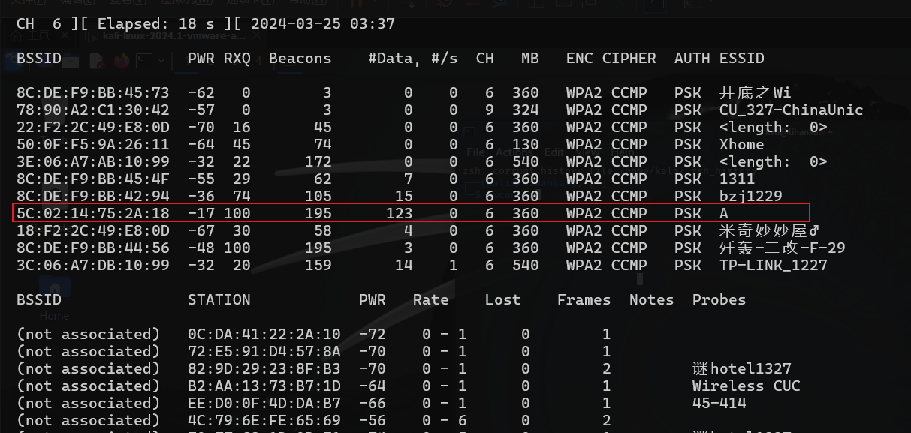
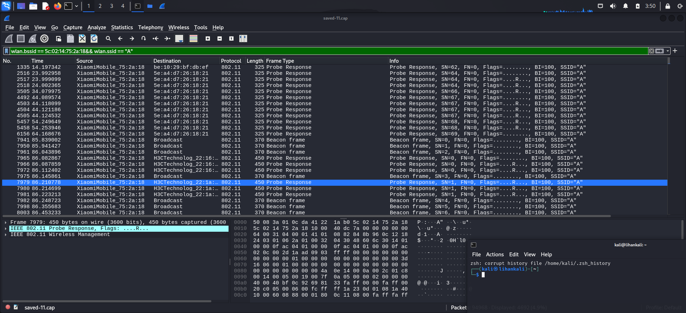

# 实验二

## 实验任务

- 发现隐藏SSID


## 实验环境

- VMware® Workstation 17 Pro 17.5.1 build-23298084
- kali-linux-2024.1-vmware-amd64

## 实验步骤

#### 发现隐藏SSID

1. 配置网卡进入监听模式

`sudo airmon-ng start wlan0`

2. 开始抓包发现wifi

`sudo airodump-ng wlan0mon`


3. 指定信道抓包

`sudo airodump-ng wlan0mon-c 6 -w saved --beacons`


4. 发送解除认证广播包

`sudo aireplay-ng --deauth 1 -a [BSSID] wlan0mon --ignore-negative-one`


5. 查看隐藏SSID

`sudo airodump-ng wlan0mon-c 6 -w saved --beacons`



#### 思考题

1. 分析捕获到的数据包，查找⽬标隐藏 SSID 5C:02:14:75:2A:18 发出的所
有 Beacon 报⽂，并查看报⽂中 SSID 字段设置。请给出对应的 Wireshark
过滤语法及截图。

- `wlan.bssid ==  5C:02:14:75:2A:18 && wlan.fc.type_subtype == 0x08`

SSID 字段为 Wildcard(Broadcast) 和 A


2. 分析捕获到的数据包，查找哪些报⽂中包含了隐藏 SSID
5C:02:14:75:2A:18 的 ESSID 名称？请给出任意⼀条报⽂的编号、报⽂的
802.11 协议帧类型。请给出对应的 Wireshark 过滤语法及截图。

- `wlan.bssid ==  5C:02:14:75:2A:18 && wlan.ssid == "A"`



- 报文编号:1335
- 802.11 协议帧类型:Probe Response


## 实验问题以及解决方法

1. aireplay-ng 无法发送解除认证广播包，信道错误

```bash
└─$ sudo aireplay-ng --deauth 1 -a  5C:02:14:75:2A:18 wlan0mon --ignore-negative-one
03:18:50  Waiting for beacon frame (BSSID: 5C:02:14:75:2A:18) on channel 7
03:19:00  No such BSSID available.
```

- 解决:

发现隐藏SSID关键在于捕获目标AP和其关联客户端的无线数据包,并通过解除认证攻击等手段触发重新连接过程。

开两个终端，一个指定信道抓包，一个用于发送解除认证广播包 即可结局


## 参考链接

- [移动互联网安全 在线课本](https://c4pr1c3.github.io/cuc-mis/)
- [claude.ai](https://claude.ai/)