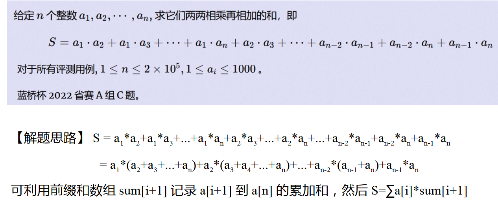
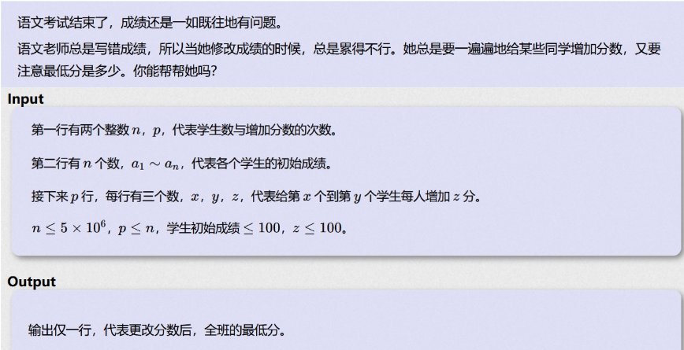
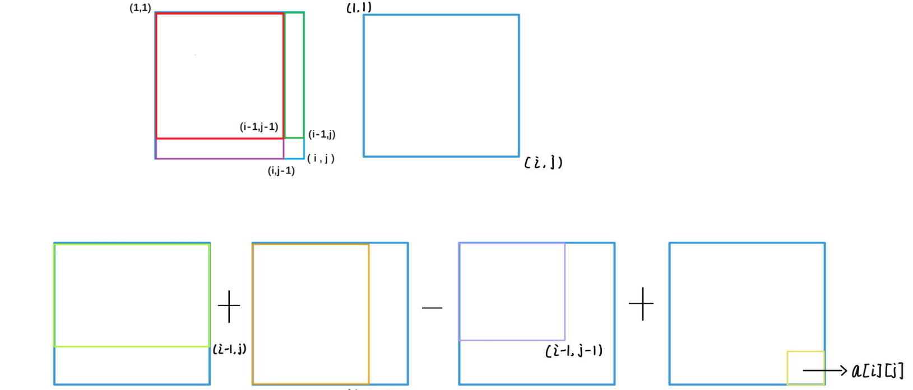
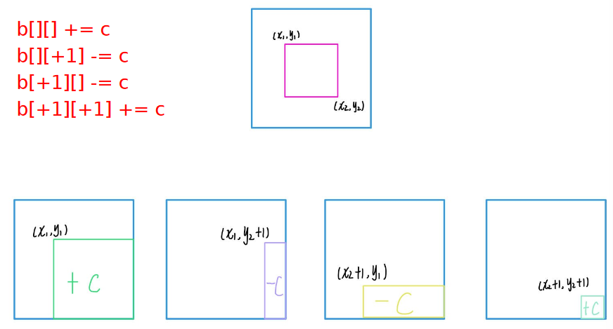
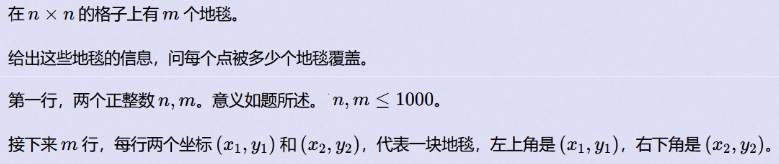
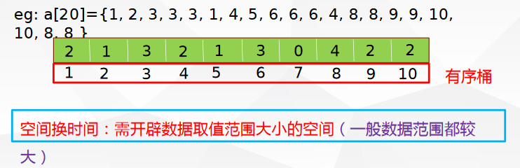
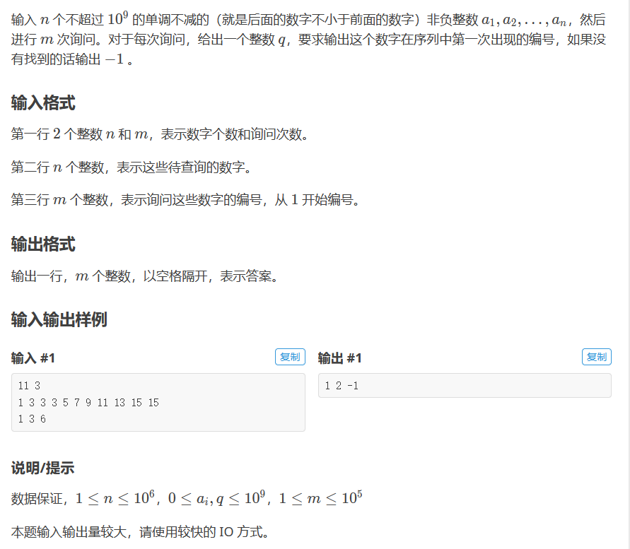
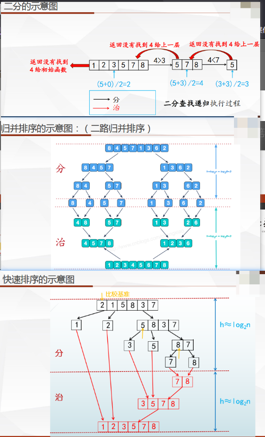
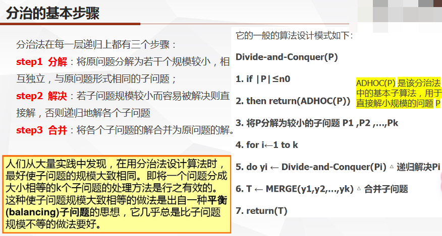
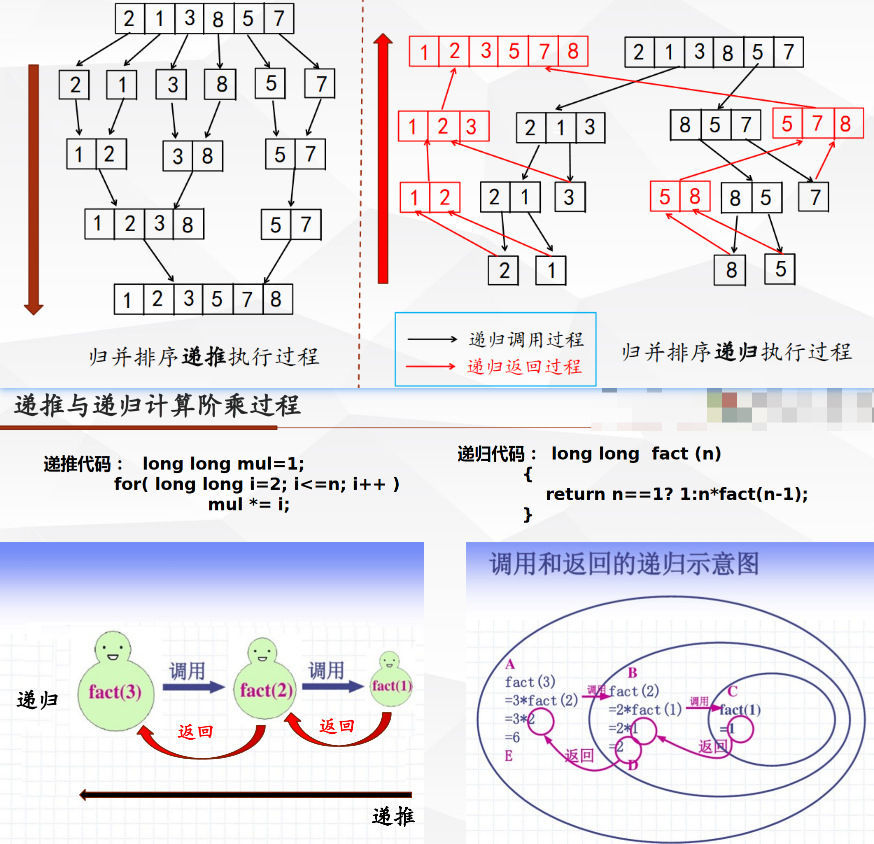

# 基础算法学习

## 前缀和与差分

```
问题引入：给出一个长度为n的数组a：a[1], a[2], ..., a[n]
有m次询问
每次询问会给出一个区间[l, r]
请输出：a[l] + a[l+1] + ... + a[r]
```

如果使用暴力算法，时间复杂度为O(m*(r-l+1)),约为O(mn),算法如下:
    
```cpp
while(m--){
    int l, r;
    cin >> l >> r;
    int sum = 0;
    for(int i = l; i <= r; i++){
        sum += a[i];
    }
    cout << sum << endl;
}
```

### 一维前缀和

#### 定义

`一维前缀和`：
已知数组a：a[1], a[2], ..., a[n]
其前缀和数组Sum定义为：
Sum[1] = a[1]
Sum[2] = a[1] + a[2]
...
Sum[L-1] = a[1] + a[2] + ... + a[L-1]  
...
Sum[R] = a[1] + ... + a[L] + ... + a[R]
...
Sum[n] = a[1] + a[2] + ... + a[n]

查询数组a的区间[L, R]和：
a[L] + a[L+1] + ... + a[R] = Sum[R] – Sum[L-1]

#### 例题与代码

这样，提前处理出前缀和数组Sum，每次询问就可以在O(1)的时间复杂度内得到结果，算法如下:

```cpp

int a[maxn]; // 原始数组
int s[maxn]; // 前缀和数组

int main(){
    int n, m;
    cin >> n >> m;
    for(int i = 1; i <= n; i++){
        cin >> a[i];
        s[i] = s[i-1] + a[i];
    }
    while(m--){
        int l, r;
        cin >> l >> r;
        cout << s[r] - s[l-1] << endl;
    }
    return 0;
}//时间复杂度为O(max(n,m))
```

`例题`:


```cpp
#include<bits/stdc++.h>
#define MAXN 200005

int n, a[MAXN];
long long sum[MAXN], ans;

int main()
{
    std::cin >> n;
    for(int i = 1; i <= n; i++)
    {
        std::cin >> a[i];
        sum[i] = sum[i - 1] + a[i];
    }
    for(int i = 1; i <= n - 1; i++)
        ans += a[i] *(sum[n] - sum[i]);
    std::cout << ans << std::endl;
    return 0;
}
```
### 一维差分

#### 定义

`一维差分`

一维前缀和的逆运算

数组a：a[1], a[2], ..., a[n]
数组b：b[1], b[2], ..., b[n]

定义：a[i] = b[1] + b[2] + ... + b[i]
则：
- a为b的前缀和数组
- b为a的差分数组


b[1] = a[1]
b[2] = a[2] - a[1]
b[3] = a[3] - a[2]
...
b[n] = a[n] - a[n-1]


#### 例题与代码

`例题`:

问题引入：
给出一个长度为n的数组a：a[1], a[2], ..., a[n]
有m次询问
每次询问会给出一个区间[l, r]和一个数c
请让数组a中的[l, r]的每个数都加上c

```cpp
//暴力算法
while(m--){
    int l, r, c;
    cin >> l >> r >> c;
    for(int i = l; i <= r; i++){
        a[i] += c;
    }
}//时间复杂度为O(m*(r-l+1))->O(mn)
```

a是b的前缀和数组，b是a的差分数组
先求出差分数组b，然后对b进行处理，最后再反过来求前缀和求出a数组

若b[2] =  b[2] + c

则a[1] = b[1]
a[2] = b[1] + b[2] + c
a[3] = b[1] + b[2] + b[3] + c
...
a[n] = b[1] + b[2] + ... + b[n] + c 

可见，只要对b[l]加c，a[l]到a[n]都会加c；
所以只要对b[l]加c，b[r+1]减c即可。

```cpp
int a[maxn], b[maxn]; // 原始数组和差分数组

int main(){
    int n, m;
    cin >> n >> m;
    for(int i = 1; i <= n; i++){//求差分数组
        cin >> a[i];
        b[i] = a[i] - a[i-1];
    }
    while(m--){//对差分数组进行处理
        int l, r, c;
        cin >> l >> r >> c;
        b[l] += c;
        b[r+1] -= c;
    }
    for(int i = 1; i <= n; i++){//求前缀和数组
        a[i] = a[i-1] + b[i];
        cout << a[i] << " ";
    }
    return 0;
}//时间复杂度为O(n+m)
```

`例题`:


```cpp
#include <cstdio>
#include <algorithm>
using namespace std;
int a[5000005],diff[5000005],n,p,mina;
int main()
{
 scanf("%d%d",&n,&p);
 for(int i=1;i<=n;i++)
 {
  scanf("%d",&a[i]);
  diff[i]=a[i]-a[i-1];//求差分数组
 }
 for(int i=1;i<=p;i++)
 {
  int x,y,z;
  scanf("%d%d%d",&x,&y,&z);
  diff[x]+=z;
  diff[y+1]-=z;//对差分数组进行处理
 }
 mina=diff[1];
 for(int i=1;i<=n;i++)
 {
  a[i]=a[i-1]+diff[i];
  mina=min(a[i],mina);//求前缀和数组
 }
 printf("%d",mina);//输出
 return 0;
}
```

- - -
`tips`
- 1.cin好像比scanf慢
- 2.最后要求最小的，一个是在最后求前缀和数组的时候，记录最小的，如果下一个是最小的 就替换掉；这里让我想起来sort函数:
```cpp
#include <algorithm>
int a[10] = {1, 2, 3, 4, 5, 6, 7, 8, 9, 10};
sort(a, a+10);//默认从小到大排序

bool myfunc(int a, int b){
    return a > b;
}
sort(a, a+10, myfunc);//从大到小排序
```

- - -

### 二维前缀和与差分

问题引入:

给出一个n行m列的矩阵
有m次询问
每次询问会给出四个整数：
表示子矩阵的左上角坐标和右下角坐标
请输出子矩阵中所有数之和

n行m列的矩阵a：a[n][m]
定义前缀和矩阵为：sum[n][m]
差分矩阵为：b[n][m]


#### 定义

`二维前缀和`

sum[i][j]的含义为：(1, 1)左上角到 (i, j) 右下角的子矩阵的元素之和



二维前缀和预处理公式:

sum[i][j] = sum[i-1][j] + sum[i][j-1] - sum[i-1][j-1] + a[i][j]

`二维差分`

b[i][j] = a[i][j] - a[i-1][j] - a[i][j-1] + a[i-1][j-1]

#### 例题与代码



求子矩阵的和，就是如图四个矩阵的加减得出。

sum(x1,y1,x2,y2)=sum[x2][y2]−sum[x1−1][y2]−sum[x2][y1−1]+sum[x1−1][y1−1]

`例题`:



```cpp
#include <iostream>
#include <algorithm>
using namespace std;

int a[1002][1002];
int b[1002][1002];


int main()
{
	int n,m;
	int x1,y1,x2,y2;
	
	cin>>n>>m;

	
	for(int p=1;p<=m;p++)
	{
		cin>>x1>>y1>>x2>>y2;
		b[x1][y1]++;
		b[x2+1][y1]--;
		b[x1][y2+1]--;
		b[x2+1][y2+1]++;
	}
	
	
	for(int i=1;i<=n;i++)
	{
		for(int j=1;j<=n;j++)
		{
			a[i][j]=a[i-1][j]+a[i][j-1]-a[i-1][j-1]+b[i][j]; 
			cout<<a[i][j]<<" ";
		}
		cout<<endl;
	}
	return 0;
 } 
```

- - -
`tips`

1. 有+1 -1 数组大小记得多设点，别g了，不差那点

- - -

## 排序

- 常见排序
- - 冒泡排序    $O(n^2)$
- - 插入排序    $O(n^2)$
- - 选择排序    $O(n^2)$
- - 桶排序      $O(max(m,n))$
- - 快速排序    $O(nlogn)$
- - 归并排序    $O(nlogn)$

### 冒泡排序

#### 定义

从数组头部开始，遍历数组中的每一个数，通过相邻两数的比较交换，每一轮循环下来找出剩余未排序数中的最大数（或者最小数）并“冒泡”至数组尾部。

#### 优化

- 1.如果某一轮循环中没有发生交换，说明数组已经有序，可以提前结束循环
- 2.每一轮循环中，最后一次发生交换的位置之后的数都是有序的，可以记录下来，下一轮循环的终点就是这个位置

#### 代码

```cpp
void bubbleSort(int a[], int n){
    for(int i = 0; i < n; i++){
        bool flag = false;
        for(int j = 0; j < n-i-1; j++){
            if(a[j] > a[j+1]){
                swap(a[j], a[j+1]);
                flag = true;
            }
        }
        if(!flag) break;
    }
}
```

### 桶排序

#### 定义

若待排序的数据在一个明显有限范围内（整型）时，可设计有限个有序桶，每个桶中装入一个值（当然也可以装入若干个值，装入若干值时，桶内数据有序），顺序输出各桶的值，得到有序序列。



#### 代码

```cpp
//输入n(1≤n≤105)个0到100的整数，输出这n个数从小到大排序的结果
#include <iostream>
#include <algorithm>
#include <cstring>
#include <cstdio>
using namespace std;
int main()
{
    int n;
    int a[105];
    cin>>n;
    for(int i=1;i<=n;i++)
    {
        int x;
        cin>>x;
        a[x]++;
    }//O(n)
    for(int i=0;i<=100;i++)
    {
        for(int j=1;j<=a[i];j++)
        {
            cout<<i<<" ";
        }
    }//O(数据范围)
    return 0;
}//时间复杂度为O(max(n，数据范围))
```
### 快速排序

#### 定义

通过一趟快速排序将要排序的数据分割成独立的两部分，其中一部分的所有数据都比另外一部分的所有数据都要小，然后再按此方法对这两部分数据分别进行快速排序，直到最后各部分只有单个数为止。

#### 代码

假设数组长度为10，需要进行升序排序的数组为：
array[10]={23, 12, 43, 2, 8, 18, 73, 21, 23, 35}
首先选取一个关键数据key：通常选用数组的第一个数
然后再按此方法对这两部分数据分别进行快速排序，直到最后各部分只有单个数为止。

sort函数就是快速排序的实现

```cpp
//默认从小到大排序
int a[10]={23, 12, 43, 2, 8, 18, 73, 21, 23, 35};
sort(a, a+10);

//自定义排序
struct stdInfo{
    string name;
    int age;
    int score;
};

bool cmp(stdInfo a, stdInfo b){
    if(a.score != b.score) return a.score > b.score;
    else if(a.age != b.age) return a.age < b.age;
    else return a.name < b.name;
}
stdInfo a[10];
sort(a, a+10, cmp);
```


### 归并排序

#### 定义

- 归并操作 的概念：将两个或两个以上有序的数组，合并成一个仍然有序的数组。
- 二路归并（两两合并）、三路归并（ 三个并一个）....
- 二路归并过程：从两个有序数组的表头开始  依次比较 a[i] 和 a[j] 的大小，如果 a[i] < a[j]，则将 a[i] 复制到归并数组 r[k] 中，并且 i 和 k 都加 1 后移，否则将 a[j] 复制归并到 r[k] 中，并且 j 和 k 都加 1 后移；如此循环下去，直到其中一个有序表取完后再将另外一个有序表中剩余的元素复制到 r 中。

#### 代码

```cpp

void mergeSort(int a[], int l, int r){
    if(l >= r) return;
    int mid = l + r >> 1;//x >> 1相当于x / 2
    mergeSort(a, l, mid);
    mergeSort(a, mid+1, r);
    int i = l, j = mid+1, k = 0;
    while(i <= mid && j <= r){
        if(a[i] <= a[j]) b[k++] = a[i++];
        else b[k++] = a[j++];
    }
    while(i <= mid) b[k++] = a[i++];
    while(j <= r) b[k++] = a[j++];
    for(int i = l, j = 0; i <= r; i++, j++) a[i] = b[j];
}

int main(){
    int a[10] = {23, 12, 43, 2, 8, 18, 73, 21, 23, 35};
    mergeSort(a, 0, 9);
}
```

## 分治与二分

小F同学在[1,100]中随机想了一个数字，让小伙伴们去猜，每次只告诉他们猜的数字是大了还是小了。假设小F同学现在想的是43。

### 二分查找

#### 定义

用给定值k 先与中间节点的值进行比较，中间节点把数组分成两个部分，若相等则查找成功；若不相等，再根据 k 与该中间节点值的比较结果确定下一步查找哪个部分，这样递归进行，直到查找到或查找结束发现表中没有这样的数值为止。属于有序查找算法。

- 二分查找的前提是数组有序，无序数组需要先排序
- 时间复杂度为$O(log_2n)$


#### 代码

- lowest_bound函数

```cpp
//C++标准库中的二分查找函数lower_bound

//形式1 返回第一个大于等于Val的第一个元素的位置
//First是数组的首地址，Last是数组的尾地址，Val是要查找的值

#include <algorithm>
int a[10]={1, 2, 3, 4, 5, 6, 7, 8, 9, 10};
int pos = lower_bound(a, a+10, 5) - a;
//返回值是一个指针，减去数组首地址得到下标

//形式2 自定义比较函数

struct stdInfo{
    string name;
    int age;
    int score;
};

bool cmp(stdInfo a, stdInfo b){
    return a.score < b.score;
}

stdInfo a[10];

int pos = lower_bound(a, a+10, 5, cmp) - a;
```

- upper_bound函数

```cpp
//C++标准库中的二分查找函数upper_bound

//返回第一个大于Val的元素的位置
int pos = upper_bound(a, a+10, 5) - a;
```

`例题`



```cpp
#include <iostream>
#include <algorithm>
using namespace std;
int a[1000002];
int main()
{
	int n,m;

	int x;
	int r;
	cin>>n>>m;
	for(int i=0;i<n;i++)
	{
		cin>>a[i];
	 } 
	 
	for(int j=0;j<m;j++)
	{
	 	cin>>x;
	 	r=lower_bound(a,a+n,x)-a;
	 	if(a[r]!=x) 
	 	{
	 		cout<<-1<<" ";
		 }
		else
		{
			cout<<r+1<<" ";
		}
	 		
	 }
	return 0;
 } 
```

【例2】：已知平面内有n个点，能否从中选出3个点，满足其中一个点是另外两个点的中点。（3<=n<=1000，-1000<=xi, yi<=1000）

```cpp
//暴力算法
//枚举三个点，判断是否满足条件，时间复杂度为O(n^3)

//二分算法
//枚举两个点，然后二分查找第三个点，时间复杂度为O(n^2*log2 n)

```

- - -

`tips`

1. 大数组的定义，不要定义在main函数内部，会导致栈溢出
2. 二分查找——二分答案很多时候题目会让你去求解一个 ans ，这个 ans 有以下一些特征。比如求一个满足条件 A 的最大值/最 小值；或者求一个最大的最小值/最小的最大值，并且我们直接求解答案 A 非常困难，并且 ans 满足单调性，那么我们不妨直接二分查找最后的答案，测试它是不是满足条件。这种直接二分最后答案的算法就叫二分答案 。 

- - -

### 分治



#### 定义

- 分治法由两部分构成，先分后治。
- - 首先将原问题分成一些小的问题进行递归求解
- - 然后再将各个小问题得到的答案合并在一起。
- 利用该问题分解出的子问题的解可以合并为该问题的解：能否利用分治法的决定条件
- 该问题所分解出的各个子问题是相互独立的 即子问题之间不包含公共的子问题：效率



`可以用分治法解决的经典问题`

- 1.二分搜索
- 2.大整数乘法
- 3.Strassen矩阵乘法
- 4.棋盘覆盖
- 5.归并排序
- 6.快速排序
- 7.线性时间选择
- 8.最接近点对问题
- 9.循环赛日程表
- 10.汉诺塔


## 递归与递推

### 递归与递推

#### 定义

- 递推：利用已知条件，依赖特定关系，用若干步可重复运算（通过相似的扩展步骤）进行逐步推导，直到最终得到结果。

- 递归：程序调用自身的编程技巧称为递归，是一个函数在其定义中直接或间接调用自身的一种方法。它通常把一个大型的复杂的问题转化为一个与原问题相似的规模较小的问题来解决，通过解决的小问题的逐步迭代，完成复杂问题的求解。

- 递归与递推的关系：顺推法的逆过程称为递归



- 递推思想的关键就是得到相邻的数据之间的递推关系。
- 分类：
- - 顺推: 从条件推出结果
- - 逆推: 从结果推出条件

#### 例题

- 顺推问题:

如果1只兔子每月能生1只小兔子，而每只小兔在它出生后的第3个月就可以生1只小兔子，如果从1只初生的小兔子开始，1年后能繁殖多少兔子？

`递推关系：Fn = Fn-1 + Fn-2`
`初始条件：F1 = 1， F2 = 1`

```cpp
int f[41];
memset(f, -1, sizeof(int)*41);
int n;
scanf("%d", &n);
f[1] = 1;
f[2] = 1;
for(int i = 3; i <= n; i++){
    f[i] = f[i-1] + f[i-2];
}
```

- 逆推问题:

父亲准备为小明的4年大学生活一次性在银行储蓄一笔钱，使用整存零取的方式，控制小明每月的月底只能提取2000元准备下月使用。假设银行一年整存零取的利息是1.71%，那么请计算出父亲至少需要一次性存入多少钱才够小明4年大学生活？

```
最后一个月的存款    2000                                        f(48)
倒数第二个月的存款  2000+2000/(1+1.71%/12)                      f(47)
倒数第三个月的存款  2000+2000/(1+1.71%/12)+2000/(1+1.71%/12)^2  f(46)
...

```

`递推关系：f(n) = f(n+1)/(1+1.71%/12) + 2000`
`初始条件：f(48) = 2000`

```cpp
float i=2000;

float x(int n){
    if(n == 1) 
    {
    		cout<<"no."<<n<<":"<<i<<endl; 
    				return i;
	}

    else 
    {
	cout<<"no."<<n<<":"<<i<<endl; 
    i=i/1.1+2000;

    return x(n-1) ;
	}
}
int main()
{
	cout<<x(48);
	
	return 0;
 } 

```

- - -

`tips`

1. memset(f, -1, sizeof(int)*41); 用于初始化数组

void *memset(void *s, int ch, size_t n);

- - -

### 递归详解

- 递归是用栈机制实现的，每深入一层，都要占去一块栈数据区域，对嵌套层数深的一些算法，递归会力不从心，空间上会以栈内存崩溃而告终，而且递归也带来了大量的函数调用，这也有许多额外的时间开销。所以在`深度大`时，它的`时空性`就不好了。

- 递归的空间复杂度：每次函数调用都要压栈，那么空间复杂度是O(n)，和递归次数呈线性关系。

#### 递归注意事项

使用递归要注意的4条基本法则
- 1）基本情形：必须总要有某些基准情形，它无需递归就能解出。
- - 分治策略的递归: 大问题化成若干小问题->小问题同样方式解决->综合起来大问题解决
- - 回溯策略的递归: 寻找一或多组解，从一个状态到下一个状态->直到找到解或者无解
- 2）要有进展：对于那些需要递归求解的情形，每一次递归调用都必须要使状态朝向一种基本情形推进。
- 3）设计法则：假设所有的递归调用都能运行。
- 4）合成效益法则：在求解一个问题的同一实例时，切勿在不同的递归调用中做重复性的工作。-->记忆化搜索

#### 例题

把n个同样的球放在k个同样的盒子里，允许盒子为空，问 共有多少种不同的分法？
注:7个球放到3个盒子，2,2,3与2,3,2是同一种分法。

`分析`:
- 分情况讨论：
- - 第一种情况n < k时，必然有k-n个盒子是空的，它的分法和空盒子的数量没有关系，因此solve(n,k)=solve(n,n)
- - 第二种情况n>=k时，再分两种情况讨论：
- - - a、分的时候至少有一个盒子空。这时和第一种情况类似，分法由非空的盒子分法确定，等于solve(n,k-1)；
- - - b、分的时候所有盒子都有。那么每个盒子里面至少有一个，那么分配方法和每个盒子中都拿走一个是一样的，等于solve(n-k,k)。
- - 那么n>=k时的分配方案为a和b两种情况之和，即`Solve(n,k) = Solve(n,k-1)+Solve(n-k,k)`

`代码`:
    
```cpp

#include <iostream>
#include <algorithm>
using namespace std;

int f(int n,int k)
{
	
	if(n==1||k==1||n==0)
		return 1;
	else
	{
		if(n>=k)
		{
			return f(n-k,k)+f(n,k-1);
		}

		else
		{
			return f(n,n);
		}
	}


}

int main()
{
	int n,k;
	cin>>n>>k;
	
	cout<<f(n,k);
    //如果不能为空则为:
    //cout<<f(n-k,k);
	
	return 0;
 } 

```

- - - 

`tips`

1. 记忆化搜索:搜索时创建数组或者其他数据结构，用来存储已经计算过的结果或已经搜索过的，避免重复计算

2. 大问题拆成小问题，可以通过提前把小问题分别算出来，最后再合成大问题的解，相比直接将每次的大问题拆成小问题计算更好

- - -

## 简单数学和枚举约简

### 简单数学

#### 数列

$a_n=S_n-S_{n-1}$

#### 组合数学

##### 定义

`组合数` 是从n个不同元素中取出m个元素（m≤n）的组合数，记作C(n,m)或者C(n,m)。

##### 计算公式

- C(n,m) = n!/(m!*(n-m)!)
- 对称性：C(n,k)=C(n,n-k)   
- 递推：C(n,k-1)+C(n,k)=C(n+1,k)
- 横向求和：ΣC(n,i)=C(n,0)+C(n,1)+C(n,2)+...+C(n,n)=2^n

##### 组合数的计算

- (1) 直接用定义计算，时间复杂度O(m)。

1. 组合数的横向递推

时间复杂度为O(n)

C(n,0)~C(n,n):
C(n,0) = 1
C(n,k+1) = C(n,k) * (n-k) / (k+1)


- (2) 通过递推关系打表，O(n^2)打表，O(1)查询。
- - 注意：上述方法在不取模的情况下要求n的范围非常小。


2. 组合数的杨辉三角，纵向递推

O(n^2)的时间求出C(0,0)~C(n,n)

C(i,0)=1，C(i,j)=C(i-1,j-1)+C(i-1,j)

注意在不取模的情况下，n不能超过64

```cpp
long long c[64][64];
void init(){
    for(int i = 0; i < 64; i++){
        c[i][0] = 1;
        c[i][i] = 1;
        if(i == 0) continue;
        for(int j = 1; j <= i; j++){
            c[i][j] = c[i-1][j-1] + c[i-1][j];
        }
    }
}
```

#####  卢卡斯定理+逆元+快速幂

- 逆元：对于整数a，如果存在整数b，使得a*b=1(mod p)，则b称为a的逆元，记为a^(-1)。a的逆元存在的充要条件是a与p互质。

- 快速幂：a^b % p = (a^(b/2) % p) * (a^(b/2) % p) % p

- 卢卡斯定理：C(n,m)和C(n%p, m%p) * C(n/p, m/p) 在模p下同余


### 枚举约简

