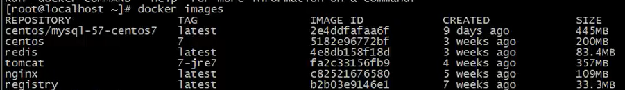
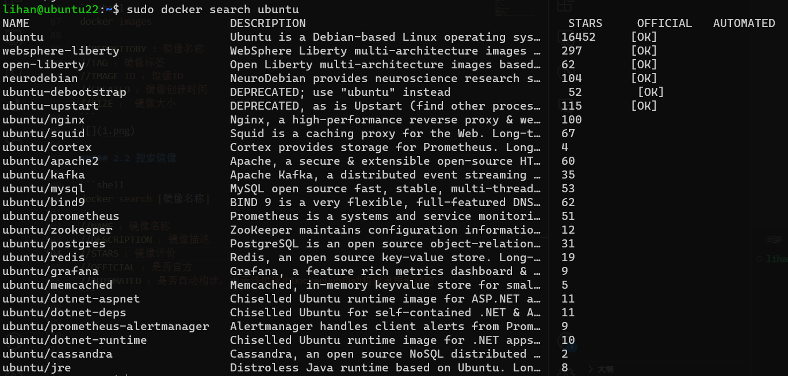
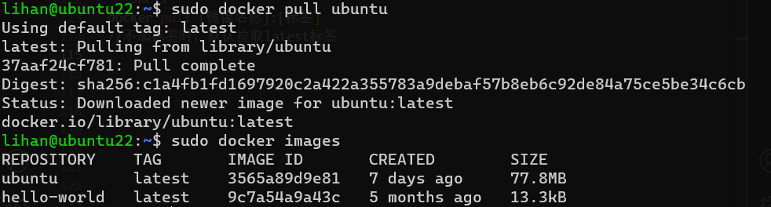
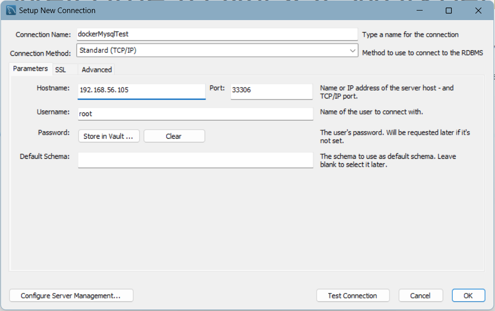
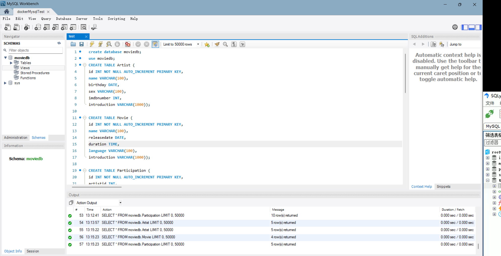
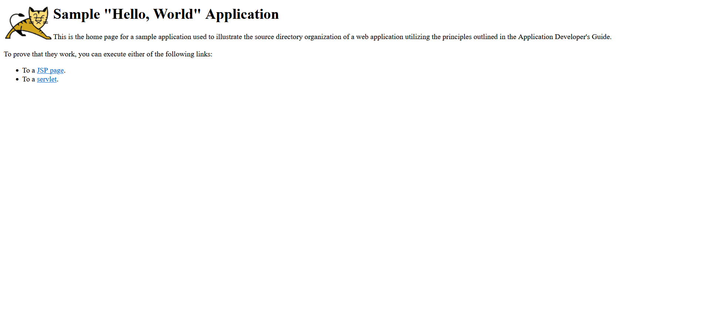
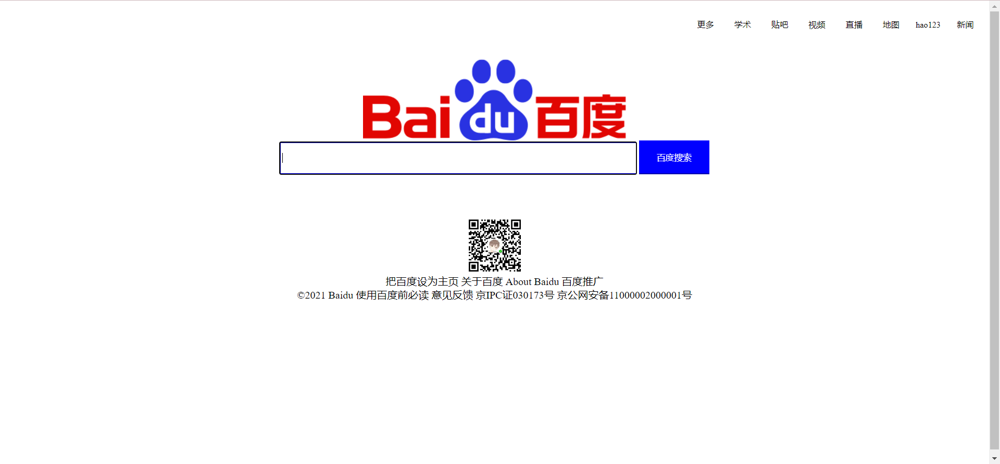
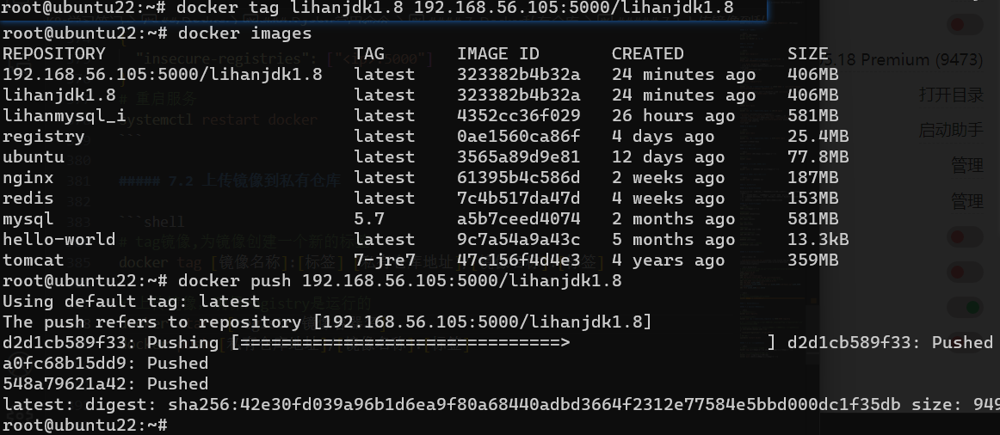
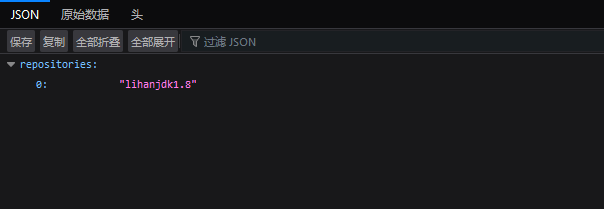

# Docker&&K8s学习笔记

## Docker
- [官网](https://hub.docker.com)
- [官方文档](https://docs.docker.com)

### Docker安装（Ubuntu22.04.3）

#### 1. 卸载旧版本

```shell
for pkg in docker.io docker-doc docker-compose podman-docker containerd runc; do sudo apt-get remove $pkg; done
```

#### 2. 安装依赖并添加GPG密钥


```shell
sudo apt-get update
sudo apt-get install ca-certificates curl gnupg
sudo install -m 0755 -d /etc/apt/keyrings
curl -fsSL https://download.docker.com/linux/ubuntu/gpg | sudo gpg --dearmor -o /etc/apt/keyrings/docker.gpg
sudo chmod a+r /etc/apt/keyrings/docker.gpg
```

#### 3. 添加Docker软件源仓库

```shell
echo \
  "deb [arch="$(dpkg --print-architecture)" signed-by=/etc/apt/keyrings/docker.gpg] https://download.docker.com/linux/ubuntu \
  "$(. /etc/os-release && echo "$VERSION_CODENAME")" stable" | \
  sudo tee /etc/apt/sources.list.d/docker.list > /dev/null
sudo apt-get update
```

#### 4. 安装Docker Engine

```shell
sudo apt-get install docker-ce docker-ce-cli containerd.io docker-buildx-plugin docker-compose-plugin
# 验证安装
sudo docker run hello-world
```

#### 5. 卸载Docker Engine

```shell
#卸载软件包
sudo apt-get purge docker-ce docker-ce-cli containerd.io docker-buildx-plugin docker-compose-plugin docker-ce-rootless-extras
#删除所有镜像、容器和卷
sudo rm -rf /var/lib/docker
sudo rm -rf /var/lib/containerd
```

#### 6. 设置ustc镜像源

```shell
#在/etc/docker/daemon.json中写入
{
  "registry-mirrors": ["https://docker.mirrors.ustc.edu.cn"]
}
```

### Docker常用命令

- `docker --help`：查看docker帮助

#### 1. 启动docker服务

```shell
#启动docker服务
sudo systemctl start docker
#查看docker服务状态
sudo systemctl status docker
#停止docker服务
sudo systemctl stop docker
#重启docker服务
sudo systemctl restart docker
#开机自启动docker服务
sudo systemctl enable docker
```

#### 2. 镜像相关

##### 2.1 查看镜像
  
```shell
docker images

#REPOSITORY : 镜像名称
#TAG ：镜像标签
#IMAGE ID ：镜像ID
#CREATED ：镜像创建时间
#SIZE ： 镜像大小
```


##### 2.2 搜索镜像

```shell
docker search [镜像名称]

#NAME ：镜像名称
#DESCRIPTION ：镜像描述
#STARS ：镜像评价
#OFFICIAL ：是否官方
#AUTOMATED ：是否自动构建，表示该镜像由DockerHub自动构建流程创建的
```


##### 2.3 拉取镜像

```shell
docker pull [镜像名称]:[标签]
#不加标签时，默认拉取latest标签
```


##### 2.4 删除镜像

```shell
docker rmi [镜像ID]
#删除镜像时，要求该镜像没有被容器使用

#删除所有镜像
docker rmi `docker images -q`

```

#### 3. 容器相关

##### 3.1 查看容器

```shell
#查看正在运行中的容器
docker ps

#查看停止的容器
docker ps -f status=exited

#查看所有容器
docker ps -a

#查看最近一次创建的容器
docker ps -l
```

##### 3.2 创建与启动容器

```shell
docker run

#参数说明
#-i ：以交互模式运行容器，通常与 -t 同时使用；
#-t ：启动后进入其命令行，即为容器重新分配一个伪输入终端，通常与 -i 同时使用；
#--name ：为容器指定一个名称；
#-v ：将本地目录挂载到容器中，前一个是宿主机目录，后一个是容器内部的挂载点；
#-d ：后台运行守护式容器，创建容器后不会自动登陆容器。
#-p ：指定端口映射，前一个是宿主机端口，后一个是容器内部的映射端口，可用多个-p做多个端口映射。

(1) 交互式方式创建容器
```shell
docker run -it --name=[容器名称] [镜像名称]:[标签] /bin/bash
#创建即登录，退出即关闭
```

(2) 守护式方式创建容器
```shell
docker run -di --name=[容器名称] [镜像名称]:[标签] /bin/bash
#创建不登陆，退出不关闭

#登录容器
docker exec -it [容器名称] /bin/bash

```

##### 3.3 启动与停止容器

```shell
docker start [容器名称]
docker stop [容器名称]
```

##### 3.4 文件拷贝

```shell
#从容器拷贝到主机
docker cp [容器名称]:[容器内路径] [主机路径]
#从主机拷贝到容器
docker cp [主机路径] [容器名称]:[容器内路径]
```

##### 3.5 目录挂载
- 目录挂载是将主机的目录挂载到容器中，容器中的文件会实时同步到主机中，主机中的文件也会实时同步到容器中(共享文件夹)

```shell
docker run -di --name=[容器名称] -v [主机目录]:[容器内目录] [镜像名称]:[标签] 
#似乎文件夹名称要一样
```
##### 3.6 查看容器ip

```shell

#查看容器全部信息
docker inspect [容器名称]

#查看容器ip
docker inspect --format='{{.NetworkSettings.IPAddress}}' [容器名称]

```

##### 3.7 删除容器

```shell  
docker rm [容器名称]
#删除所有容器
docker rm `docker ps -a -q`
```

#### 4. 应用部署

##### 4.1 MySQL

```shell
#拉取镜像
docker pull mysql:5.7

#创建容器
docker run -di --name=lihan_mysql -p 33306:3306  -e MYSQL_ROOT_PASSWORD=lihan mysql:5.7
```
- 使用`MySQL Workbench`连接数据库
- 用127.0.0.1连不上，突然想起来我用的是虚拟机。。。

- 导入[sql文件](test.sql)


##### 4.2 Tomcat

```shell
#拉取镜像
docker pull tomcat:7-jre7

#创建容器
docker run -di --name=lihan_tomcat -p 18080:8080 -v /usr/local/webapps:/usr/local/tomcat/webapps tomcat:7-jre7
```
将[sample.war](sample.war)放在docker宿主机的`/usr/local/webapps`目录下，访问`http://localhost:18080/sample`即可测试


##### 4.3 Nginx

```shell
#拉取镜像
docker pull nginx

#创建容器
docker run -di --name=lihan_nginx -p 180:80 nginx
```
[testweb](./testweb/)目录复制到docker中
` docker exec -it lihan_nginx /bin/bash`进入容器,进入`:/etc/nginx/conf.d`目录，查看`default.conf`文件，根据`root   /usr/share/nginx/html;`,将`testweb`目录中的文件复制到`/usr/share/nginx/html`目录下，访问`http//localhost:180`即可测试


##### 4.4 Redis部署
  
```shell
#拉取镜像
docker pull redis

#创建容器
docker run -di --name=lihan_redis -p 6379:6379 redis
```
略，没学过，先不测试了

#### 5.迁移与备份

##### 5.1 容器保存为镜像
  
```shell
docker commit [容器名称] [镜像名称]:[标签]

#查看镜像
docker images
```

##### 5.2 镜像保存为文件(.tar)

```shell
docker save -o [文件名].tar [镜像名称]:[标签]
```

##### 5.3 文件(.tar)导入为镜像

```shell
docker load -i [文件名].tar
```

#### 6. Dockerfile

##### 6.1 Dockerfile介绍

Dockerfile是由一系列命令和参数构成的脚本，这些命令应用于基础镜像并最终创建一个新的镜像
- 对于开发人员:可以为开发团队提供一个完全一致的开发环境;
- 对于测试人员:可以直接拿开发时所构建的镜像或者通过Dockerfile文件构建一个新的镜像开始工作
- 对于运维人员:在部署时，可以实现应用的无缝移植。

##### 6.2 Dockerfile指令
```shell
#指定基础镜像
FROM [镜像名称]:[标签]

#维护者信息
MAINTAINER [维护者姓名]

#设置环境变量
ENV [key] [value]

#镜像操作指令
RUN [shell命令] 

#拷贝文件
COPY [源路径] [目标路径]

#COPY并解压压缩包
ADD [源路径] [目标路径]

#设置工作目录
WORKDIR [工作目录]

#设置容器启动时执行的命令
ENTRYPOINT [shell命令]

```

##### 6.3 Dockerfile构建镜像


- jdk8镜像构建为例 

- [jdk-8u371-linux-x64.tar.gz](https://www.oracle.com/sg/java/technologies/javase/javase8u211-later-archive-downloads.html#license-lightbox)

```shell Dockerfile
# 将jdk-8u371-linux-x64.tar.gz放在宿主机的/usr/local/dockerjdk目录下
# 创建`Dockerfile`文件
FROM ubuntu:18.04
MAINTAINER lihan
RUN mkdir /usr/local/java
ADD jdk-8u371-linux-x64.tar.gz /usr/local/java/
# jdk-8u371-linux-x64.tar.gz 解压后为 jdk1.8.0_371
ENV JAVA_HOME /usr/local/java/jdk1.8.0_371
ENV JRE_HOME $JAVA_HOME/jre
ENV CLASSPATH $JAVA_HOME/bin/dt.jar:$JAVA_HOME/lib/tools.jar:$JRE_HOME/lib:$CLASSPATH
ENV PATH $JAVA_HOME/bin:$PATH
``` 

```shell
# 构建镜像
# . 表示当前目录下的Dockerfile文件
docker build -t lihanjdk1.8 .
```

#### 7. Docker私有仓库

##### 7.1 搭建与配置私有仓库

```shell
# 拉取私有仓库镜像
docker pull registry

# 创建私有仓库容器
docker run -di --name=lihan_registry -p 5000:5000 registry

# 打开浏览器，访问http://<ip>:5000/v2/_catalog，看到`{"repositories":[]}`表示私有仓库搭建成功

# 修改docker配置文件，添加私有仓库地址，使本地可以上传镜像到私有仓库
在`/etc/docker/daemon.json`中添加
{
  "insecure-registries": ["<ip>:5000"]
}
# 重启服务
systemctl restart docker
```

##### 7.2 上传和下载镜像到私有仓库

```shell
# tag镜像,为镜像创建一个新的标签
docker tag [镜像名称]:[标签] [私有仓库地址]/[镜像名称]:[标签]

# 上传镜像，确保registry是运行的
docker start [registry镜像容器名]
docker push [私有仓库地址]/[镜像名称]:[标签]

# 下载镜像
docker pull [私有仓库地址]/[镜像名称]:[标签]
```



### Docker总结
学习目标:
- 掌握Docker基础知识，能够理解Docker镜像与容器的概念
- 完成Docker安装与启动
- 掌握Docker镜像与容器相关命令。
- 掌握Tomcat Nginx 等软件的常用应用的安装。
- 掌握docker迁移与备份相关命令能够运用Dockerfile编写创建容器的脚本能够搭建与使用docker私有仓库

## Kubernetes(K8s)

- 
- 

### Kubernetes安装


