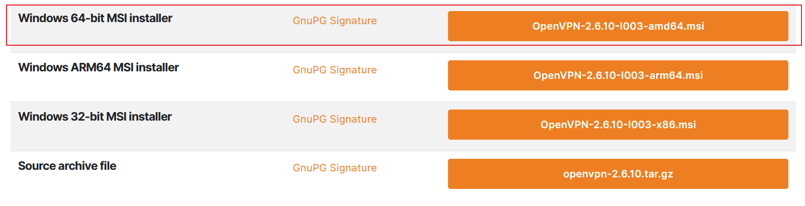
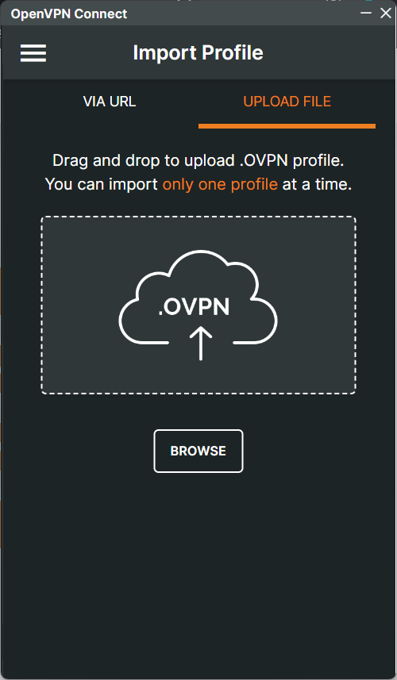

## 前言

服务器一直闲着，除了搞个游戏联机服务器，偶尔泡泡程序，运行网站，想着再试试搞个VPN服务器试试，刚好注意到了OpenVPN，就试试看。

## 环境

- 服务端：Debian 11
- 测试客户端：Windows 11

## 配置

### 1. 安装OpenVPN客户端(window为例)

[下载地址](https://openvpn.net/community-downloads/)
点击下载安装即可。


### 2. OpenVPN客户端使用



将VPN服务提供者提供的.ovpn文件导入客户端，点击连接即可。

### 3. 安装OpenVPN服务端(Debian为例)

```bash
sudo apt update
sudo apt install openvpn
```

### 4. 生成主证书颁发机构 （CA） 证书和密钥

```bash
#使用easy-rsa工具生成CA证书和密钥
sudo apt install easy-rsa
# 新建文件夹保存证书
mkdir -p /etc/openvpn/certs
# 复制easy-rsa工具到/etc/openvpn/certs
cp /usr/share/easy-rsa/* /etc/openvpn/certs
# 编辑vars配置
cp ./vars.example ./vars
sudo vim ./vars
# 修改如下内容
set_var EASYRSA_REQ_COUNTRY "CN"
set_var EASYRSA_REQ_PROVINCE "Beijing"
set_var EASYRSA_REQ_CITY "Shanghai"
set_var EASYRSA_REQ_ORG "koten"
set_var EASYRSA_REQ_EMAIL "888888@qq.comm"

# 初始化CA
./easyrsa init-pki    #1、初始化，在当前目录创建PKI目录，用于存储整数

./easyrsa build-ca    #2、创建根证书，会提示设置密码，用于ca对之后生成的server和client证书签名时使用，其他提示内容直接回车即可
```

### 5. 生成server端和client端证书和密钥

```bash
# 生成server证书和密钥
./easyrsa gen-req server nopass    #1、生成server证书请求，nopass表示不设置密码
./easyrsa sign-req server server    #2、签发server证书，第一个server表示证书名称，第二个server表示证书类型
# 生成client证书和密钥
./easyrsa gen-req client1 nopass    #1、生成client证书请求，nopass表示不设置密码
./easyrsa sign-req client client1   #2、签发client证书，第一个client表示证书名称，第二个client表示证书类型
# 同理生成其他client证书和密钥

# 生成Diffie-Hellman密钥交换
./easyrsa gen-dh
```

**也可以简化合并生成签发证书**

```bash
./easyrsa init-pki
./easyrsa build-ca   # 生成 CA
./easyrsa build-server-full server nopass   # 服务端证书
./easyrsa build-client-full clientA nopass  # 客户端 A
./easyrsa build-client-full clientB nopass  # 客户端 B
./easyrsa gen-dh
openvpn --genkey --secret ta.key
```

|Filename       | 	Needed By               | 	Purpose                 | 	Secret  |
|---------------|---------------------------|---------------------------|-----------|
|ca.crt 	    |server + all clients 	    |Root CA certificate 	    |NO         |
|ca.key 	    |key signing machine only 	|Root CA key 	            |YES        |
|dh{n}.pem 	    |server only 	            |Diffie Hellman parameters 	|NO         |
|server.crt 	|server only 	            |Server Certificate 	    |NO         |
|server.key 	|server only 	            |Server Key 	            |YES        |
|client1.crt 	|client1 only 	            |Client1 Certificate 	    |NO         |
|client1.key 	|client1 only 	            |Client1 Key 	            |YES        |
|client2.crt 	|client2 only 	            |Client2 Certificate 	    |NO         |
|client2.key 	|client2 only 	            |Client2 Key 	            |YES        |
|client3.crt 	|client3 only 	            |Client3 Certificate 	    |NO         |
|client3.key 	|client3 only 	            |Client3 Key 	            |YES        |

### 6. 配置OpenVPN服务端

```bash
sudo vim /etc/openvpn/server.conf
# 服务端 配置文件 server.conf

port 1194
proto udp
dev tun
#local 127.0.0.1

ca   /etc/openvpn/easy-rsa/pki/ca.crt
cert /etc/openvpn/easy-rsa/pki/issued/server.crt
key  /etc/openvpn/easy-rsa/pki/private/server.key
dh   /etc/openvpn/easy-rsa/pki/dh.pem
tls-auth /etc/openvpn/easy-rsa/ta.key 0

server 10.8.0.0 255.255.255.0
ifconfig-pool-persist ipp.txt

push "redirect-gateway def1 bypass-dhcp"
push "dhcp-option DNS 8.8.8.8"

keepalive 10 120
cipher AES-256-CBC
persist-key
persist-tun

user openvpn
group openvpn
status openvpn-status.log
verb 3
```

#### 启动

```bash

sudo systemctl enable openvpn-server@server
sudo systemctl start openvpn-server@server

sudo systemctl status openvpn-server@server
```

- 报错：

1. 权限问题：

注意相关`ca.crt`、`server.crt`、`server.key`、`dh.pem`、`ta.key`等文件的权限，确保OpenVPN服务有权限读取这些文件。

```bash
sudo chown -R root:root /etc/openvpn/easy-rsa/pki
sudo chmod 600 /etc/openvpn/easy-rsa/pki/private/server.key
sudo chmod 644 /etc/openvpn/easy-rsa/pki/ca.crt /etc/openvpn/easy-rsa/pki/dh.pem /etc/openvpn/easy-rsa/pki/issued/server.crt

sudo touch /var/log/openvpn-status.log
sudo chown openvpn:openvpn /var/log/openvpn-status.log
sudo chmod 644 /var/log/openvpn-status.log

```

仍然不行的话，去掉`server.conf`中的`user openvpn`和`group openvpn`，以root用户运行。

```bash
#注释掉
#user openvpn
#group openvpn
```

2. 防火墙

记得设置服务器的防火墙，放行1194端口-udp

### 7. 配置OpenVPN客户端


- 仅路由VPN内网流量，其他流量走本地网络，不影响互联网

```bash
client
dev tun
proto udp
remote [你的openvpn服务器ip] 1194

# resolv-retry infinite
nobind

persist-key
persist-tun
remote-cert-tls server
cipher AES-256-CBC
verb 3

ca   ca.crt
cert client_0.crt
key  client_0.key
tls-auth ta.key 1

route-nopull
route 10.8.0.0 255.255.255.0
```

- 全部流量走VPN，实现**上网

```bash
# client.ovpn
client
dev tun
proto udp
remote [你的openvpn服务器ip] 1194

resolv-retry infinite 
nobind

persist-key
persist-tun
remote-cert-tls server
cipher AES-256-CBC
verb 3

ca   ca.crt
cert client_0.crt
key  client_0.key
tls-auth ta.key 1

#route-nopull                 #取消注释以使用自定义路由
#route 10.8.0.0 255.255.255.0 #仅路由VPN内网流量，其他流量走本地网络，不影响互联网

```

之后在`服务端`执行

```bash
# iptables 做 SNAT/MASQUERADE（假设公网网口是 eth0，VPN 网段 10.8.0.0/24）
sudo iptables -t nat -A POSTROUTING -s 10.8.0.0/24 -o eth0 -j MASQUERADE 
# 允许转发（参考规则，视你防火墙而定）
sudo iptables -A FORWARD -s 10.8.0.0/24 -o eth0 -m conntrack --ctstate NEW,ESTABLISHED -j ACCEPT 

sudo iptables -A FORWARD -d 10.8.0.0/24 -i eth0 -m conntrack --ctstate ESTABLISHED -j ACCEPT
```

#### 启动

将`client.ovpn`、`ca.crt`、`client_0.crt`、`client_0.key`、`ta.key`放到客户端的config目录下，打开OpenVPN GUI，右键点击托盘图标，选择导入配置文件，选择刚才的`client.ovpn`文件，导入成功后，点击连接即可。

- 报错：

1. 连接超时

可能被墙了，可以尝试用`stunnel`进行SSL隧道加密，见 [`8.使用 stunnel 进行 SSL 隧道加密`](#8-使用-stunnel-进行-ssl-隧道加密)

### 8. 使用 stunnel 进行 SSL 隧道加密

有时可能被墙了，或者不稳定，可以尝试用`stunnel`进行SSL隧道加密。

走 tcp 443 端口，伪装成 HTTPS 流量。

#### 服务器端

```bash
sudo pacman -S stunnel
```

生成自签名证书

```bash
openssl req -new -x509 -days 3650 -nodes -out /etc/stunnel/stunnel.pem -keyout /etc/stunnel/stunnel.pem

chmod 600 /etc/stunnel/stunnel.pem
```

编辑配置文件 `/etc/stunnel/stunnel.conf`

```ini  
pid = /var/run/stunnel.pid
cert = /etc/stunnel/stunnel.pem
foreground = yes
[openvpn]
accept = 443          
# 对外提供 HTTPS 端口
connect = 127.0.0.1:1194   
# 转发到 OpenVPN 服务器端口
# 注释不能在行尾
```

启动 stunnel

放行防火墙443端口-tcp和1194端口-udp、tcp

```bash
# 测试
sudo stunnel /etc/stunnel/stunnel.conf

# 取消输出调试信息 stunnel.conf 中
foreground = no

# 设置开机启动
sudo systemctl enable stunnel
sudo systemctl start stunnel
```

修改 `/etc/openvpn/server.conf` 中 `proto udp` 为 `proto tcp` 填写 `local 127.0.0.1`，重启 OpenVPN 服务

```ini
port 1194
#proto udp
proto tcp
dev tun
local 127.0.0.1

ca   /etc/openvpn/easy-rsa/pki/ca.crt
cert /etc/openvpn/easy-rsa/pki/issued/server.crt
key  /etc/openvpn/easy-rsa/pki/private/server.key
dh   /etc/openvpn/easy-rsa/pki/dh.pem
tls-auth /etc/openvpn/easy-rsa/ta.key 0

server 10.8.0.0 255.255.255.0
ifconfig-pool-persist ipp.txt

push "redirect-gateway def1 bypass-dhcp"
push "dhcp-option DNS 8.8.8.8"

keepalive 10 120
cipher AES-256-CBC
persist-key
persist-tun

#user openvpn
#group openvpn
status openvpn-status.log
verb 3
```

#### 客户端

下载并安装 [stunnel for Windows](https://www.stunnel.org/downloads.html)

编辑配置文件 `stunnel.conf`

```ini
[openvpn]
client = yes
accept = 127.0.0.1:1194       
# 本地客户端连接端口
connect = [服务器ip]:443  
# 连接服务器 stunnel 的 HTTPS
CAfile = D:\bin\openvpn\pki\ca.crt
```
启动 stunnel
放行出站防火墙1194端口-tcp

修改 `client.ovpn` 中 `proto udp` 为 `proto tcp`，`remote [你的openvpn服务器ip] 1194` 为 `remote 127.0.0.1 1194`

```ini
client
dev tun
proto tcp
remote 127.0.0.1 1194

# resolv-retry infinite
nobind

persist-key
persist-tun
remote-cert-tls server
cipher AES-256-CBC
verb 3

ca   ca.crt
cert client_0.crt
key  client_0.key
tls-auth ta.key 1

route-nopull
route 10.8.0.0 255.255.255.0
```

之后重启 OpenVPN GUI，重新连接即可。


