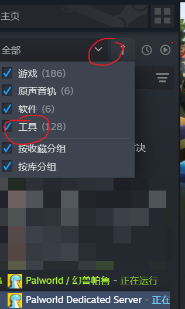
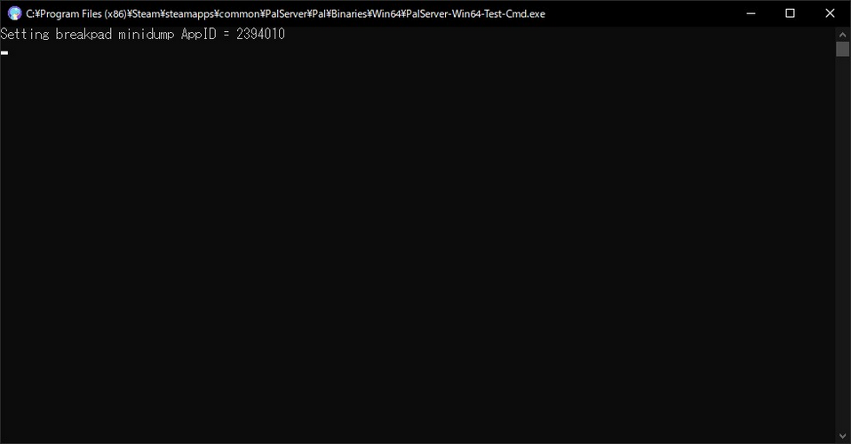
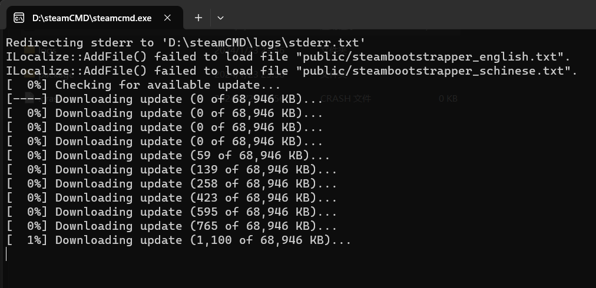

# 前言

幻兽帕鲁(Palworld)是一个抓宝可梦打黑工的开放世界冒险游戏，我想实现24h不间断的服务器以供朋友们随时上号可以继续建设共同的世界，不必等待房主上号。

这需要利用游戏提供的`幻兽帕鲁私有服务器(Palworld Dedicated Server)`工具实现。

# 环境

- windows 11
- Ubuntu 22.04

- 服务器配置

| CPU | RAM | Network |
| --- | --- | --- |
| 4核 | 16G | UDP端口8211 端口转发 |


# 参考

- [官方开服教程](https://tech.palworldgame.com/dedicated-server-guide)
- [steamcmd](https://developer.valvesoftware.com/wiki/SteamCMD)

# 操作

## windows 11

### 安装官方开服软件

购买游戏后，在steam库中的工具中找到`Palworld Dedicated Server`并下载安装。



### 配置开服软件

打开安装好的开服软件，选择`Play Palworld Dedicated Server`启动



## steamCMD-Windows

[官网](https://developer.valvesoftware.com/wiki/SteamCMD#Downloading_SteamCMD)下载后，新建文件夹`steamCMD`作为安装目录，解压到该目录下并运行。



- 下载完成后，设置游戏安装目录

```bash
force_install_dir D:\steamCMD\palworld
```

- 登录

```bash
# 匿名登陆

login anonymous

# 或者使用账号密码登陆

login username 
# 输入密码
```

- 下载更新游戏

```bash

app_update <app_id> [-beta <betaname>] [-betapassword <password>] [validate]

# app_id 为游戏的id，beta为测试版本，有的beta版本有密码，validate为验证文件完整性

# 以幻兽帕鲁为例
# app_update 2394010 validate
```

### steamcmd中下载幻兽帕鲁

```bash
# steamcmd
login anonymous
app_update 2394010 validate
quit
```

### 配置开服软件

```bash
# windows命令行
cd D:\steamCMD\steamapps\common\PalServer
PalServer.exe
```

## steamCMD-Ubuntu

```bash

# 作为root用户，创建steam用户：

sudo useradd -m steam
sudo passwd steam

# 进入其主文件夹：

sudo -u steam -s
cd /home/steam

# 下载steamcmd：

sudo add-apt-repository multiverse; sudo dpkg --add-architecture i386; sudo apt update
sudo apt install steamcmd
```

- 其他同[steamCMD-Windows](#steamcmd-windows)操作

- 运行`./PalServer.sh`启动服务器

## steamCMD-Docker

```bash
# wsl

# 下载并启动镜像
docker run -di --name=steamcmd cm2network/steamcmd 

docker exec -it steamcmd /bin/bash

# steamcmd.sh 位于 /home/steam/steamcmd

```

- 其他同[steamCMD-Ubuntu](#steamcmd-ubuntu)操作


## Ubuntu 22.04
