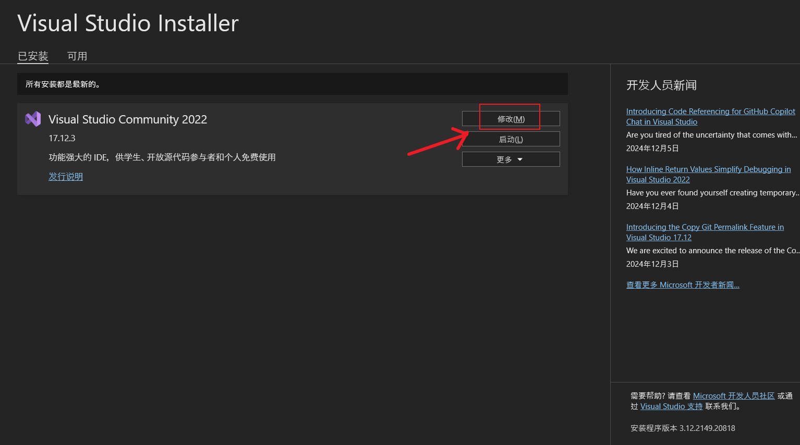
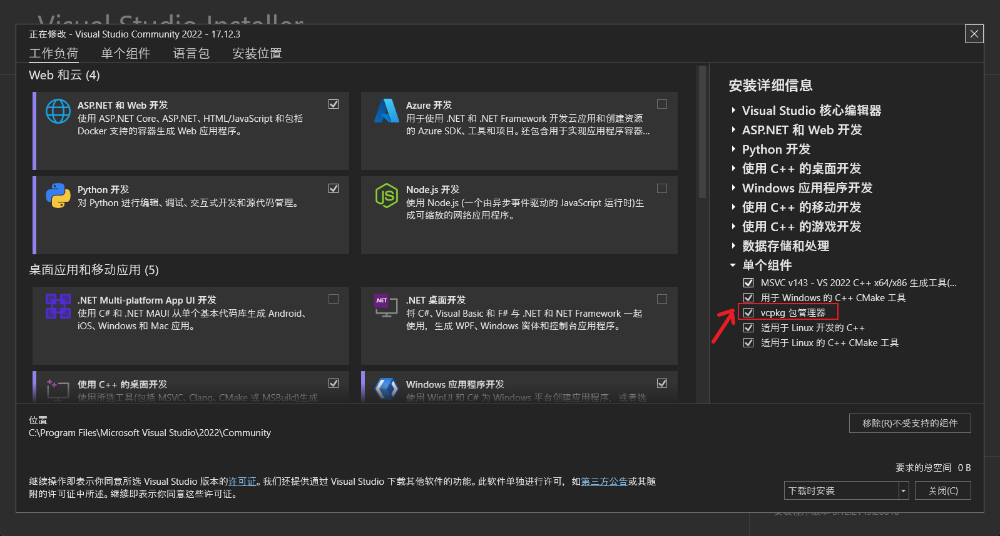
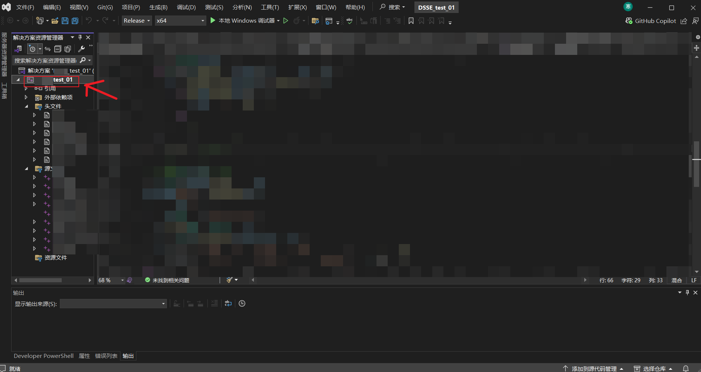
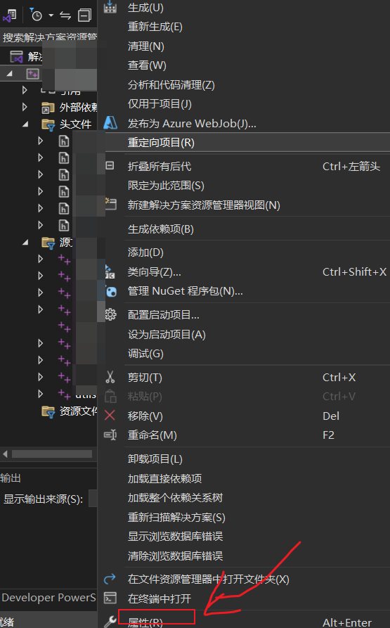
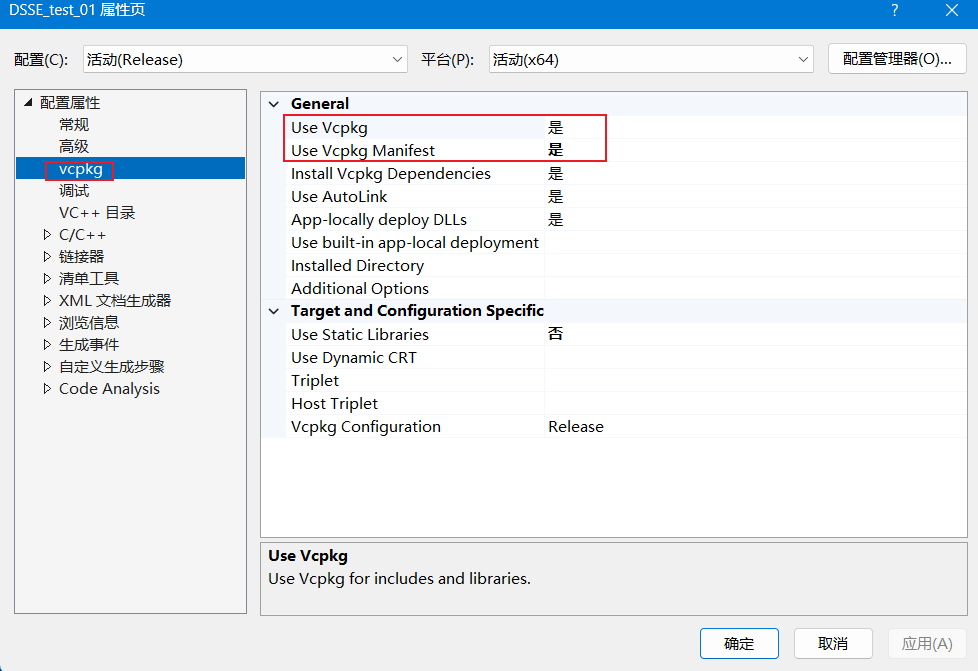

## 前言

做毕设时，使用 C++ 进行开发，需要调用 openssl 等第三方库，找了找有没有像 python 的 pip 一样的包管理工具，找到了 vcpkg。这里记录一下配置过程。总的来说，比 pip 麻烦一点，乱七八糟小问题不少。

## 安装

1. 安装 Visual Studio 2022，安装时勾选`C++`组件。

- 已安装的话，打开`Visual Studio Installer`，点击`修改`，勾选`Vcpkg`组件。





2. 项目中使用 vcpkg

- 安装完组件后，记得重启电脑，不然可能不显示`vcpkg`配置。

- 右键项目打开项目属性页面，找到 `Vcpkg` 选项。





- 进行如下配置，点击`应用`。



## 使用

- 由于贴主尚不清楚的原因，VS 中的 Vcpkg 只能使用 `Manifest` 方式安装包，需要创建和编辑`vcpkg.json`文件。

- 在项目目录下使用`vcpkg new -application`命令创建`vcpkg.json`和`vcpkg-configuration.json`文件。

- 可以在[vcpkg官网](https://vcpkg.io/)查找需要的包，如`openssl`、`jsoncpp`、`cpp-httplib`等。

- 编辑`vcpkg.json`文件，内容如下，配置了`openssl`、`jsoncpp`、`cpp-httplib`三个包:

```json
{
    "dependencies": [
        {
            "name": "openssl",
            "host": true,
            "version>=": "3.4.0"
        },
        {
            "name": "jsoncpp",
            "host": true,
            "version>=": "1.9.6"
        },
        {
            "name": "cpp-httplib",
            "host": true,
            "version>=": "0.18.0"
        }
    ]
}
```

- 在目录下使用`vcpkg install`命令安装包。

## 注意

- `Release`和`Debug`模式下，`vcpkg`的属性配置不同，需要分别配置。
- 如上文进行的配置，生成的`exe`文件目录下会有相关`dll`文件。
