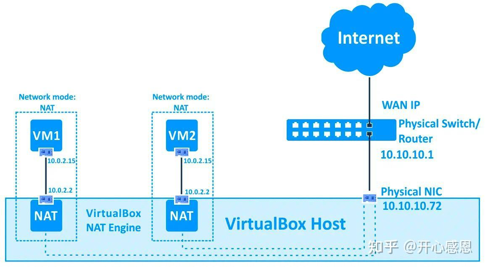
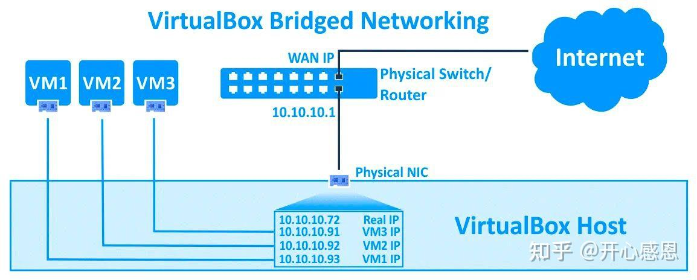
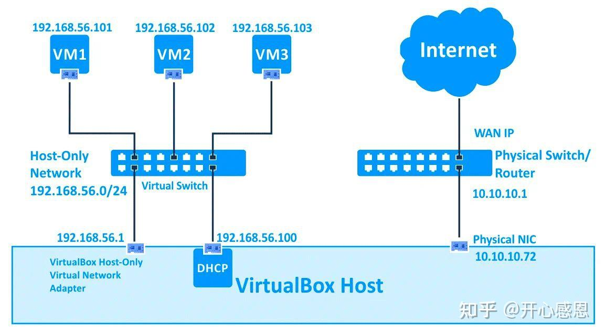
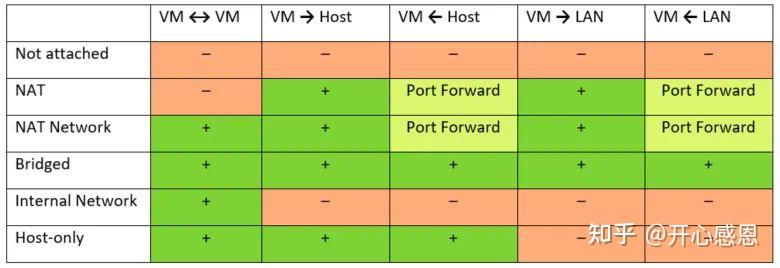

## 前言
配置VirtualBox虚拟机网络时，有几种网络模式，这里做一个总结。

## 网络模式

### 网络地址转换NAT
在VirtualBox中，当使用NAT模式时，多个虚拟机的IP地址相同。如果您将2个或多个虚拟机的网络适配器配置为使用NAT模式，每个虚拟机将在一个隔离网络的虚拟NAT设备后获得一个10.0.2.15的IP地址。每个虚拟机的默认网关是10.0.2.2。
VirtualBox网络使用NAT网络模式的时候，虚拟机上的操作系统也可以访问外部网络，包括互联网；宿主机或其所在局域网的其他服务器不能直接访问虚拟机。

### NAT网络

NAT网络模式，不能从宿主机访问客机（除非你在全局VirtualBox网络设置中配置了端口转发）。一个内置的VirtualBox NAT路由器使用VirtualBox主机的物理网络接口控制器作为外部网络接口（和NAT模式一样）。
如果你对多个虚拟机使用NAT网络模式，它们可以通过网络相互通信。虚拟机可以访问物理网络中的其他主机，也可以访问外部网络，包括互联网。任何来自外部网络的机器以及宿主机所连接的物理局域网的机器都不能访问被配置为使用NAT网络模式的虚拟机。

NAT网络的默认地址是10.0.2.0/24。默认的网关IP地址是10.0.2.1（x.x.x.1的ip模版通常被用于设置默认网关IP），比如，如果你在virtualbox中配置了基于NAT网络模式的虚拟网络，设置了192.168.22.0/24的网络地址，则这个网络的网关地址会是192.168.22.1。

在NAT网络模式下，你不能改变网关的IP地址，也不能改变由DHCP服务器分配的IP地址范围。类似的，DHCP服务器的IP地址默认是10.0.2.3（使用x.x.x.3的模版）。

### 桥接网卡(桥接适配器)
将虚拟机的虚拟网络适配器与VirtualBox主机的物理网络适配器相连。虚拟机的虚拟网络适配器使用主机网络接口进行网络连接。简单地说，虚拟网络适配器直接发送或接收网络数据包，不使用额外的路由。
宿主机所在的物理本地局域网的服务器都能独立对等地访问跑在虚拟机上的服务器。桥接模式下运行的虚拟网络适配器的默认网关与主机的默认网关相同.
你可以从虚拟机访问宿主机、宿主机所在物理网络的其他主机以及外部网络，包括互联网。虚拟机也可以被同一物理局域网中的宿主机以及其他主机（或虚拟机）所访问。如果你在宿主机上有多个物理网络适配器，你应该在VirtualBox网络设置中选择正确的适配器。

`混杂模式`这种模式允许网络适配器中转所有接收到的流量，无论流量是寻址哪个适配器的。在正常模式下，网络适配器只接收包括该特定网络适配器的MAC地址作为目标地址的帧。在正常模式下，被寻址到与所选适配卡的MAC地址不同的MAC地址的帧（当流量不是广播时）会被丢弃。混杂模式使一个物理网络适配器有多个MAC地址成为可能，允许所有传入的流量通过主机的物理网络适配器，到达虚拟机的虚拟网络适配器，该虚拟机有自己的MAC地址，并被认为是宿主机物理适配器上的另一个mac地址，即使该流量并不是寻址该特定虚拟机的虚拟网络适配器。
使用混杂模式有三个选项：

1、Deny。

任何不以虚拟机的虚拟网卡为目的地的流量都将被屏蔽。这个选项是默认设置。

2、Allow VMs。

除了去向或来自于虚拟机的流量，其他流量都将被屏蔽。

3、Allow ALL。

这一模式下没有限制，虚拟机的网卡可以看到所有进来、出去的流量。混杂模式不仅可以用于桥接网络模式，也可以用于NAT网络模式，Internal网络模式和Host-only适配器模式。

### 内部网络(Internal Network)

VirtualBox中的虚拟机网卡被配置成Internal network模式的时候，他们会被接入一个隔离的虚拟网络。在这个隔离的虚拟网络中，虚拟机之间可以互相通信，但是他们不能和Virtualbox中的宿主机通信，不能和宿主机所在的局域网中的其他主机通信，也不能外部网络通信。宿主机或其他设备可以访问接入到Internal Network中的虚拟机。Virtualbox中的Internal network可以用来模拟真实网络。

### Host-Only仅主机网络

这种网络模式用于在宿主机和虚拟机之间进行通信。一个虚拟机可以与连接到host-only网络的其他虚拟机通信，也可以与宿主机通信。VirtualBox宿主机可以访问所有连接到host-only网络的虚拟机。
虚拟机的虚拟网络适配器在其IP配置中没有网关，因为host-only模式不允许你连接到host-only网络以外的任何设备。

### 端口转发(Port Forward)

 端口转发是将寻址向某个IP地址和端口的流量转发到另一个不同的IP地址和端口的处理操作。服务器和其他路由设备上可以使用专门应用程序来实现端口转发。端口转发最常用的一个应用场景是为隐藏在NAT后边的特定的网络设备提供外部网络访问入口。

配置完端口转发规则后，客户端可以通过连接路由器（或主机）外部IP地址和专用端口来访问特定的服务。网络包会首先被路由器上的一个应用程序所截获，然后这个应用程序会读取网络包头中的目的IP地址和端口号（IP包头，含有TCP或UDP段的包头）。如果包头中目的IP地址和端口号的组合能与端口转发规则集合中的某个条件匹配上，路由器程序就会重写包头中的信息（IP地址和/或端口号），并根据端口转发规则将包/段发送给另一个网络接口。

默认情况下，VirtualBox宿主机和其他局域网中的主机不能访问网络适配器被设置成NAT或NAT Network模式-的VirtualBox虚拟机，但是VirutalBox提供了内置的端口转发特性支持了这种类型的访问。

### 总结

