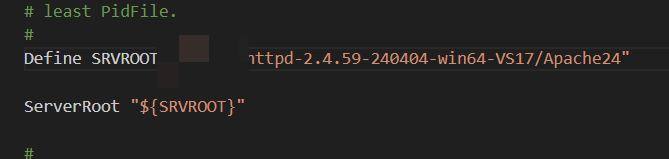
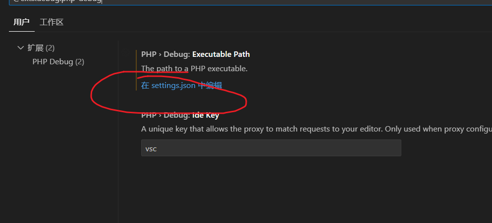
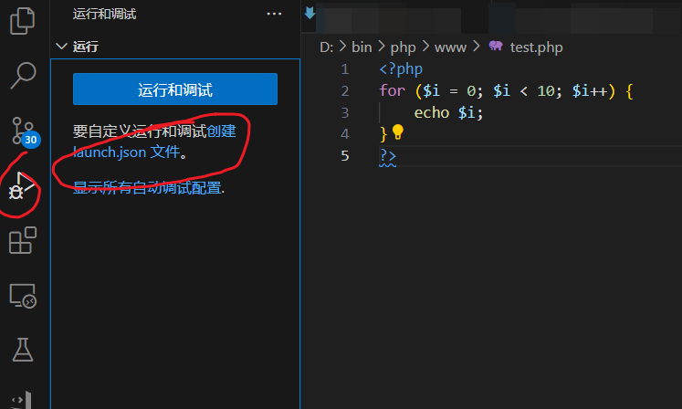

## 前言

翻了半天浏览器，官网的windows配置环境好像有点复杂，整理一下发个帖子吧。

## 环境配置

### Apache环境配置

#### 1.官网下载

- [Apache官网](https://httpd.apache.org/)打开，点击`Download`


- 选择`Files for Microsoft Windows`下载


- 注意到这里有四个选项
- - Apache Lounge是单独安装apache
- - Bitnami WAMP Stack、WampServer、XAMPP是集成环境，包含了Apache、MySQL、PHP等

- - 这里选择`Apache Lounge`


- 选择`httpd-2.4.59-240404-win64-VS17.zip`下载并解压到本地


#### 2.配置Apache

- 进入`~\httpd-2.4.59-240404-win64-VS17\Apache24\bin`目录，并用管理员权限打开命令行

- 输入`httpd -k install`安装服务
- - 可以通过`httpd -k uninstall`卸载服务
- - 通过添加`-n`参数可以指定服务名，如`httpd -k install -n Apache2.4`，默认为`Apache2.4`，卸载时也要指定服务名


- 打印`The 'Apache2.4' service is successfully installed.`,安装完成
- - `Errors reported here must be corrected before the service can be started.`报错可以忽略。
- - `httpd.exe: Syntax error on line 39 of ~/httpd-2.4.59-240404-win64-VS17/Apache24/conf/httpd.conf: ServerRoot must be a valid directory`报错，是因为`httpd.conf`中的`ServerRoot`路径不对
- - - 根据提示进入`httpd.conf`修改`ServerRoot`路径为实际目录，如`ServerRoot "C:/httpd-2.4.59-240404-win64-VS17/Apache24"`



- 输入`httpd -k start`启动服务，打开浏览器输入`localhost`，出现`It works!`页面，说明安装成功
- - `AH00558: httpd.exe: Could not reliably determine the server's fully qualified domain name, using *. Set the 'ServerName' directive globally to suppress this message`报错可以忽略
- - 输入`httpd -k stop`停止服务


#### 3.配置配置文件

- 配置环境变量


### PHP环境配置

#### 1.官网下载

- [PHP官网](https://www.php.net/)打开，点击`Downloads`


- 选择`Windows downloads`下载


- 选择`VS16 x64 Thread Safe (2024-May-08 09:16:28) Zip [30.66MB]`下载
- - 选择非线程安全版本可能缺失`php8apache2_4.dll`文件


- 下载完成后解压到本地

#### 2.配置PHP

- 添加环境变量


- 输入`php -v`查看版本，说明安装成功


- 进入`~\php-8.3.7-Win32-vs16-x64`目录，将`php.ini-development`文件复制一份并重命名为`php.ini`


- 修改`php.ini`文件

- - 找到`extension_dir`，修改为`extension_dir = "D:\bin\php\php-8.3.7-Win32-vs16-x64\ext"`


### Apache+PHP整合环境配置

#### 1.配置Apache

- 进入`~\httpd-2.4.59-240404-win64-VS17\Apache24\conf`目录，打开`httpd.conf`文件

- 找到`#LoadModule vhost_alias_module modules/mod_vhost_alias.so`,在下面添加

```conf

LoadModule php_module "D:/bin/php/php-8.3.7-Win32-vs16-x64/php8apache2_4.dll"
PHPIniDir "D:/bin/php/php-8.3.7-Win32-vs16-x64"
AddType application/x-httpd-php .php .html .htm

```

- 修改网站默认首页，找到

```conf

<IfModule dir_module>
    DirectoryIndex index.html
</IfModule>

```

- 修改为

```conf

<IfModule dir_module>
    DirectoryIndex index.php index.html
</IfModule>

```

- 修改Apache 默认的站点目录

- - 在`~\php-8.3.7-Win32-vs16-x64`目录下新建`www`目录，将`index.php`文件放入

```php

<?php
  phpinfo();
?>

```

- - 在`httpd.conf`文件中找到

```conf

# DocumentRoot: The directory out of which you will serve your
# documents. By default, all requests are taken from this directory, but
# symbolic links and aliases may be used to point to other locations.
#
DocumentRoot "${SRVROOT}/htdocs"
<Directory "${SRVROOT}/htdocs">

```

修改为

```conf

# DocumentRoot: The directory out of which you will serve your
# documents. By default, all requests are taken from this directory, but
# symbolic links and aliases may be used to point to other locations.
#
DocumentRoot "你的路径\php\www"
<Directory "你的路径\php\www>

```

#### 2.重启Apache

- 输入`httpd -k start`启动服务，打开浏览器输入`localhost`，出现`phpinfo`页面，说明安装成功


### php依赖管理工具 Composer

#### 1.官网下载

- [Composer官网](https://getcomposer.org/download/)打开

- - 安装方式一:
- - 点击`Composer-Setup.exe`下载，在 php 安装目录中找到 php.ini 文件，`;extension=openssl`前面的分号去掉，保存并重启 Apache 服务。之后双击安装文件，安装 Composer


- - 安装方式二:
- - 修改`php.ini`文件


- - 复制官网的命令行代码，粘贴到命令行中执行


#### 2.配置Composer镜像(可选)

```bash
#aliyun
composer config -g repo.packagist composer https://mirrors.aliyun.com/composer/ 

```

### VSCode配置

#### 1.安装插件

- 在vs code插件商店中，搜索并安装相关的组件：

- - Composer
- - PHP 
- - PHP Debug（后面需要做进一步的设置）
- - PHP Extendsion Pack
- - Php IntelliSense

- - - Vs code 安装 debug 插件后，需要在 settings.json 中进行设置，即在最外层大括号下面，添加以下两个php.exe所在的路径：

```json
{
    "php.validate.executablePath": "xx/php-8.3.7-Win32-vs16-x64/php.exe",
    "php.executablePath": "xx/php-8.3.7-Win32-vs16-x64/php.exe"
}
```





### Xdebug配置

#### 1.官网下载

- 命令行输入`php -i`查看php信息，复制信息到[官网](https://xdebug.org/wizard.php)检查版本并下载对应版本


- 下载完成后,移动到php的ext目录下，并重命名为`php_xdebug.dll`

- 修改`php.ini`文件

```conf
#添加
[XDebug]
zend_extension=php_xdebug.dll
xdebug.output_dir="xx\php\tmp\xdebug"
; xdebug 监听地址（Xdebug3写法，2的名称为 remote_host）
xdebug.client_host="127.0.0.1"
xdebug.client_port=9003
xdebug.remote_handler=dbgp
xdebug.start_with_request = yes
xdebug.idekey = Vscode
xdebug.collect_return = On
xdebug.mode = debug
; 本机调试，Xdebug3新增设置
xdebug.discover_client_host = On

```

- 重启Apache服务

- cmd 命令提示符下测试xdebug安装是否成功：

```bash
php --version
```

-- 打开浏览器，输入`localhost`，查看phpinfo页面，搜索`xdebug`，如果有相关信息，说明安装成功


#### VSCode配置

- 在网站根目录`www`下新建`test.php`文件

```php

<?php
  for ($i = 0; $i < 10; $i++) {
  echo $i;
  }
?>

```

- vscode打开`test.php`文件，点击左侧的调试按钮，选择`create a launch.json file`，选择`PHP`，生成`launch.json`文件

```json
//自动生成的launch.json如下
{
    // 使用 IntelliSense 了解相关属性。 
    // 悬停以查看现有属性的描述。
    // 欲了解更多信息，请访问: https://go.microsoft.com/fwlink/?linkid=830387
    "version": "0.2.0",
    "configurations": [
        {
            "name": "Listen for Xdebug",
            "type": "php",
            "request": "launch",
            "port": 9003
        },
        {
            "name": "Launch currently open script",
            "type": "php",
            "request": "launch",
            "program": "${file}",
            "cwd": "${fileDirname}",
            "port": 0,
            "runtimeArgs": [
                "-dxdebug.start_with_request=yes"
            ],
            "env": {
                "XDEBUG_MODE": "debug,develop",
                "XDEBUG_CONFIG": "client_port=${port}"
            }
        },
        {
            "name": "Launch Built-in web server",
            "type": "php",
            "request": "launch",
            "runtimeArgs": [
                "-dxdebug.mode=debug",
                "-dxdebug.start_with_request=yes",
                "-S",
                "localhost:0"
            ],
            "program": "",
            "cwd": "${workspaceRoot}",
            "port": 9003,
            "serverReadyAction": {
                "pattern": "Development Server \\(http://localhost:([0-9]+)\\) started",
                "uriFormat": "http://localhost:%s",
                "action": "openExternally"
            }
        }
    ]
}

```



- 选择`Listen for Xdebug`，点击左侧的调试按钮，选择`Listen for Xdebug`，设置断点，点击`F5`，打开浏览器，输入`localhost/test.php`，断点调试


- php.ini中，xdebug.mode = debug 的使用场景为需要断点调试的时候。
- 本地开发时，一般同时开启两个，即`xdebug.mode = debug,profile`

#### 7.1 xdebug.mode

- 此设置控制启用哪些Xdebug功能。
接受以下值：

| 值	| 说明 |
| --- | --- |
|off	    | 没有启用任何功能。Xdebug 除了检查功能是否已启用外不起作用。如果您想要接近零的开销，请使用此设置。|
|develop	| 启用包括重载的var_dump()在内的开发帮助。|
|coverage	| 使Code Coverage Analysis能够生成代码覆盖率报告，主要是与PHPUnit结合使用 。|
|coverage	| 使Code Coverage Analysis能够生成代码覆盖率报告，主要是与PHPUnit结合使用 。|
|debug	    | 启用步骤调试。这可用于在代码运行时逐步检查代码，并分析变量的值。|
|gcstats	| 使垃圾收集统计信息能够收集有关PHP的垃圾收集机制的统计信息。|
|profile	| 启用性能分析，您可以使用它通过KCacheGrind之类的工具分析性能瓶颈。|
|trace	    | 启用功能跟踪功能，该功能允许您记录每个函数调用，包括参数，变量赋值以及在对文件的请求期间进行的返回值。|

- 以","（逗号）分隔 xdebug.mode 的值作为标识符来同时启用多个模式xdebug.mode=develop,trace。

- 还可以通过XDEBUG_MODE在命令行上设置环境变量来设置模式，这样优先于xdebug.mode 设置。


##### 7.2 start_with_request

