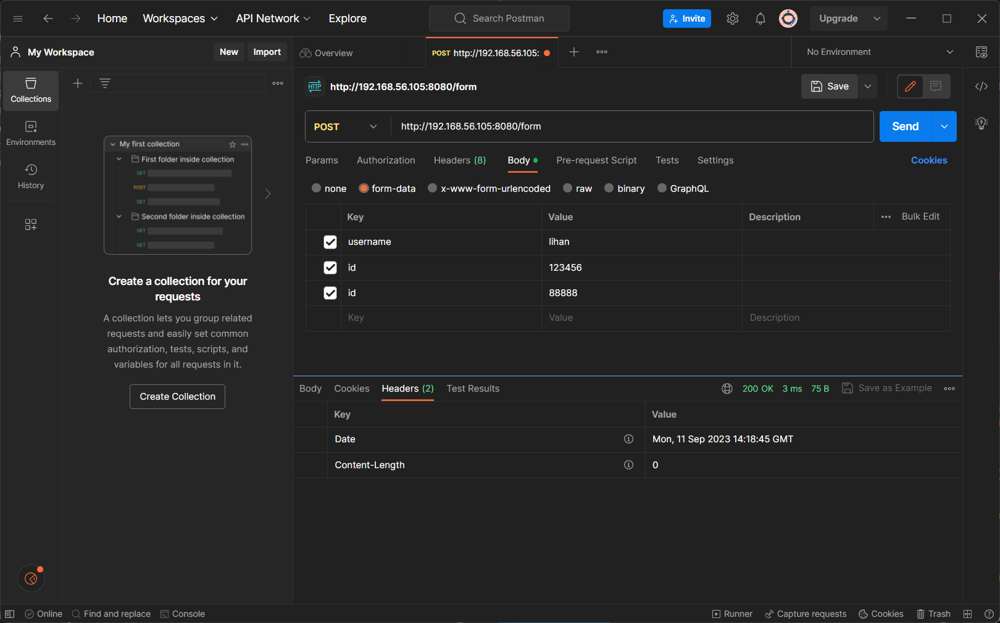
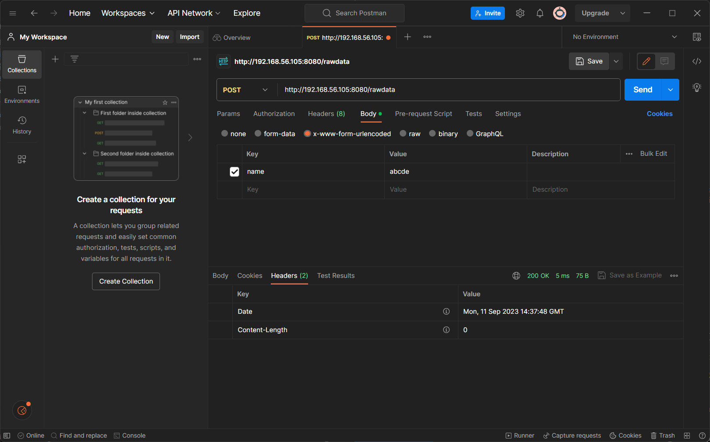
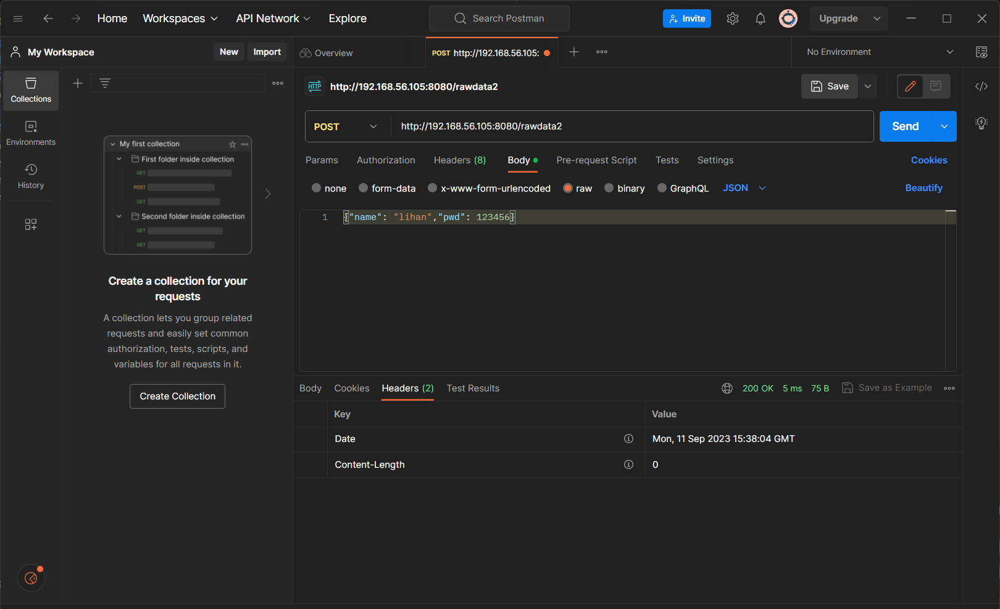

# ginWeb框架学习(ubuntu22.04.3)

## gin

- [gin官网](https://gin-gonic.com/zh-cn/)
- [gin中文文档](https://gin-gonic.com/zh-cn/docs/)

### gin安装与环境配置

1. 安装gin

```shell
# 切换国内代理
GOPROXY=https://goproxy.cn,direct
# 安装gin
go get -u github.com/gin-gonic/gin
```

2. 安装postman

[postman官网](https://www.postman.com/)
用于调试post请求接口用

3. 测试gin是否安装成功

```go
package main

import "github.com/gin-gonic/gin"

func main() {
	router := gin.Default()
	router.GET("/index", func(context *gin.Context) {
		context.String(200, "Hello lihan!")
	})
	router.Run(":8080")
}
```
```shell
# 运行
go run main.go
# 访问[主机地址]:8080/index
# 例如 127.0.0.1:8080/index
# 显示 Hello World! 则安装成功
```

### gin教程

#### gin启动方式

```go
package main

import (
	"github.com/gin-gonic/gin"
)

func Index2(context *gin.Context) {
	context.String(200, "Hello lihan2!")
}

func main() {

	//创建一个默认路由引擎
	router := gin.Default()

	//注册一个路由和处理函数，访问/index的路由时，会执行后面的匿名函数
	router.GET("/index", func(context *gin.Context) {
		context.String(200, "Hello lihan!")
	})

	//另一种方法，可以直接使用已经声明的函数
	router.GET("/index2", Index2)

	//启动HTTP服务,gin会默认把web服务器运行在本机的0.0.0.0:8080端口上(即所有网卡IP的8080端口)
	router.Run(":8080")
	//第二种启动方式，用原生http服务的方式启动，这种方式可以实现更多的自定义配置
	//http.ListenAndServe(":8080", router)
}

```

#### gin视图 view

##### 响应 response

1. 状态码

- [状态码](https://zh.wikipedia.org/zh-hans/HTTP%E7%8A%B6%E6%80%81%E7%A0%81)
```go
200 表示正常响应 http.StatusOk
//常见状态码
200 - 请求成功
301 - 资源（网页等）被永久转移到其它URL
404 - 请求的资源（网页等）不存在
500 - 内部服务器错误
//状态码分类
1**	信息，服务器收到请求，需要请求者继续执行操作
2**	成功，操作被成功接收并处理
3**	重定向，需要进一步的操作以完成请求
4**	客户端错误，请求包含语法错误或无法完成请求
5**	服务器错误，服务器在处理请求的过程中发生了错误
```

2. 返回字符串

```go
router.GET("/", func(c *gin.Context) {
		c.String(200, "你好啊！")
	})
```

3. 返回json **重点**

```go
//main.go
router.GET("/json", ginJson)
//ginJson函数
func ginJson(c *gin.Context) {
	//json响应结构体
	type UserInfo struct {
		UserName string `json:"username-json"` //返回给前端的字段名
		Age      int    `json:"age_json"`
		PassWord string `json:"-"` //"-"不会返回给前端
	}
	//user := UserInfo{"lihan", 32, "123456"}
	//c.JSON(200, user)

	//json响应map
	//userMap := map[string]string{
	//	"user_name": "lihan",
	//	"age":       "32",
	//}
	//c.JSON(200, userMap)

	//直接响应json
	c.JSON(200, gin.H{"user_name": "lihan", "age": 32})
}
```

4. 返回xml和yaml

```go
//main.go
router.GET("/xml", ginXml)
router.GET("/yaml", ginYaml)

//ginXml、ginYaml函数
func ginXml(c *gin.Context) {
	c.XML(200, gin.H{"user_name": "lihan", "age": 32, "status": http.StatusOK, "data": gin.H{"id": 1, "name": "lihan"}})
}

func ginYaml(c *gin.Context) {
	c.YAML(200, gin.H{"user_name": "lihan", "age": 32, "status": http.StatusOK, "data": gin.H{"id": 1, "name": "lihan"}})
}
```

5. 返回html

```go
//main.go
router.LoadHTMLGlob("templates/*")
router.GET("/html", ginHtml)

//ginHtml函数
func ginHtml(c *gin.Context) {
	type UserInfo struct {
		UserName string
		Age      int
		PassWord string
	}
	user := UserInfo{"lihan", 32, "123456"}
	c.HTML(200, "index.html", user)

	//c.HTML(200, "index.html", gin.H{"user_name": "lihan", "age": 32, "status": http.StatusOK, "data": gin.H{"id": 1, "name": "lihan"}})
} //gin.H()可以向html传参
```

```html
{{/*  templates/index.html  */}}
<!DOCTYPE html>
<html lang="en">

<head>
    <meta charset="UTF-8">
    <title>首页</title>
</head>

<body>
    <h1>响应html {{ .UserName}}</h1>
    {{/* <h1>响应html {{ .data.name}}</h1> */}}
</body>

</html>
```

6. 响应文件

```go
//main.go
	//golang中，没有相对文件的路径，只有相对项目的路径

	//配置单个文件，网页请求的路由，文件路径
	router.StaticFile("/downloads/lihan.png", "static/lihan.png")
	//配置文件夹，网页请求的路由，文件夹路径
	router.StaticFS("/downloads/files", http.Dir("static/texts"))

```
<!-- 项目目录结构 -->
- 项目文件夹[gowebstudy]
  - static
    - texts
      - test.txt
    - lihan.png
    - pwd.txt
  - 2.gin_view视图
    - 2.1response响应.go

7. redirect 重定向
- HTTP 301 Moved Permanently (永久重定向):
    当服务器返回HTTP状态码301时，它告诉客户端请求的资源已永久移动到一个新的URL。
    浏览器（或其他HTTP客户端）会记住这个永久重定向，以后的请求都会直接转向新的URL，而不再请求原始URL，可缓存。

- HTTP 302 Found (临时重定向):
    当服务器返回HTTP状态码302时，它告诉客户端请求的资源已临时移动到一个新的URL。
    浏览器会将这个重定向视为临时性质，因此不会记住新的URL，每次都需要重新请求原始URL，不可缓存

```go
//main.go
router.GET("/lihan", ginRedirect)
//ginRedirect函数
func ginRedirect(c *gin.Context) {
	c.Redirect(301, "https://lihan3238.github.io/")
}
```

##### 请求 request

1. Query 查询参数

```go
//main.go
func _query(c *gin.Context) {
	fmt.Println(c.Query("username"))
	//c.GetQuery仅判断是否存在，不判断是否为空
	fmt.Println(c.GetQuery("username"))
	//c.QueryArray获取全部username的值，返回一个切片
	fmt.Println(c.QueryArray("username"))
	//c.DefaultQuery获取username的值，如果为空则返回默认值
	fmt.Println(c.DefaultQuery("id","default_id"))
}
//?id=2&username=lihan&username=op

func main() {
	router := gin.Default()
	router.GET("/query", _query)

	router.Run(":8080")
}

//访问：http://192.168.56.105:8080/query?id=2&username=lihan&username=op
//返回：
lihan
lihan true
[lihan op]

``` 

2. Param 动态参数

```go
//main.go
router.GET("/param/:user_id", _param)
router.GET("/param/:user_id/:book_id", _param)

//_param函数
func _param(c *gin.Context) {
	fmt.Println(c.Param("user_id"))
	fmt.Println(c.Param("book_id"))
}
//http://192.168.56.105:8080/param/user1/book2
```

3. PostForm 表单参数

- 要使用Post而非Get请求
- 可以接收 multipart/form-data 和 application/x-www-form-urlencoded 类型的数据

```go
//main.go
router.POST("/form", _form)

//_form函数
func _form(c *gin.Context) {
	fmt.Println(c.PostForm("username"))
	fmt.Println(c.PostFormArray("id"))
	fmt.Println(c.DefaultPostForm("addr", "default_addr"))
}
```


```shell
# 返回
lihan
[123456 88888]
default_addr
```

4. GetRawData 获取原始参数

```go
//main.go
router.POST("/rawdata", _rawData)
//_rawData函数
func _rawData(c *gin.Context) {
	//fmt.Println(c.GetRawData())
	body, _ := c.GetRawData()
	fmt.Println(string(body))
}
```
<!-- x-www-form-urlencoded -->

```shell
# 返回
name=abcde
```

<!-- form-data -->

```shell
Content-Disposition: form-data; name="name"

abcd
----------------------------609676969091043609505229--
```

5. GetRawData 序列化Json与类型绑定

```go
//main.go
router.POST("/rawdata2", _rawData2)

//_rawData2函数

func _rawData2(c *gin.Context) {
	body, _ := c.GetRawData()
	contentType := c.GetHeader("Content-Type")
	switch contentType {
	case "application/json":
		type User struct {
			Username string `json:"name"`
			Password int    `json:"pwd"`
		}
		var user User
		err := json.Unmarshal(body, &user)
		if err != nil {
			fmt.Println(err.Error())
		}
		fmt.Println(user)
	}
}
```

```shell
{lihan 123456}
```

<!-- 封装绑定json到任意类型（结构体为例） -->

```go
func bandJson(c *gin.Context, obj any) (err error) {
	body, _ := c.GetRawData()
	contentType := c.GetHeader("Content-Type")
	switch contentType {
	case "application/json":
		err := json.Unmarshal(body, obj)
		if err != nil {
			fmt.Println(err.Error())
			return err
		}
	}
	return nil
}

func _rawData2(c *gin.Context) {
	type User struct {
		Username string `json:"name"`
		Password int    `json:"pwd"`
	}
	var user User
	err := bandJson(c, &user)
	if err != nil {
		fmt.Println(err.Error())
	}
	fmt.Println(user)
}
```

6. 


