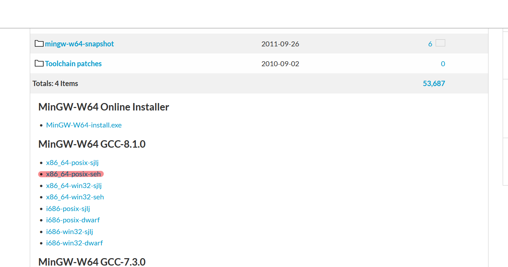
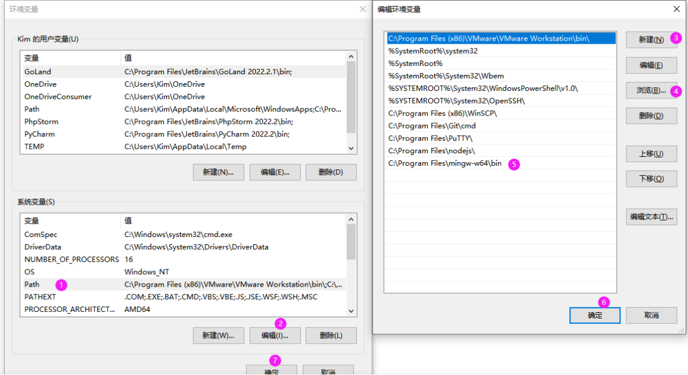

# hugo网站搭建

## 1.前置条件
- [go](https://github.com/golang/go)
- [git](https://git-scm.com/book/en/v2/Getting-Started-Installing-Git)
- [hugo](https://gohugo.io/)
- [hugo下载](https://github.com/gohugoio/hugo)

### 1.1 hugo下载安装
```
go env -w CGO_ENABLED=1
go install -tags extended github.com/gohugoio/hugo@latest
```
如果出现gcc报错，需要根据如下流程安装gcc
1. 打开链接[下载](https://sourceforge.net/projects/mingw-w64/files/mingw-w64/)
2. 选择版本下载（win11为例）

3. 解压到目录
C:\Program Files (x86)\mingw64
4. 设置环境变量

### 1.2 hugo使用
[参考文档](https://gohugo.io/getting-started/quick-start/)
[中文文档](https://www.gohugo.org/doc/overview/quickstart/)

### 1.3 github部署hugo模板
1. 在github创建仓库
`Repository name`那一栏，格式为`<name>.github.io`。如果你想让你的博客网址就是`.github.io`，则`<name>`不能是任意名字，必须是你的github用户名。
2. gitclone仓库到本地
3. 下载主题模板到本地文件夹内并git push
4. 进入`https://github.com/<name>/<name>.github.io`点击上方栏的`Settings`，然后点击左方栏的`Pages`，在`Build and deployment`里的`Source`中选择`Github Actions`，在下面找到`Hugo`，点击`Configure`，在新界面点击右侧的绿色按钮的`Commit changes...`。
找不到`Hugo`就去`browse all workflows`里找。
5. 后续写博客
后续更新只需要在`content`文件夹加入md文件，然后执行

### 1.4 基于gitalk的评论区

- 使用 GitHub 登录
- 支持多语言 [en, zh-CN, zh-TW, es-ES, fr, ru, de, pl, ko, fa, ja]
- 支持个人或组织
- 无干扰模式（设置 distractionFreeMode 为 true 开启）
- 快捷键提交评论 （cmd|ctrl + enter）

[Readme](https://github.com/gitalk/gitalk/blob/master/readme.md)
[在线示例](https://gitalk.github.io)

#### 安装

两种方式

- 直接引入

```html
  <link rel="stylesheet" href="https://cdn.jsdelivr.net/npm/gitalk@1/dist/gitalk.css">
  <script src="https://cdn.jsdelivr.net/npm/gitalk@1/dist/gitalk.min.js"></script>

  <!-- or -->

  <link rel="stylesheet" href="https://unpkg.com/gitalk/dist/gitalk.css">
  <script src="https://unpkg.com/gitalk/dist/gitalk.min.js"></script>
```

- npm 安装

```sh
npm i --save gitalk
```

```js
import 'gitalk/dist/gitalk.css'
import Gitalk from 'gitalk'
```

#### 使用

首先，您需要选择一个公共github存储库（已存在或创建一个新的github存储库）用于存储评论，

然后需要创建 **GitHub Application**，如果没有 [点击这里申请](https://github.com/settings/applications/new)，`Authorization callback URL` 填写当前使用插件页面的域名。

最后, 您可以选择如下的其中一种方式应用到页面：

##### 方式1

添加一个容器：

```html
<div id="gitalk-container"></div>
```

用下面的 Javascript 代码来生成 gitalk 插件：

```js
var gitalk = new Gitalk({
  clientID: 'GitHub Application Client ID',
  clientSecret: 'GitHub Application Client Secret',
  repo: 'GitHub repo',
  owner: 'GitHub repo owner',
  admin: ['GitHub repo owner and collaborators, only these guys can initialize github issues'],
  id: location.pathname,      // Ensure uniqueness and length less than 50
  distractionFreeMode: false  // Facebook-like distraction free mode
})

gitalk.render('gitalk-container')
```

##### 方式2：在React使用

使用以下代码引入Gitalk组件

```jsx
import GitalkComponent from "gitalk/dist/gitalk-component";
```

按以下方式在React中使用Gitalk组件

```jsx
<GitalkComponent options={{
  clientID: "...",
  // ...
  // 设置项
}} />
```

#### 设置

- **clientID** `String` 

  **必须**. GitHub Application Client ID.

- **clientSecret** `String` 

  **必须**. GitHub Application Client Secret.

- **repo** `String` 

  **必须**. GitHub repository.

- **owner** `String` 

  **必须**. GitHub repository 所有者，可以是个人或者组织。

- **admin** `Array` 

  **必须**. GitHub repository 的所有者和合作者 (对这个 repository 有写权限的用户)。

- **id** `String` 
  
  Default: `location.href`.

  页面的唯一标识。长度必须小于50。
  
- **number** `Number` 
  
  Default: `-1`.

  页面的 issue ID 标识，若未定义`number`属性则会使用`id`进行定位。

- **labels** `Array` 
  
  Default: `['Gitalk']`.

  GitHub issue 的标签。

- **title** `String` 
  
  Default: `document.title`.

  GitHub issue 的标题。

- **body** `String` 
  
  Default: `location.href + header.meta[description]`.

  GitHub issue 的内容。

- **language** `String` 
  
  Default: `navigator.language || navigator.userLanguage`.

  设置语言，支持 [en, zh-CN, zh-TW, es-ES, fr, ru, de, pl, ko, fa, ja]。

- **perPage** `Number` 
  
  Default: `10`.

  每次加载的数据大小，最多 100。

- **distractionFreeMode** `Boolean` 
  
  Default: false。

  类似Facebook评论框的全屏遮罩效果.

- **pagerDirection** `String`

  Default: 'last'

  评论排序方式， `last`为按评论创建时间倒叙，`first`为按创建时间正序。

- **createIssueManually** `Boolean` 
  
  Default: `false`.

  如果当前页面没有相应的 isssue 且登录的用户属于 admin，则会自动创建 issue。如果设置为 `true`，则显示一个初始化页面，创建 issue 需要点击 `init` 按钮。

- **proxy** `String` 

  Default: `https://cors-anywhere.azm.workers.dev/https://github.com/login/oauth/access_token`.

   GitHub oauth 请求到反向代理，为了支持 CORS。 [为什么要这样?](https://github.com/isaacs/github/issues/330)

- **flipMoveOptions** `Object` 
  
  Default:
  ```js
    {
      staggerDelayBy: 150,
      appearAnimation: 'accordionVertical',
      enterAnimation: 'accordionVertical',
      leaveAnimation: 'accordionVertical',
    }
  ```

  评论列表的动画。 [参考](https://github.com/joshwcomeau/react-flip-move/blob/master/documentation/enter_leave_animations.md)

- **enableHotKey** `Boolean` 
  
  Default: `true`.

  启用快捷键(cmd|ctrl + enter) 提交评论.


#### 实例方法

- **render(String/HTMLElement)**

  初始化渲染并挂载插件。

#### TypeScript

已经包括了配置项和Gitalk类的类型定义，不包括React组件的类型定义。

