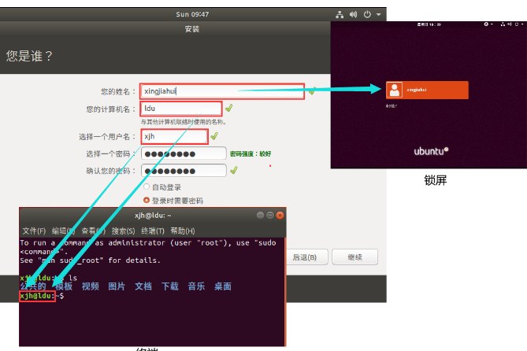
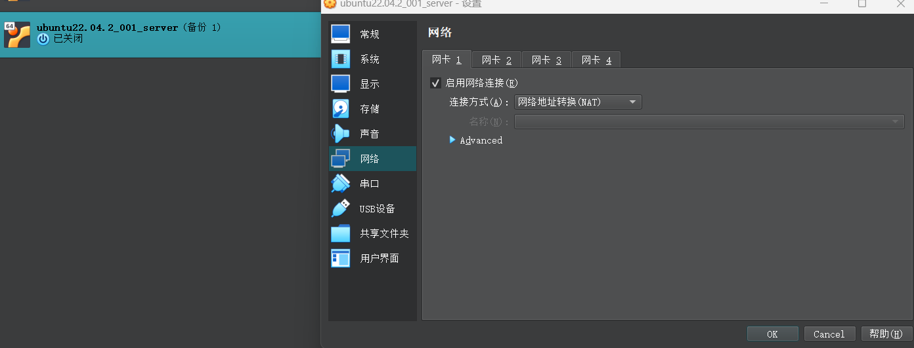
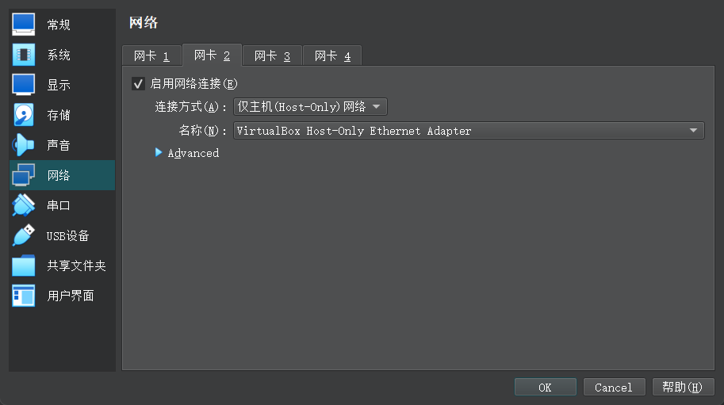
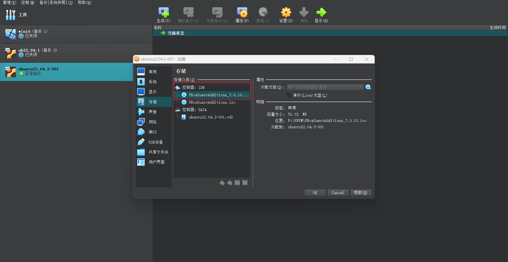

[新网卡配置](https://blog.csdn.net/xiongyangg/article/details/110206220)
#### 前置


## 姓名、主机名、用户名

```
您的姓名->指的是计算机登录时，显示的名字，与下面的2行密码(这个密码是用户名的密码，非姓名的密码，而且这个密码可以)配合登录计算机，登录之后就没什么用了

计算机名->指的是计算机登录之后的主机名，也就是hostname，在shell终端中输入hostname，会显示该名称，同时，shell终端的命令提示符格式就是：user@hostname:~$:   这个hostname就是这个计算机名，至于它的作用，自行百度即可

用户名：->指的是计算机登录之后的用户名，在shell终端中使用w命令可以查看当前所有登录过的用户名，使用who/whoami可以查看当前登录的用户名，使用ssh远程登录时，需要使用的就是用户名
```
## 配置虚拟机双网卡


如果为ubuntu新添加了网卡，那么通过命令ifconfig -a可以看到所有网卡，但是可能有网卡没有工作，这个情况下使用ifconfig就会看到出现网卡比使用参数-a少，那没有出现的网卡就是没有生效。

所有网卡：
```
xanarry@vbs:~$ ip addr
enp0s3: flags=4163<UP,BROADCAST,RUNNING,MULTICAST>  mtu 1500
        inet 10.0.2.15  netmask 255.255.255.0  broadcast 10.0.2.255
        inet6 fe80::a00:27ff:fe34:4ea1  prefixlen 64  scopeid 0x20<link>
        ether 08:00:27:34:4e:a1  txqueuelen 1000  (Ethernet)
        RX packets 489  bytes 46089 (46.0 KB)
        RX errors 0  dropped 0  overruns 0  frame 0
        TX packets 337  bytes 44455 (44.4 KB)
        TX errors 0  dropped 0 overruns 0  carrier 0  collisions 0

enp0s8: flags=4163<UP,BROADCAST,RUNNING,MULTICAST>  mtu 1500
        inet6 fe80::a00:27ff:fea2:190e  prefixlen 64  scopeid 0x20<link>
        ether 08:00:27:a2:19:0e  txqueuelen 1000  (Ethernet)
        RX packets 46  bytes 4880 (4.8 KB)
        RX errors 0  dropped 0  overruns 0  frame 0
        TX packets 20  bytes 2761 (2.7 KB)
        TX errors 0  dropped 0 overruns 0  carrier 0  collisions 0

lo: flags=73<UP,LOOPBACK,RUNNING>  mtu 65536
        inet 127.0.0.1  netmask 255.0.0.0
        inet6 ::1  prefixlen 128  scopeid 0x10<host>
        loop  txqueuelen 1000  (Local Loopback)
        RX packets 90  bytes 6813 (6.8 KB)
        RX errors 0  dropped 0  overruns 0  frame 0
        TX packets 90  bytes 6813 (6.8 KB)
        TX errors 0  dropped 0 overruns 0  carrier 0  collisions 0
```


工作网卡：
```
xanarry@vbs:~$ ifconfig
enp0s3: flags=4163<UP,BROADCAST,RUNNING,MULTICAST>  mtu 1500
        inet 10.0.2.15  netmask 255.255.255.0  broadcast 10.0.2.255
        inet6 fe80::a00:27ff:fe5e:ad3f  prefixlen 64  scopeid 0x20<link>
        ether 08:00:27:5e:ad:3f  txqueuelen 1000  (Ethernet)
        RX packets 78  bytes 9938 (9.9 KB)
        RX errors 0  dropped 0  overruns 0  frame 0
        TX packets 70  bytes 13068 (13.0 KB)
        TX errors 0  dropped 0 overruns 0  carrier 0  collisions 0

lo: flags=73<UP,LOOPBACK,RUNNING>  mtu 65536
        inet 127.0.0.1  netmask 255.0.0.0
        inet6 ::1  prefixlen 128  scopeid 0x10<host>
        loop  txqueuelen 1000  (Local Loopback)
        RX packets 84  bytes 6324 (6.3 KB)
        RX errors 0  dropped 0  overruns 0  frame 0
        TX packets 84  bytes 6324 (6.3 KB)
        TX errors 0  dropped 0 overruns 0  carrier 0  collisions 0
```
如何生效：
ubuntu20网络的配置信息将不在保存在/etc/network/interfaces文件中，虽然该文件依然存在，但是内容是空的。新系统已经使用netplan管理网络，对于配置信息，使用vim打开文件sudo vim /etc/netplan/00-installer-config.yaml，内容如下，可以看到网卡enp0s3下面有参数dhcp4: true，说明该网卡开启了dhch地址分配，但是并没有出现enp0s8，所以手动加入enp0s8。

注意：yaml文件名在不同的机器上文件名可能不同。
```
network:
  ethernets:
    enp0s3:
      dhcp4: true
  version: 2
```
添加过后的内容为：
```
network:
  ethernets:
    enp0s3:
      dhcp4: true
    enp0s8:
      dhcp4: true
  version: 2
```
最后执行
```
sudo netplan apply
```
生效
##### 参考[https://ubuntu.com/server/docs/network-configuration](https://ubuntu.com/server/docs/network-configuration)
##### 万能[https://git.cuc.edu.cn/ccs/linux-2023/LiMingxuan](https://git.cuc.edu.cn/ccs/linux-2023/LiMingxuan)


## scp传输文件
```
scp test.txt lihan@192.168.56.103:/home/lihan/leo
lihan@192.168.56.103's password:
```
- 一定要加上':',不能多打空格！！
- 记得无论是linux-->windows还是回传，都是在windows命令行操作
```
scp lihan@192.168.56.103:/home/lihan/leo/test.txt D:\大二学习\Linux\自学
lihan@192.168.56.103's password:
```

## vim操作
- 按i进行插入
- :q!不保存退出 :wq!保存退出
- 记得sudo


## ssh免密登录
### 1.ssh登录Bad permission
```
找到.ssh文件夹。它通常位于C:\Users，例如C:\Users\Akkuman。
右键单击.ssh文件夹，然后单击“属性”。
找到并点击“安全”标签。
然后单击“高级”。 单击“禁用继承”，单击“确定”。 将出现警告弹出窗口。单击“从此对象中删除所有继承的权限”。
你会注意到所有用户都将被删除。让我们添加所有者。在同一窗口中，单击“编辑”按钮。
接下来，单击“添加”以显示“选择用户或组”窗口。
单击“高级”，然后单击“立即查找”按钮。应显示用户结果列表。 选择您的用户帐户。
然后单击“确定”（大约三次）以关闭所有窗口。
完成所有操作后，再次关闭并打开VSCode 并尝试连接到远程SSH主机。
现在这个问题应该解决了
```

### 2.ssh免密登录配置（以windows远程登录虚拟机linux为例）
#### 确保linux和windows都有ssh后，首先在windows下生成公私钥
```
ssh-keygen -b 4096
```
弹出提示命名（如果只有一个公私钥对就直接按回车用默认命名），进行命名
弹出提示密码，直接回车两次跳过设置密码
#### 将生成在C:\Users\leo\.ssh下的公钥xxxx.pubscp发送到linux的/home/lihan/.ssh目录下，并替换authorized_keys文件内容
#### 注意 如果有多个免密登录配置，记得在windows的C:\Users\leo\.ssh目录下，修改config文件，指定公私钥地址


#### 若仍存在问题 
```
sudo vim /etc/ssh/sshd_config

修改
PubkeyAuthentication yes
AuthorizedKeysFile .ssh/authorized_keys

添加
RSAAuthentication yes
```

### 共享文件夹
首先安装客机增强键
1. 下载[VBoxGuestAddtions_7.0.10](http://download.virtualbox.org/virtualbox/7.0.10/VBoxGuestAdditions_7.0.10.iso)

2. 下载好后，在储存介质中挂载


3. 打开虚拟机安装
```
#提权
sudo su

#更新apt-get
apt-get update  &&  apt-get upgrade

#安装依赖工具
apt-get install dkms  && apt-get install build-essential3. reboot4. 登陆后 

#选择设备->安装增强功能（报错不用管 叉掉）


#挂载cdrom
mount /dev/cdrom /mnt/ 

出现 warning不用管
#安装
/mnt/VBoxLinuxAddtions.run

#卸载
umount /mnt/
```

4. 挂载共享文件夹


5. 执行共享文件夹的挂载命令
``` 
sudo mount -t vboxsf [你设置的共享文件夹名称名称] [挂载后的本地路径]
#例如
sudo mount -t vboxsf virtualBoxFile /home/lihan/win_share
```
- 安装好后就可以删掉客机增强键的包了

### 使用sudo出现问题：xxx is not in the sudoers file

1. 输入指令
```
# 进入root用户中，$变成了#
su

```


2. 输入指令
```
sudo adduser vboxuser sudo 
注意，vboxuser就是我被玩坏，需恢复的用户，大家记得替换成自己的用户名
```

3. 重启后就好了

### linux clash
[https://dreamacro.github.io/clash/zh_CN/introduction/service.html](https://dreamacro.github.io/clash/zh_CN/introduction/service.html)

然后打开[clash.razord.top/](clash.razord.top/)配置，7890或者9090端口
