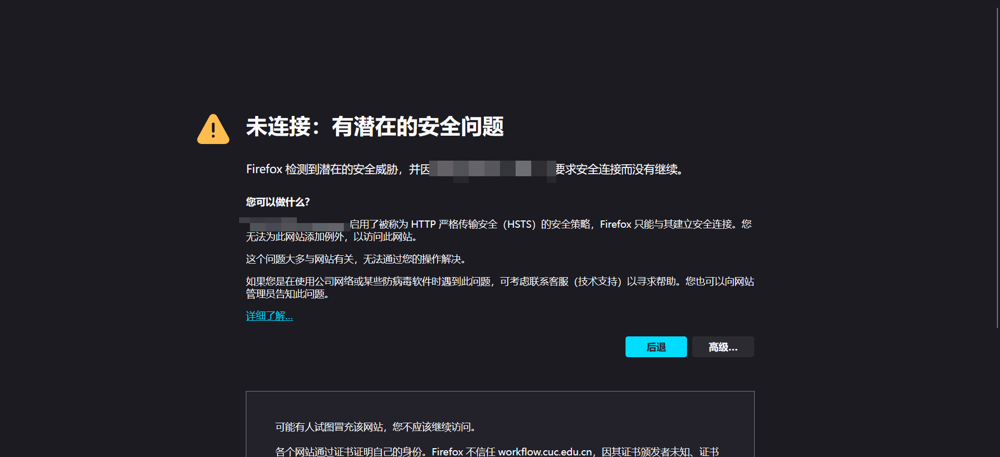
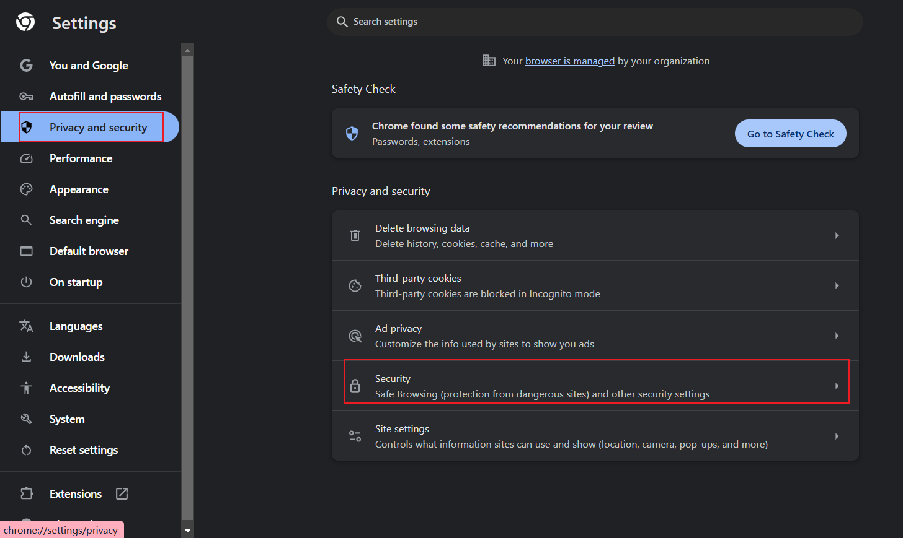
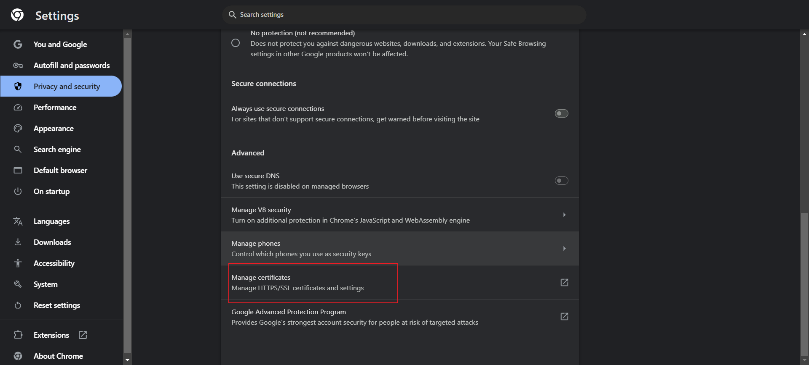
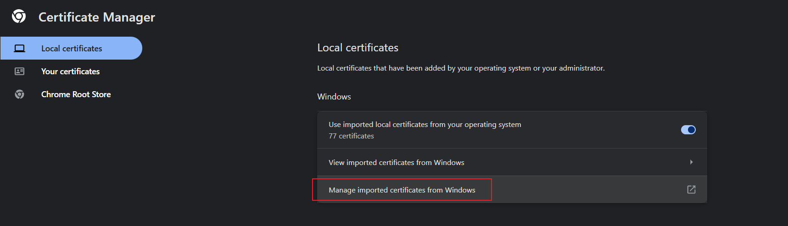
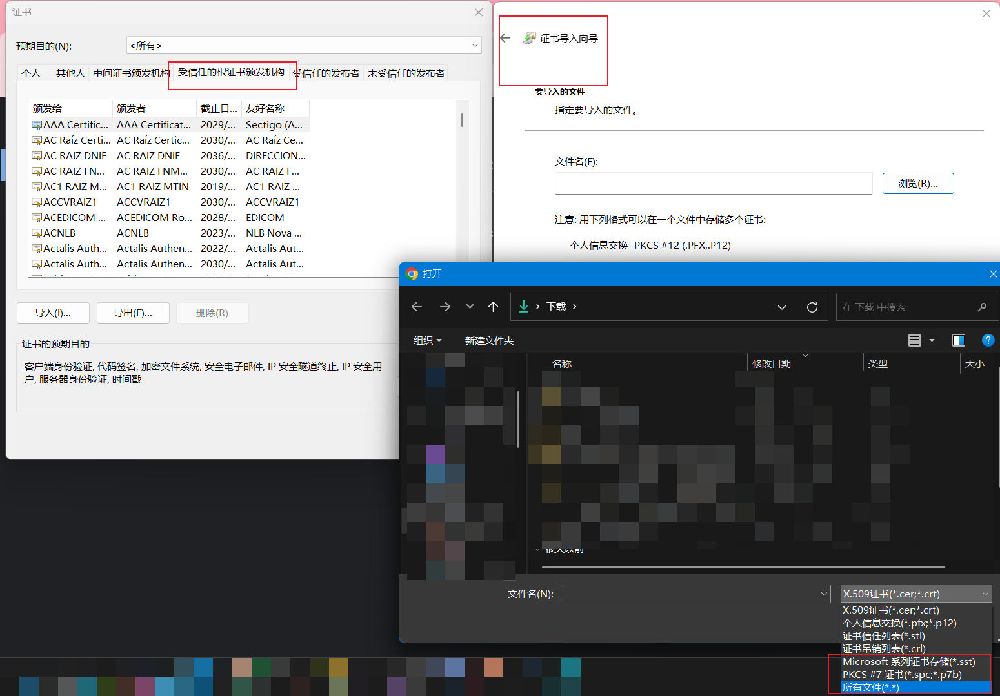

## 问题

学校羽毛球预约系统换新了，想用 Burp Suite 看看 url api 什么的，打开浏览器的 FoxyProxy 开启代理后，浏览器显示连接不是私密连接(Private)。这其实是个老问题了，今天索性解决了。

Firefox 浏览器开启 FoxyProxy 后访问HTTPS网站，显示如下（Chrome等浏览器会有些差别）：

## 解决

网上主要两类解决方法，一个是临时修改浏览器配置，允许访问不安全的网站，另一个是安装 Burp Suite 证书。我肯定就选一劳永逸的了哈哈。
按照[参考链接](https://www.cnblogs.com/jiangyatao/p/13139576.html)中的方法：

1. 下载证书

打开 Burp Suite ，打开浏览器的 FoxyProxy ，访问`http://burp`，点击`CA Certificate`下载证书。应该是`cacert.der`文件。

2. 导入证书

以 Chrome 为例，打开设置，搜索证书（Certificate），点击`管理证书`，选择`受信任的根证书颁发机构`，点击`导入`，选择`cacert.der`文件，一路确定即可。

3. 重启浏览器

4. 访问 HTTPS 网站
