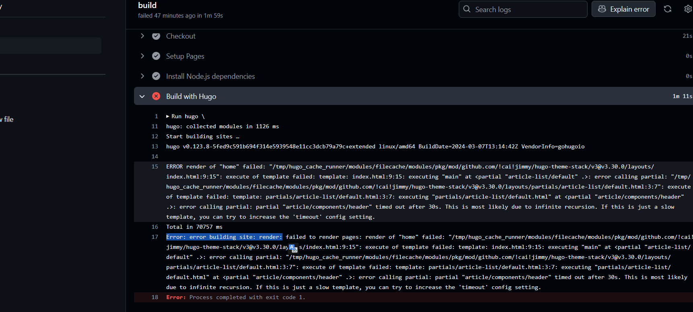

# 问题



```
Run hugo \
hugo: collected modules in 1126 ms
Start building sites … 
hugo v0.123.8-5fed9c591b694f314e5939548e11cc3dcb79a79c+extended linux/amd64 BuildDate=2024-03-07T13:14:42Z VendorInfo=gohugoio

ERROR render of "home" failed: "/tmp/hugo_cache_runner/modules/filecache/modules/pkg/mod/github.com/!cai!jimmy/hugo-theme-stack/v3@v3.30.0/layouts/index.html:9:15": execute of template failed: template: index.html:9:15: executing "main" at <partial "article-list/default" .>: error calling partial: "/tmp/hugo_cache_runner/modules/filecache/modules/pkg/mod/github.com/!cai!jimmy/hugo-theme-stack/v3@v3.30.0/layouts/partials/article-list/default.html:3:7": execute of template failed: template: partials/article-list/default.html:3:7: executing "partials/article-list/default.html" at <partial "article/components/header" .>: error calling partial: partial "article/components/header" timed out after 30s. This is most likely due to infinite recursion. If this is just a slow template, you can try to increase the 'timeout' config setting.
Total in 70757 ms
Error: error building site: render: failed to render pages: render of "home" failed: "/tmp/hugo_cache_runner/modules/filecache/modules/pkg/mod/github.com/!cai!jimmy/hugo-theme-stack/v3@v3.30.0/layouts/index.html:9:15": execute of template failed: template: index.html:9:15: executing "main" at <partial "article-list/default" .>: error calling partial: "/tmp/hugo_cache_runner/modules/filecache/modules/pkg/mod/github.com/!cai!jimmy/hugo-theme-stack/v3@v3.30.0/layouts/partials/article-list/default.html:3:7": execute of template failed: template: partials/article-list/default.html:3:7: executing "partials/article-list/default.html" at <partial "article/components/header" .>: error calling partial: partial "article/components/header" timed out after 30s. This is most likely due to infinite recursion. If this is just a slow template, you can try to increase the 'timeout' config setting.
Error: Process completed with exit code 1.
```

Hugo + Stack 部署在 GitHub Pages 下，一次正常更新推文后，突然出现部署失败，报错如上。

# 解决

由于在`.gitignore`中添加了`public/` `resources/`，导致在 GitHub Actions 每次会重新生成所有图片等资源，如果过多就会导致超时。

将`config\_default\config.toml`中的`timeout`设置为`120`（单位为秒），可以解决问题。

```toml
timeout = 120
```

# 注意

可能通过修改`.gitignore`中的`public/` `resources/`，不让 GitHub Actions 每次重新生成所有图片等资源，只生成新增资源来解决问题。

# 参考

