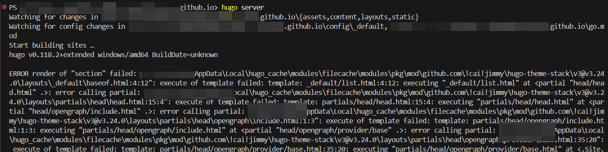

# 问题



hugo主题stack版本更新到v3.24.0后，搭建网站时会出现如图报错。

# 解决

stack v3.24.0 版本需要 hugo 0.123.8以上版本。
更新 hugo 版本即可解决。

# 注意

使用时，也会出现同样的问题，需要修改`.github\workflows\hugo.yml`文件中的hugo版本。

```yml
jobs:
  # Build job
  build:
    runs-on: ubuntu-latest
    env:
      HUGO_VERSION: 0.123.8
```