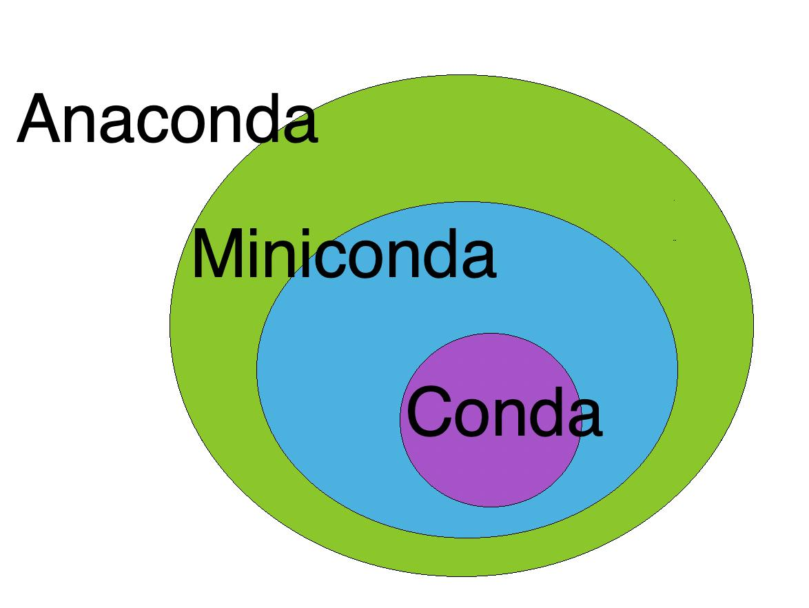

## 前言

毕业配了个新机，想着干干净净的环境，Python 干脆也研究下怎么更好地进行版本管理，省的又变得乱七八糟的，于是研究了下，选择了在 Windows 下使用 Anaconda 来配置 Python 环境。

## 简介与 Conda 选择

Anaconda 是一个开源的 Python 发行版，专为科学计算、数据科学和机器学习等领域设计。它集成了 Python 解释器、常用的科学计算库（如 NumPy、Pandas、Matplotlib 等）以及包管理工具 conda。Anaconda 提供了一个易于使用的环境管理和包管理系统，使得用户可以轻松地创建和管理不同的 Python 环境。



1. Conda（Miniconda和Anaconda都包含此命令，用来管理虚拟环境）：

Conda是一个开源的包管理系统和环境管理系统，用于安装多种语言的软件包。虽然它是为Python程序创建的，但它也可以用于其他语言，比如R，Scala，Java，JavaScript，C/ C++等。Conda允许你创建、导出、列出、删除和更新包含多个环境的Python版本，这对于处理具有不同依赖关系的多个项目特别有用。

2. Miniconda（默认环境只有Python和Conda，自定义安装其他包，使用时需要激活虚拟环境）：

Miniconda是Anaconda的轻量级版本，只包含了Python和Conda，以及它们的依赖项。Miniconda的优点是其小巧且快速，用户可以自行选择并安装他们需要的软件包。

3. Anaconda（还集成了科学计算和深度学习相关包，创建新的虚拟环境中不会使用这些包（新虚拟环境只有指定的python版本，需要安装其他东西，除非命令中指定虚拟环境复制默认环境，相关命令为'conda create --name myenv --clone base'），适合在默认环境或者系统变量中使用Anaconda的人）：

Anaconda是一个非常流行的Python发行版，用于科学计算。它包含了conda、Python和超过150个科学软件包及其依赖项。Anaconda的目标是简化包管理和部署。Anaconda适合那些希望一次性安装所有东西的用户。

如果使用conda搭建虚拟运行环境，无所谓这三个，因为都需要定制虚拟环境，安装也不费劲。

看完以上还不知道安装哪个？-->安装Anaconda，它除了安装包大，没其他缺点。

<hr>

From [conda、miniconda、anaconda之间有什么关系？ - Ridge的回答 - 知乎](https://www.zhihu.com/question/369468216/answer/3024064186)

<hr>

注意：
- [anaconda.com](https://www.anaconda.com/) 是 Anaconda 的官方网站，提供了 Anaconda 的下载、文档和支持信息。
- [anaconda.org](https://anaconda.org/) 是 Anaconda 的包仓库，提供了大量的开源软件包和库，可以通过 conda 命令轻松安装。

## Anaconda 安装

1. 访问 [Anaconda 官网下载](https://www.anaconda.com/download/success) 下载 Anaconda 安装包。

2. 运行安装包，按照提示进行安装。

3. 添加环境变量

- 在安装过程中，选择“将 Anaconda 添加到系统 PATH 环境变量”选项（如果没有这个选项，可以手动添加）。
- 如果没有添加，可以手动将 Anaconda 的安装路径（如 `C:\ProgramData\anaconda3\Scripts\` ）添加到系统的 PATH 环境变量中。

4. 验证安装

- 打开命令提示符（CMD）或 PowerShell，输入以下命令验证 Anaconda 是否安装成功：

```bash
conda --version
anaconda --version
```

5. 激活 Anaconda 环境

- 在命令提示符或 PowerShell 中输入以下命令激活 Anaconda 环境：

```bash
conda activate base
```

命令行会增加 `(base)` 前缀，表示 Anaconda 的基础环境已激活。

<hr>

注意————**PowerShell脚本 ExecutionPolicy**：
- 

<hr>