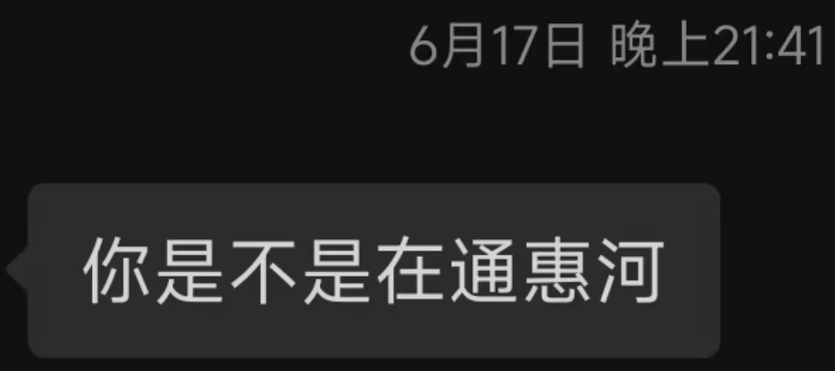

```
Should auld acquaintance be forgot,
And never brought to mind?
Should auld acquaintance be forgot,
And auld lang syne? 
For auld lang syne, my jo,
For auld lang syne,
We'll tak a cup o' kindness yet,
For auld lang syne. 

———— Auld Lang Syne
```

## 毕业随想·拖延

```yaml
date: 2025-06-19 23:17:00+0800
```

为毕业写点什么的想法恐怕从很早有了。特别是最后两个月里，每次和室友玩了一趟，都想着得赶紧记录下了，一是不放心自己不靠谱的记忆，二是让 1228 与我的本科时光在博客里永生吧。

除了客观的需求（主观的客观？），总是在情绪上来的时候更有码字的冲动，大部分随笔都诞生在消极的情绪下。上次的“毕业随笔”里说，一直用“理想与追求”麻痹自己，还担心毕业前的一两个月里都在忧伤中度过，不曾想和 1228 六个人连欢了两个月，把忧伤留到了最后。

想着有 cwt 拍的那些照片回忆，倒也不用那么担心我糟糕的记性，到毕业最后几天，本想着该抽出时间写了吧，晚上又是和 wy zhj 打《黑夜君临》去了，一拖就是回到了西安。本想着缩在我那闷热的小房间里，夜深人静戴着耳机酝酿下情绪该写了，乱七八糟的事情又搞得直到我来了武汉还是一笔没动。

这两天一直在倒腾新装的电脑，白天的时候准备在新电脑上开个文件服务器传文件来着，想着难得发个技术博文，顺便研究下新电脑的 Python 环境，搞个 miniconda，这新博客的需求上来了，我就跟那栈一样，不得不把早早想着的毕业随想顶出来了。

打开 VS Code 一看，好家伙上次这博客时间还是 19 号，回西安的第二天晚上————其实算第一天了，因为首日睡了一觉直接去乾县呆了一天。

不能再拖了，再拖着，那些记忆真的要模糊了。

## 时间·伤感

伤感对我来讲太熟悉了，至今仍记得三四岁的我，站在西安旧居的客厅中央，午后的日光洒在地板上，我看到拿着晾衣杆的母亲，忽然就有了一种奇怪的感觉。我想这就是第一次对时间的感伤吧。

小时候父母算管得严的了，除了看书，发呆思考和幻想是我打发时间的主要方式了，走在上学放学的路上，胡思乱想些什么很快就让路程被“跳过剧情”了，而夜晚则是我思考人生的主战场了。就在此刻坐着的书桌前，在阳台的玻璃门前，在捂着头的被窝里，我花了太多太多心思与感情在与时间周旋了。

小学高年级的时候，想到马上就要毕业，我躲在被窝里哭，那时候很享受伤感的感觉，总时有意让自己回忆从小到大的所有往事，这种“爱好”一直持续到高三的时候，现在想来，也算是年少不识愁滋味了。小学毕业后，毕业伤感的“程序”愈演愈烈，以至于初中高中刚入学就开始幻想毕业时候的伤感了。到了大学，我想自己总算意识到自己总能适应新的环境，这种感伤不过是对离开熟悉的环境熟悉的人的不安吧。

感伤与死亡纠缠起来，我对时间流逝之快是深恶痛绝，高中以后倒是开始厌恶起感伤，到了后来拒绝一丝一毫的情感波动的境地————悲剧内核的喜剧云云我是完全拒绝，看剧我就看只图一乐的“庸俗”剧情。唉，小时候那个看着星际精灵蓝多多还能为大结局流泪的 lihan 是一去不返了，这些年每次情绪波动起来的时候，自以为的理智思考跟消防员一样第一时间就会冲出来开始救火。

两年恋爱、为前途的努力(emmm努力？)、保研后混乱的生活还有疯玩的最后两个月把一切都推到毕业前的最后几天。我本以为自己不会再想小时候那样为毕业而感伤，追求、享乐或者其他什么东西，也许真的让我现实起来了。**没想到毕业退无可退，情绪就连本带息的来收债了**。


## 崩溃·朋友

这段日子里第一次崩溃也就是上次随笔的时候，和 cwt 吃了几次学校旁边的老陕老晋，逛了几次超市，几番交流下来，愈发舍不得与像他这样的朋友分别。

看来高考前那段时间我也想了不少哈哈，当时忽然意识到自己交朋友都是一段一段的，从五六年级开始与 xkw 的友情开始，每个朋友似乎都对应着一段时间和一端经历：xkw是陪我吃半秋山、看谍中谍、上培优班；cyt（算吗...）是初一被她戏弄；zzl lss srp 算是初中最后的日子里陪我胡闹的伙伴吧；高一认识了 lcy ，听我胡言乱语，一起桌游羽毛球乒乓球；后来是 fmm ，斗罗大陆与皇室战争时期；美国期间和 wsq 促膝长谈，“从小缺爱”让我记到了现在；疫情网课期间和后来，忽悠 xby 打各种游戏；高三和 zqz 的同桌的最后的日子里，让我模模糊糊看到了一点高中后的未来。

大学里和五个舍友也是轮番熟悉起来，先是谈恋爱时候拉着 zhj 到处陪我和 zyx 吃喝玩乐；分手后和 wy 折腾前卫艺术社；后来跟 cwt 研究 Linux 和博客；再后来天天拉着 lys 打游戏，出去玩，参加活动；最后和 lmx 也在毕业前算是熟悉了一些。

有些朋友过了那段时期就再也没什么联系，像 lcy 这样的朋友毕竟是少数，我自知是运气让我遇到了 1228————又有多少人愿意听我键政、陪我口嗨、半夜在宿舍楼道里通宵辩论：**或者说，我不自信还会遇到这样让我能放松一切防备，为所欲为的人了**。

一次通惠河边的长谈过后，我就在宿舍床上抱着电脑一边慌慌张张地码着博文一边想着即将分别，想着即将到来的研究生生活的无趣，忍不住埋在枕头上痛苦。

连着两个月的疯玩给情绪按下了暂停键，现在想来也不好说是“索性”吧。从雍和宫到古北水镇，从试驾 Su7 到叠人墙翻上野长城，我只是自顾自地一直快乐下去了。

6月15号毕业典礼的时候，我看着漫天飞散的彩纸，耳畔是校歌熟悉的旋律，泪水终是没忍住流下来两簇。我不明白，我不理解，我不接受，为什么光阴似箭，日月如梭，为什么 Happines always ends 。我只知道，大学本科从这一刻起不再是我的身份，我的生活，它永远化为了我的回忆。


天下没有不散的宴席，这样的道理谁又不懂，可是生命终有尽头，年轻的日子更是寸秒寸金，临别前讲的再见往往都是诀别。每一刻正在进行的经历不过是在制作中的回忆，**当人和日子只能在脑海中追忆，快乐很快就氧化成了悲伤**。

好在这天的太阳那么大，这天的阳光那么耀眼，这天的人也是熙熙攘攘，我没有崩溃太多，甚至还蹭了动院的毕业合照（哈哈）。

到了晚上蓝条便耗尽了，在最后日子里的每个晚上，我都忍不住地跑到通惠河边坐着。

我看着流淌的河水，看着塔吊还有后面慢慢挪移的月亮，我忽然意识到自己为什么这么难受：都是我干的啊！！！都是我干的！！！凭什么要给我夺走！！！大学四年的日子是我过的！朋友和陌生人都是我认识的！事情都是我干的！美食美景都是我品尝的！**我辛辛苦苦好不容易经营出的四年大学时光，凭什么就这么付之一炬！！！**

泪水止不住地滴落，我难受地躺在堤边打滚，担心弄脏衣服又忽地坐起。当眼泪滴落在岸边时，我想到也许若干年后再回到通惠河边，会看到当年的泪痕吗。


河边去了三四天吧，有时候在哭，好像隐隐约约又找到了点儿时感伤的快感，不过很快就是更大地痛苦涌上来；有时候我在拼命地想通痛苦的根源是什么，可是想通也没用，**解决不了的问题，越是清楚，越是绝望**；有时候我想我是需要一个人陪我吧，我会懊悔过去的错过，懊悔我推开的那些人，其实我要的永恒的陪伴，无论是过去还是未来，这个宇宙里是不可能找到的。

我好想好想现在有一个人，在我痛哭时坐在我身边，就像翻版的我一样彻彻底底地懂我的一切————我在通惠河边边哭边想。不过这样简单美好的幻想总是难以在我的脑海里存活几秒，忍不住继续想下去就会知道，没有永恒，那么越是完美的幸福，越是会在结束时带给我更大的伤痛，**只有我自己才是最可靠的**。

可是，可是，lihan 是社交动物，是社会关系的总和，可是，可是......

我的脑袋在通惠河边没有一次是清醒的，河边奏起的友谊地久天长更是完美的背景音乐，正巧 wxy 发来毕业典礼的合照，我终是没忍住发了一张通惠河边的照片，我不敢奢望她或者是任何人能理解我，看着她发的老掉牙的安慰，我在想：像她这样的人会有这样的烦恼吗？


学业的成功自不必说，感情上记得她提过并没有这方面的追求，与刻板印象里的学霸形象不同，LOL、番剧、出游也丰富着她的娱乐生活，学生干部的工作也是有条不紊————这样把各个方面都平衡的状态其实一直是我渴望做到的，她真的做到了。她和 wzr 一样，他们总是知道自己要什么，自己要做什么，她们不会同我这般迷茫，亦不会有时间和精力去浪费自己的感情在这种荒谬的想法与事情上吧。

6月17日，我的痛苦正处极点，我真的好不想去 KTV ，我知道我会忍不住哭泣，可是我还是去了。和 lys 一路骑行过来，又是一阵畅想人生，到了 KTV 里，我真的无法面对这些人：**zyx** **zhj** **lys** **wy** **cwt** **yxy** **lmx** ，特别是有些人，也许我一生也不会再见到她们了。

wy 哭了，我真的听不得那些伤感的曲子，更见不得我的朋友的眼泪。我用尽了全身的力气在忍住我的泪水，此时此刻在码字的lihan亦是如此。

我不记得那可恶的泪水究竟淌下来了没有，临别的最后一顿终是定在了那家 lz 师哥 带我来的羊棒骨，即使我一开始希望能吃地更好些。一行人围在角落的圆桌，我根本没有心思尝菜，全部的力量都在阻止我的崩溃。

借口是什么我也记不得了，我又逃到了通惠河边，这次是河对岸。同样的崩溃，同样的嚎啕大哭，边哭还要边担心被他们发现。

wy 还是猜到了，我没有回复他的消息。



我想，我是不是没救了，我要一辈子陷入这痛苦的漩涡出不来了。这般的崩溃也不例外，伤感的情绪确实如同那古板的“吃饱了没事干导致的抑郁症”一般，在我忙起来时消散或者蛰伏。可是这也太痛苦了吧！！！我真的熬得过去这一关吗？真的，太难受了，真的太难受了，这也太夸张了。

答案自然是可以，我还是回到了宿舍，我还是活到了现在写下这篇帖子。可是剧烈的痛苦，让我下定了决心，**研究生三年，我绝不会允许一个人如 1228 般进入我的世界**。

## 【插曲】·春日影·一辈子

拖了几个月的帖子写到今天，耳边是单曲循环的 Mygo!!!!! 版本的 [`春日影`](https://github.com/lihan3238/music/raw/refs/heads/main/musics/%E6%98%A5%E6%97%A5%E5%BD%B1(MyGO!!!!!%20ver.)-MyGO!!!!!.mp3)，真的感觉自己能理解`高松灯`想要`组一辈子乐队`的请求（乞求）。弹幕说灯太重了，正如祥子骂素世`只想着自己呢`，灯确实是为了自己才希望组一辈子，可是灯和我都理解一个道理，没有永恒的保障，**为了不承受结束的痛苦，我宁愿放弃享受快乐**。只是我更贪心点，我不止要一辈子，我要永恒。

## 1228·青春

我有过很多感情，也与不少人和物有过牵连。有时我发现，每一段时期都有一个印在心底的象征。

每当我忆起爷爷奶奶，脑海里浮现的是我幼年在西安的短暂经历和那一个个回西安的假期。我总喜欢叫他们“爷！奶奶！”，而不是理论上的外公外婆，爷爷对我的爱浓缩在早晨的煎饼果子里。

田园般的少年生活早早就化作了 cyt 这个象征萦绕在我心头。她是我喜欢的第一个女生，也是我无忧无虑的小学初中生活的具象。

经历了快乐，结束时的痛苦也都让我刻骨铭心，纵使终究是忘却了。

倘若让我评价我的大学生活，也许我不会用成功来形容，毕竟无论是感情还是学业都有不少的遗憾与进步空间。我愿意用两个最庸俗不过的词语去描述：我度过了超级幸福与快乐的大学四年！

与过去的日子相比，大学的四年我很成功，我的成绩不再同高中般吊车尾，我也享受了两年的恋爱，我同 wy 组过社团，同 lys 混过酒吧，我打过游戏，游山玩水，遗憾绝谈不上！

一切的一切皆自 2021年9月9日第一次迈入 1228 这个宿舍起，也自 2025年6月18日最后一次迈出 1228 为终。


1228 之好我不再赘述，盖棺定论，我无悔将心全部掏出交由 1228，幸运的是 1228 亦未负我。

总之的总之，**1228 几乎已经是我的整个青春**————至少我是这么承认与定决了。

我情愿将 1228 与我的青春绑死，即使经历了并且还会再回味离别与结束时的绞痛，但这终究是最后一次的绝无仅有了。

是的，到此为止，到此为止了，我绝不再允许下一个 symbol 的出现了。

## 现实·逃跑

毕业之前，我用现实逃避痛苦，毕业之后，我还是只能用现实逃避痛苦。

2025年6月18日，离开 1228 ，离开 CUC 的日子。**当分别进入倒计时，我情愿早点逃跑**，每一秒钟都是对我的凌迟。偶然结识的对门师弟为我们用拍立得和他的古董相机记录下了我们分别前的照片，垂垂暮矣之时，我会拿着这几张照片跟子孙分享我的青春吗？还是在未来对着这些照片一个人以泪洗面？哈哈，我的 golden old days 。


没有告别，我趁所有人不注意第一个溜出来宿舍，带着我的行李箱步向离开之路。我怕五声“再见”足以让我放弃一切嵌入墙壁，永远住在 1228 的童话里。

**毕业之别，更像是一场逃跑，自知追不上，索性转身逃走，免得看到青春渐行渐远。**

本科的最后一个暑假，装了人生第一台自己装的电脑，看了人生第一次好好看的番，还有和 lcy 打了一假期的三角洲，稀里糊涂地就过去了。

夜半梦醒，对青春的留恋和痛苦仍不时折磨下我。

我要读清北博，我要当教授，我要努力，我又搬来了现实对抗它。

我开始幻想研究生三年努力学习，潜心科研，幻想我发顶会，练球技，醉笙歌......开学的两周里，我无不在想为我幻想的现实“努力”，纵使研究生的环境并称心，我仍下定了决心：

**我决定放弃研究生的三年生命，不会再创造任何回忆，永远忠于我 1228 的青春**


也许我的思路是一路当了教授，我可以做我想做的事情，也获得相对自由的时间与金钱，也许有了这些，**我还可以重组 1228**

**总有一天，我们能一起唱春日影**

即使，即使...

即使我知道，我在骗自己...

> *———— 终稿于 2025.9.14 午夜 于 NPWU* 
> *曾经那么想回到的西安，从定福庄1号到东祥路1号，祭奠我那些廉价又入骨的感情。*
