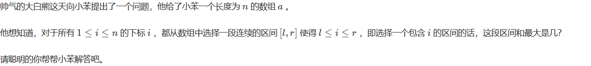

## 速度优化

- 1. cin好像比scanf慢
- 2. memset(f, -1, sizeof(int)*41); 用于初始化数组

```cpp
void *memset(void *s, int ch, size_t n);
```

- 3. 大问题拆成小问题，可以通过提前把小问题分别算出来，最后再合成大问题的解，相比直接将每次的大问题拆成小问题计算更好



```cpp

#include <iostream>
#include <algorithm>
using namespace std;

int a[200005];
long long sum[200005];
long long sum1[200005];
long long sum2[200005];

int main()
{
	int n;
	long long min=0,max=0;
	cin>>n;
	for(int i=1;i<=n;i++)
	{
		scanf("%lld",&a[i]);
		sum[i]=sum[i-1]+a[i];
	}
	min=0;
	sum1[1]=min;
	for(int i=2;i<=n;i++)
	{
		if(sum[i-1]<min)
			min=sum[i-1];
		sum1[i]=min;
	//	cout<<"min"<<min;
	}
	
	max=sum[n];
	sum2[n]=max;
	for(int i=n-1;i>=1;i--)
	{	
		if(sum[i]>max)
			max=sum[i];
		sum2[i]=max;
	//	cout<<"max"<<max; 
	}
	
	for(int i=1;i<=n;i++)
	{
		printf("%lld ",sum2[i]-sum1[i]);
	}
	
	return 0;
 } 

 
 

```

- 4. 记忆化搜索:搜索时创建数组或者其他数据结构，用来存储已经计算过的结果或已经搜索过的，避免重复计算

## 崩溃bug

- 1. 有+1 -1 数组大小记得多设点数组大小，别g了，不差那点
- 2. 大数组的定义，不要定义在main函数内部，会导致栈溢出
- 3. 二分查找——二分答案很多时候题目会让你去求解一个 ans ，这个 ans 有以下一些特征。比如求一个满足条件 A 的最大值/最 小值；或者求一个最大的最小值/最小的最大值，并且我们直接求解答案 A 非常困难，并且 ans 满足单调性，那么我们不妨直接二分查找最后的答案，测试它是不是满足条件。这种直接二分最后答案的算法就叫二分答案 。 


```cpp

#include <iostream>
#include <algorithm>
using namespace std;

int xp[1005][1005];
bool xpp[1005][1005];
int p[6]={0,-1,0,1,0};
int q[6]={0,0,-1,0,1};
int m,n;
void func(int y,int x);
int main()
{
	int f=0;
	char t;
	scanf("%d %d",&n,&m);
	getchar();
	for(int i=1;i<=n;i++)
	{
		for(int j=1;j<=m;j++)
		{
			t=getchar();
			if(t=='*')
			{
				xp[i][j]=1;
			}	
			else
			{
				xp[i][j]=0;				
			}	
		}	
		getchar();	
	}
	
	
	func(0,0);
	
	for(int i=1;i<=n;i++)
	{
		for(int j=1;j<=m;j++)
		{
			if(xp[i][j]==1&&xpp[i][j]!=true)
			{
				printf("*");
			}	
			else
			{
				printf(".");		
			}	
		}
		printf("\n");		
	}	
	
	
	return 0;
 } 
 
 void func(int y,int x)
 {
	if(x<0||y<0||x>m+1||y>n+1||xpp[y][x]==true)
	{
		return;
	}
 	if(xp[y][x]==1)
 	{
 		xpp[y][x]=true;
 		return;
	 }
	 xpp[y][x]=true;

	 for(int i=1;i<=4;i++)
	 {
	 	func(y+p[i],x+q[i]);

	 }
	return;
 }
```


