## 前言

和朋友出远门旅游的想法应该有了一两年了，今年五月的时候和 wy 第一次尝试，两个人从北京去乌兰察布玩了两天，由于实在没啥规划，完全是俩人都闲的受不了了，吃喝玩乐没那么如愿。所以这次去广东玩，期待是有的，但也有失望而归的准备。Luckily，这次的二人旅行还是很愉快的，虽然有些小插曲，但总体来说还是很开心的。

俩人一起出去旅行也不完全是一时兴起，之前就零零散散地和 lcy 提起过，趁着都保研了有些时间，就干脆利落定下来了。

## 行程

- 武汉-深圳 1.10 18:27--->1.11 07:15
- - 列车 T95 12小时48分钟 武昌站-深圳东站
- 【1】深圳 1.11早-1.12午
- 深圳-珠海 1.12 14:00--->1.12 15:15
- - 轮船 迅隆11 75分钟 蛇口港-珠海横琴
- 【2】（珠海）横琴 1.12下午-1.13午
- 珠海-顺德 1.13 15:54--->1.13 16:37
- - 高铁 - 43分钟 前山站-顺德站
- 【3】（佛山市）顺德 1.13下午-1.14下午
- 顺德-广州 1.14 16:50--->1.14 18:20 
- - 地铁 - 90分钟 3号线 顺德欢乐海岸-2号线 公园前
- 【4】广州 1.14晚-1.16晚
- 广州-武汉 1.16 18:06--->1.16 22:10
- - 列车 G1118 4小时 广州北站-武汉站

## 推荐

### 

## 详细旅途

### I. T95 武汉->深圳 1.10 夜

绿皮火车上，本来想着带 Switch 一起玩打发时间，最后果然是没怎么玩，一直聊到凌晨一点。

讨论了未来的学业与就业，他比我更现实，而我总是想万全。我总认为困难是进入门槛，自信无论在什么环境总能适应，而他会警惕无法胜任 offer 的风险。讲真，跟他经常聊聊还挺好的，受益匪浅。

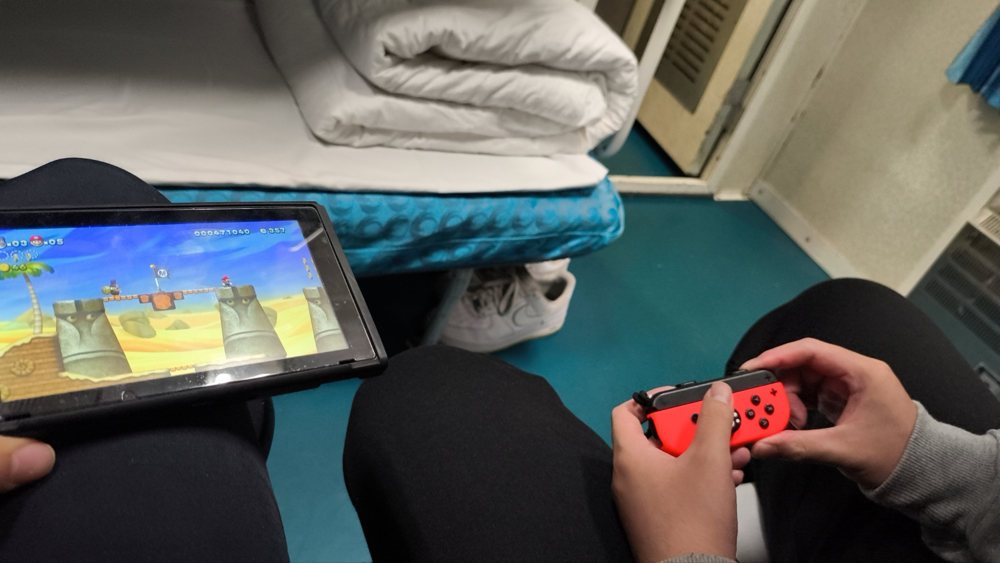

### 1. 深圳 1.11早-1.12午

#### 1.1 五十年不变

深圳气温比北京暖和，下了火车后，在 lihan 键政梗小鬼人格的驱使下，我们直奔了打卡点打卡。

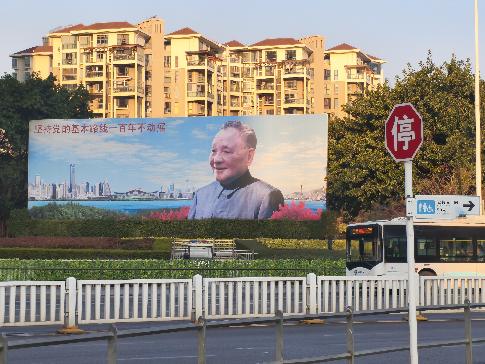

#### 1.2 巴登街肠粉

随后我们去了巴登街的一家肠粉店（合顺石墨肠粉汤粉炒粉粥【1】），点了肠粉油条豆浆等 lcy 舅舅接我们去市区。双肉双蛋的肠粉比在学校食堂吃的味道淡些，量更大。

#### 1.3 南科大

到了市区，先去了南科大见高中同学。校园很大，虽没啥显眼的建筑，内部倒是颇为精致。我们在校园里走了一圈，然后去了附近的一家烤肉自助（南里奥）。味道其实不错，不过早上肠粉量太足了，实在吃不下多少，而且 lcy 和我主要想来品味当地的特色，所以这餐非常一般了。

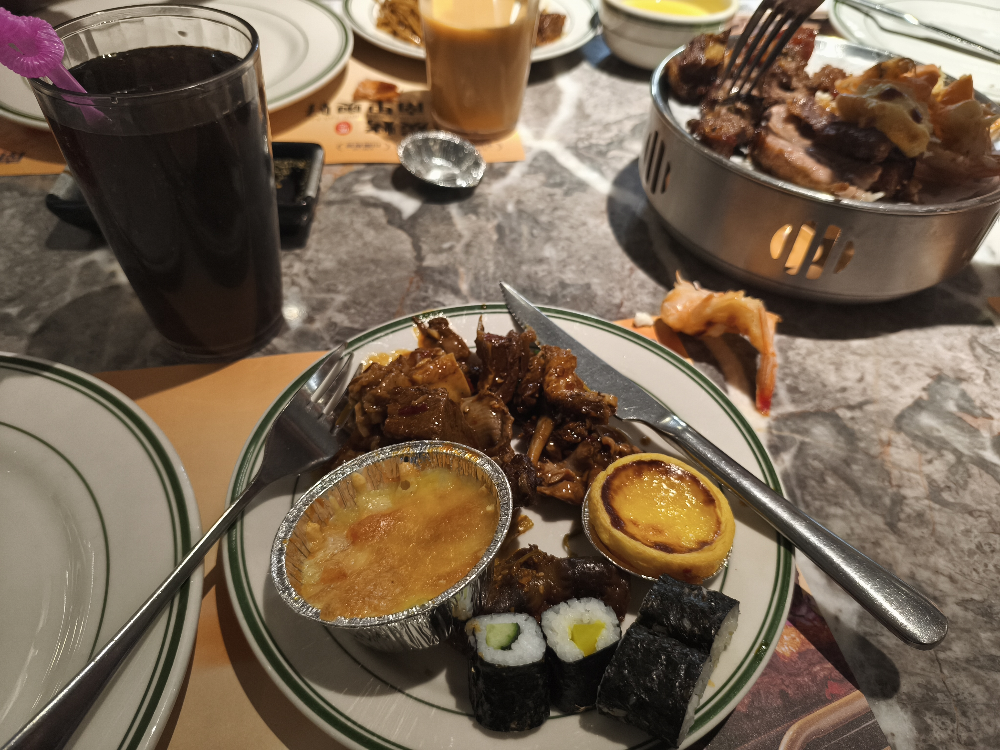

几个在深圳读书的同学可能对当地的美食与风景麻木了，饭后讨论接下来的行程时，他们都不太感兴趣。最终，我们决定去转转华强北和深圳湾公园。等同学收拾东西时候，跟 lcy 去网鱼开了把漫威争锋哈哈。

#### 1.4 华强北

总在网上听说华强北，其实一直对这三个字没啥概念，到了实地，倒是见面不如闻名，只是一个其貌不扬的大型电子市场。转了一圈，我们就出发去深圳湾公园了。

#### 1.5 深圳湾公园

深圳湾公园和红树林公园挨着，地铁坐到深圳湾公园站，出站后就是深圳湾公园。虽然是工作日，公园里人还是密密麻麻，靠近海边的地方还有些零零碎碎的缝隙，站过去可以可以看到对岸的香港和链接深圳香港的深圳湾公路大桥(一开始认成了港珠澳大桥哈哈)。

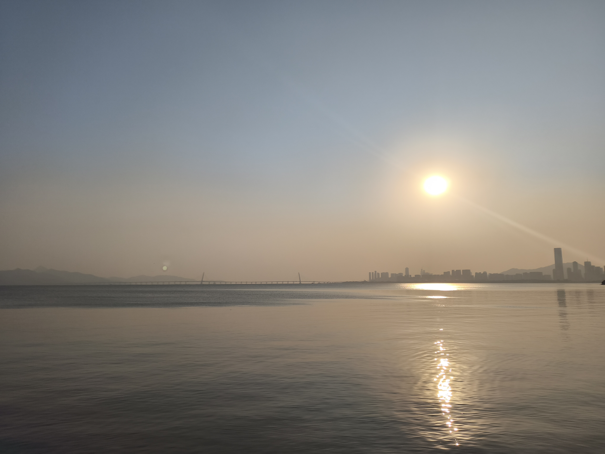

转眼夕阳降至，人也越来越多，试着摆姿势找角度拍了几张照片，总是不太满意。
鸽子、夕阳、海风还有帅哥:)，笨拙的双手还是装不下这些美好。

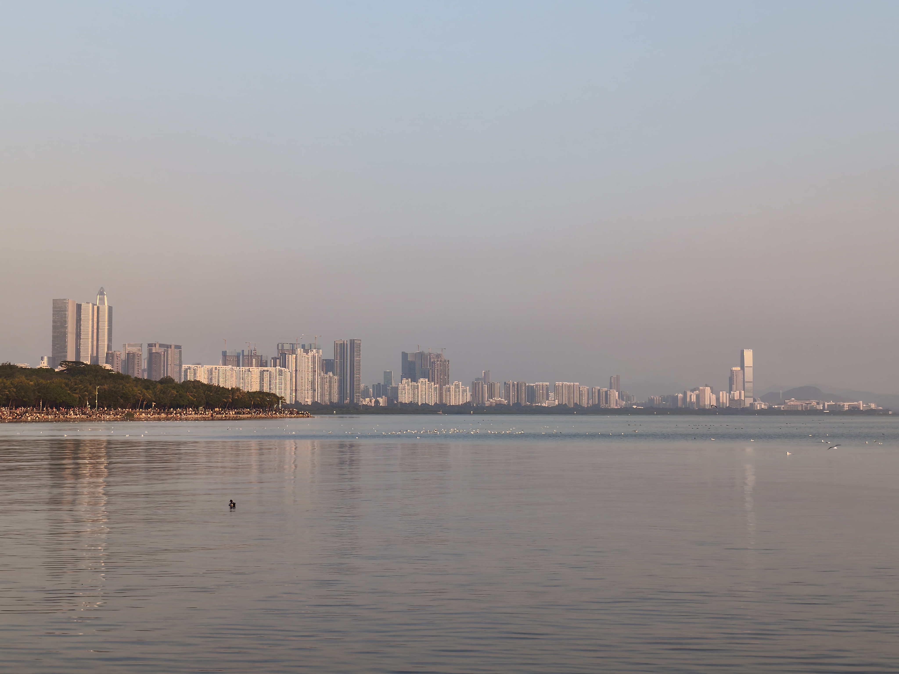

晚上一行人吃了啫啫煲（啫火啫啫煲（深圳龙华天虹购物中心店）），性价比一般，味道也一般，连锁店其实北京也有，没吃出什么特色。

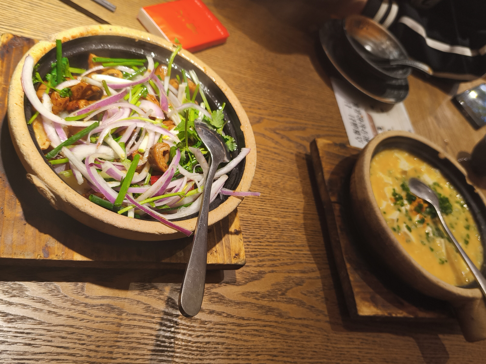

### 1.6 深圳早茶-悦景酒家

和 lcy 的旅行目标主要是美食，合计了下预算，遂决定尝试奢侈一把，试试深圳的早茶天花板————悦景酒家（悦景酒家 罗湖店【2】）。

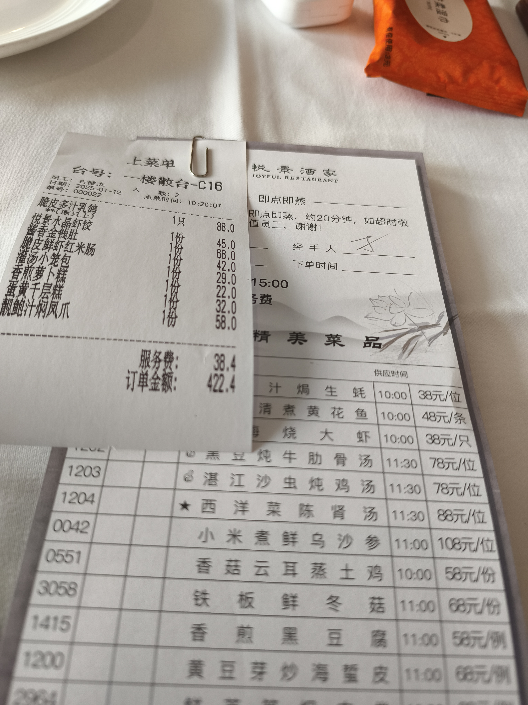

上午十点左右到店，一楼散桌还有座位，看到菜单，价格属实麻了，甚至我俩都没敢点招牌的贵菜，捡着勉强称得上划算的多点了几道尝尝味。

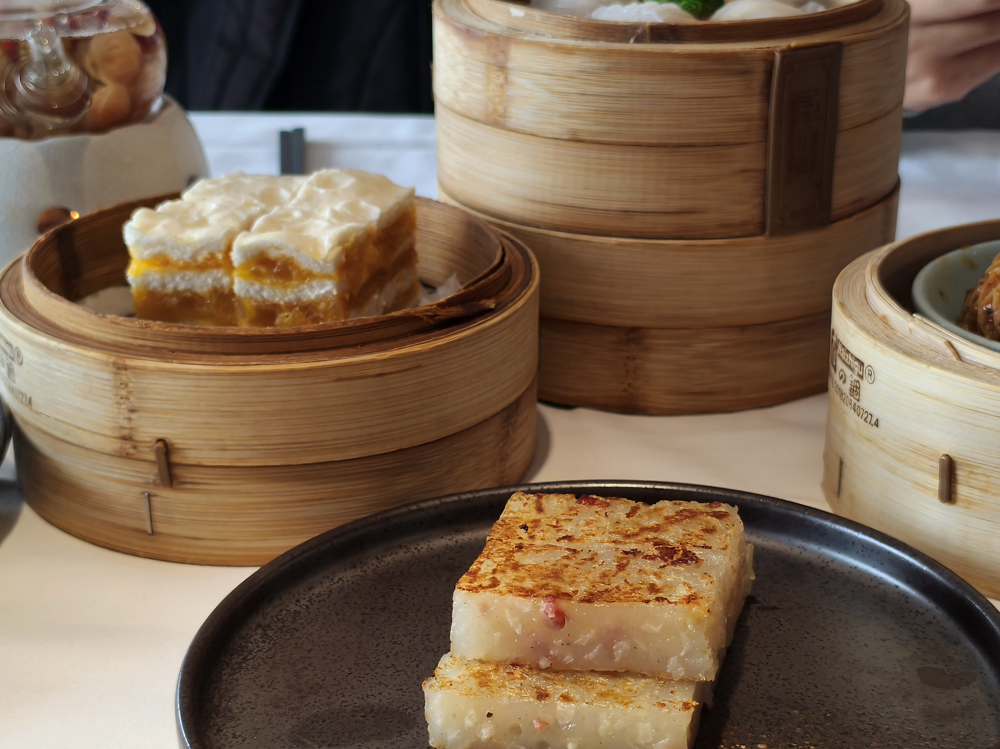

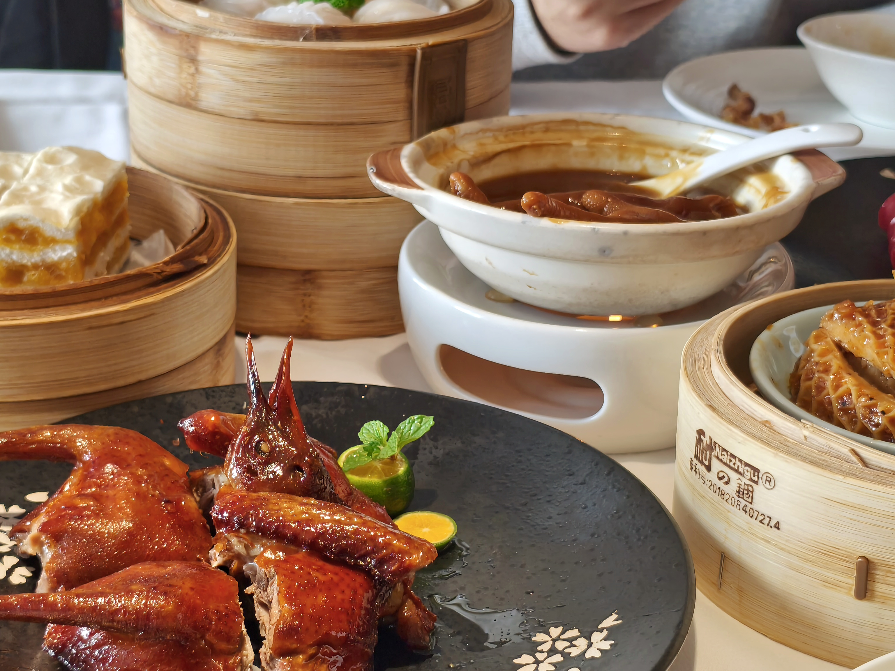

味道确实好吃，甚至不吃海鲜的我也尝了一口虾饺，算是尝了当地的特色。

### 1.7 深圳->珠海 跨海轮渡

饭后我们按计划乘轮渡前往珠海横琴，除了时间和价格合适，第一次坐海上的轮船也算是尝鲜。

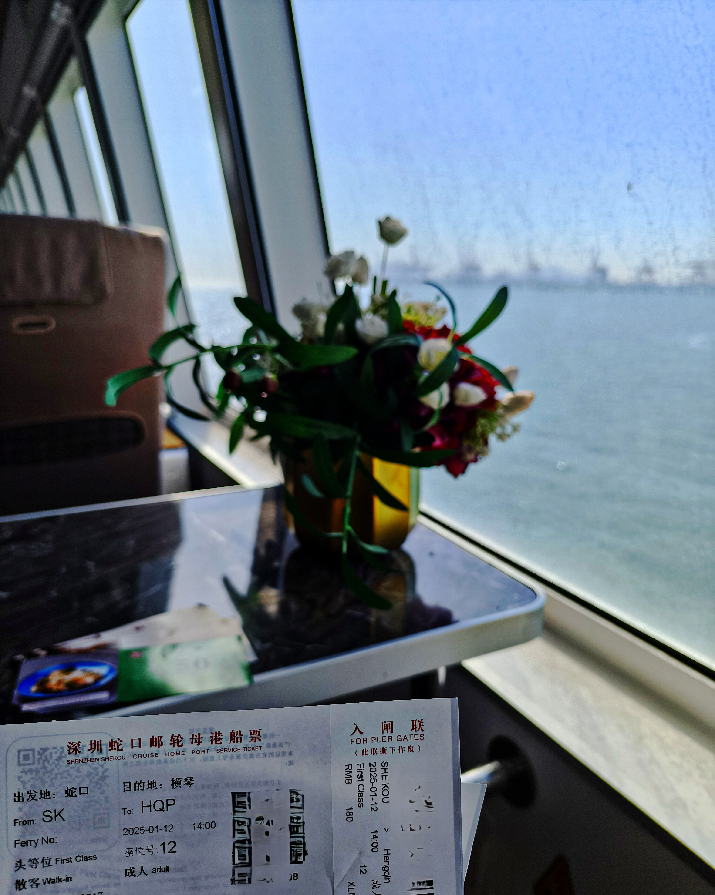

（码了下信息）

（港珠澳大桥）

头等舱价格没差多少，索性选择一次尝鲜个够。相比一楼，二层头等舱人少不少，虽说有座位号，没有人其实也可以选择风景好的位置随便坐。不过虽然有免费零食饮料（果断选择维他柠檬茶哈哈），可惜玻璃脏兮兮的也拍不出好看的风景（也许是我技术太差）。

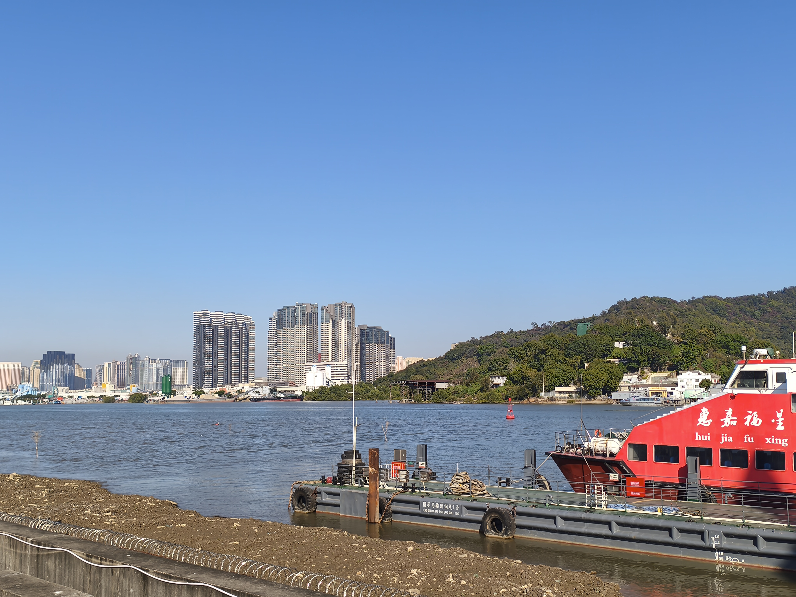

### 1.8 珠海半日速通

查了些攻略，Pass 了情侣打卡点（疑似有点男同了）明确了目标，决定主要行程在横琴岛上，遂先去了酒店放下行李，然后开始我们的珠海速通之旅。

(民宿酒店37层的落地窗外风景)

又一个第一次，听 lcy 的建议选择了民宿（澳景湾·电玩度假海景公寓 珠海国际会展中心店【3】），直接给珠海之旅开了个彩头。不说两室两厅的大房子，但落地窗外这个风景，225 元俩人太值了。

这次旅行除了美食，也想试着学点拍照的技术，跟着小红书抄了点小技巧，还有打卡点，照片确实比之前拍的好看了不少。

(珠海香洲区 海贝桥【4】)

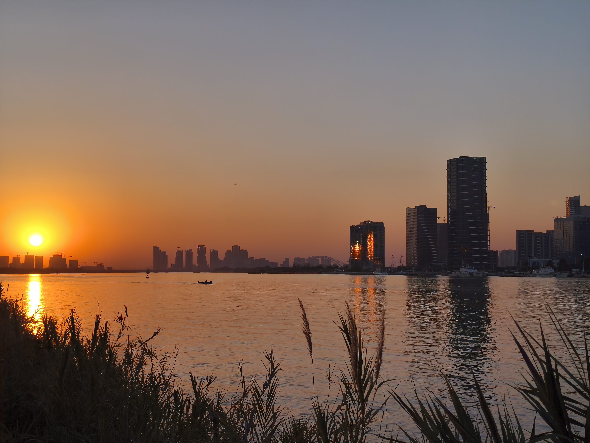

（珠海香洲区 花海长廊 其实没啥花了，小公园没啥特点）

珠海与澳门隔海相望，晚餐就尝试了澳门茶餐厅。猪扒包、冻柠茶还是很对我胃口的。（华欢冰室-WahFoon 横琴店【5】）

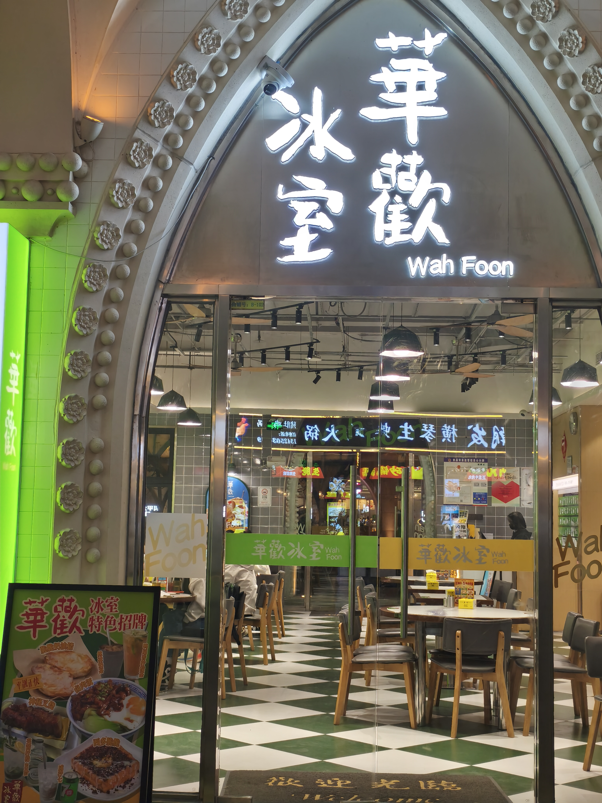

餐毕出来，发现恰巧这里是之前取消计划的打卡点之一————励骏庞都广场，对面正是通往澳门的横琴口岸。

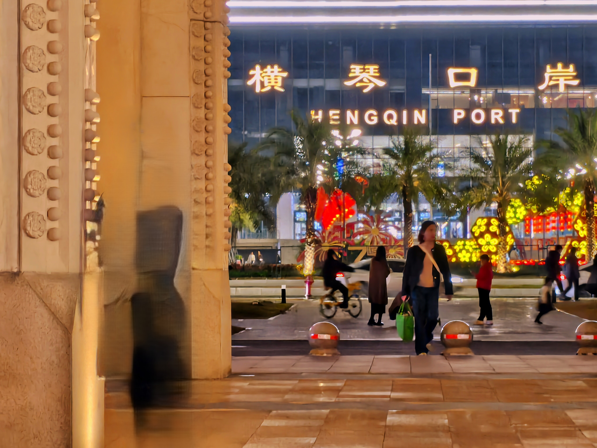

（逆天打码哈哈）

夜里和 lcy 边聊边逛，记得聊的是大学我们各自的宿舍学习情况，去了一趟珠海的大陆部分上的一处景点————夏湾小吃街【6】。刚到这里时候是八点九点吧，看着很普通的街边零星布着一些小吃店铺。十点正打算离开时候，忽然在城管开路下，小吃推车摊子哗啦啦一瞬间不知从哪里钻出来涌入，顿时变成了人山人海的小吃天堂。也是十分震撼了。

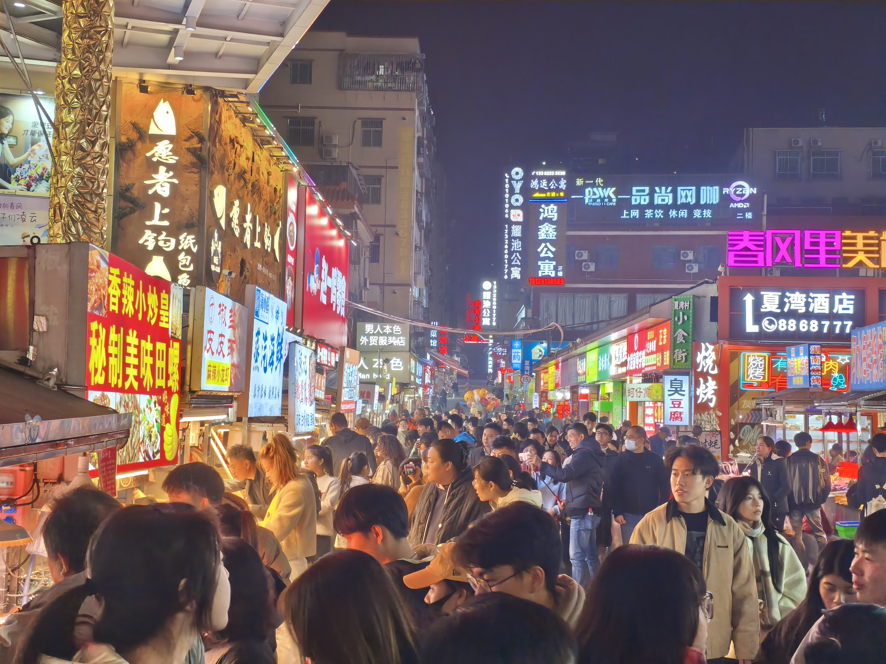

夜里回到酒店，和 lcy 看他感兴趣的 b 站长篇纪实片，算是深入了解了加沙巴以战争。不过让我们聊到5点的还是经典的感情问题哈哈。

### 1.9 珠海的第二个半天

