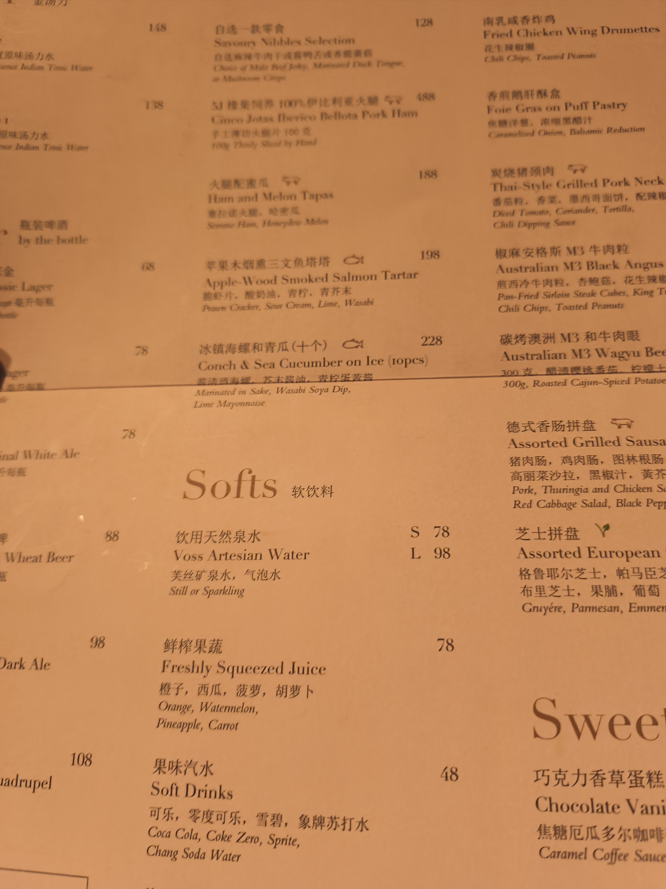

## 前言

和朋友出远门旅游的想法应该有了一两年了，今年五月的时候和 wy 第一次尝试，两个人从北京去乌兰察布玩了两天，由于实在没啥规划，完全是俩人都闲的受不了了，吃喝玩乐没那么如愿。所以这次去广东玩，期待是有的，但也有失望而归的准备。Luckily，这次的二人旅行还是很愉快的，虽然有些小插曲，但总体来说还是很开心的。

俩人一起出去旅行也不完全是一时兴起，之前就零零散散地和 lcy 提起过，趁着都保研了有些时间，就干脆利落定下来了。

## 行程

- 武汉-深圳 1.10 18:27--->1.11 07:15
- - 列车 T95 12小时48分钟 武昌站-深圳东站
- 【1】深圳 1.11早-1.12午
- 深圳-珠海 1.12 14:00--->1.12 15:15
- - 轮船 迅隆11 75分钟 蛇口港-珠海横琴
- 【2】（珠海）横琴 1.12下午-1.13午
- 珠海-顺德 1.13 15:54--->1.13 16:37
- - 高铁 - 43分钟 前山站-顺德站
- 【3】（佛山市）顺德 1.13下午-1.14下午
- 顺德-广州 1.14 16:50--->1.14 18:20 
- - 地铁 - 90分钟 3号线 顺德欢乐海岸-2号线 公园前
- 【4】广州 1.14晚-1.16晚
- 广州-武汉 1.16 18:06--->1.16 22:10
- - 列车 G1118 4小时 广州北站-武汉站

## 推荐

- 深圳：
- - 【1】 合顺石墨肠粉汤粉炒粉粥 肠粉
- - 【2】 悦景酒家 罗湖店 早茶
- 珠海：
- - 【3】 澳景湾·电玩度假海景公寓 珠海国际会展中心店 民宿
- - 【4】 珠海香洲区 海贝桥 拍照打卡
- - 【5】 华欢冰室-WahFoon 横琴店 澳门茶餐厅
- - 【6】 夏湾小吃街 小吃
- - 【7】 野狸岛 拍照打卡 美食
- - 【8】 正方·喜市多便利店（海峡店） 拍照打卡
- - 【9】 PAUL KEI 澳门葡记手信现烤店（海韵城店） 葡式蛋挞
- 顺德：
- - 【10】 欣欣饭堂 私房菜 桑拿鸡
- - 【11】 大良华盖路小吃街 小吃
- - 【12】 全季酒店佛山顺德华侨城欢乐海岸PLUS店 酒店
- - 【13】 杏坛公平靓正（大良店） 粥底火锅
- - 【14】 何姨葛水（清晖店） 糖水
- 广州：
- - 【15】 北京路步行街 小吃
- - 【16】 民强茶铺·鲜奶茶（惠福东路店） 沙示柠檬茶
- - 【17】 又一间茶点轩（江南店） 早茶
- - 【18】 广州柏悦酒店·悦吧高空酒吧 酒吧
- - 【19】 伯友茶记（白云路店） 茶餐厅

## 详细旅途

### I. T95 武汉->深圳 1.10 夜

绿皮火车上，本来想着带 Switch 一起玩打发时间，最后果然是没怎么玩，一直聊到凌晨一点。

讨论了未来的学业与就业，他比我更现实，而我总是想万全。我总认为困难是进入门槛，自信无论在什么环境总能适应，而他会警惕无法胜任 offer 的风险。讲真，跟他经常聊聊还挺好的，受益匪浅。

### 1. 深圳 1.11早-1.12午

#### 1.1 五十年不变

深圳气温比北京暖和，下了火车后，在 lihan 键政梗小鬼人格的驱使下，我们直奔了打卡点打卡。

#### 1.2 巴登街肠粉

随后我们去了巴登街的一家肠粉店（合顺石墨肠粉汤粉炒粉粥【1】），点了肠粉油条豆浆等 lcy 舅舅接我们去市区。双肉双蛋的肠粉比在学校食堂吃的味道淡些，量更大。

#### 1.3 南科大

到了市区，先去了南科大见高中同学。校园很大，虽没啥显眼的建筑，内部倒是颇为精致。我们在校园里走了一圈，然后去了附近的一家烤肉自助（南里奥）。味道其实不错，不过早上肠粉量太足了，实在吃不下多少，而且 lcy 和我主要想来品味当地的特色，所以这餐非常一般了。

几个在深圳读书的同学可能对当地的美食与风景麻木了，饭后讨论接下来的行程时，他们都不太感兴趣。最终，我们决定去转转华强北和深圳湾公园。等同学收拾东西时候，跟 lcy 去网鱼开了把漫威争锋哈哈。

#### 1.4 华强北

总在网上听说华强北，其实一直对这三个字没啥概念，到了实地，倒是见面不如闻名，只是一个其貌不扬的大型电子市场。转了一圈，我们就出发去深圳湾公园了。

#### 1.5 深圳湾公园

深圳湾公园和红树林公园挨着，地铁坐到深圳湾公园站，出站后就是深圳湾公园。虽然是工作日，公园里人还是密密麻麻，靠近海边的地方还有些零零碎碎的缝隙，站过去可以可以看到对岸的香港和链接深圳香港的深圳湾公路大桥(一开始认成了港珠澳大桥哈哈)。

转眼夕阳降至，人也越来越多，试着摆姿势找角度拍了几张照片，总是不太满意。
鸽子、夕阳、海风还有帅哥:)，笨拙的双手还是装不下这些美好。

晚上一行人吃了啫啫煲（啫火啫啫煲（深圳龙华天虹购物中心店）），性价比一般，味道也一般，连锁店其实北京也有，没吃出什么特色。

#### 1.6 深圳早茶-悦景酒家

和 lcy 的旅行目标主要是美食，合计了下预算，遂决定尝试奢侈一把，试试深圳的早茶天花板————悦景酒家（悦景酒家 罗湖店【2】）。

上午十点左右到店，一楼散桌还有座位，看到菜单，价格属实麻了，甚至我俩都没敢点招牌的贵菜，捡着勉强称得上划算的多点了几道尝尝味。

味道确实好吃，甚至不吃海鲜的我也尝了一口虾饺，算是尝了当地的特色。

### II. 跨海轮渡 深圳->珠海 1.12 下午

饭后我们按计划乘轮渡前往珠海横琴，除了时间和价格合适，第一次坐海上的轮船也算是尝鲜。

（码了下信息）

（港珠澳大桥）

头等舱价格没差多少，索性选择一次尝鲜个够。相比一楼，二层头等舱人少不少，虽说有座位号，没有人其实也可以选择风景好的位置随便坐。不过虽然有免费零食饮料（果断选择维他柠檬茶哈哈），可惜玻璃脏兮兮的也拍不出好看的风景（也许是我技术太差）。

### 2. 珠海 1.12下午-1.13下午

#### 2.1 珠海半日速通-海贝桥 花海长廊 华欢冰室 横琴口岸 励骏庞都广场

查了些攻略，Pass 了情侣打卡点（疑似有点男同了）明确了目标，决定主要行程在横琴岛上，遂先去了酒店放下行李，然后开始我们的珠海速通之旅。

(民宿酒店37层的落地窗外风景)

又一个第一次，听 lcy 的建议选择了民宿（澳景湾·电玩度假海景公寓 珠海国际会展中心店【3】），直接给珠海之旅开了个彩头。不说两室两厅的大房子，但落地窗外这个风景，225 元俩人太值了。

这次旅行除了美食，也想试着学点拍照的技术，跟着小红书抄了点小技巧，还有打卡点，照片确实比之前拍的好看了不少。

(珠海香洲区 海贝桥【4】)

（珠海香洲区 花海长廊 其实没啥花了，小公园没啥特点）

珠海与澳门隔海相望，晚餐就尝试了澳门茶餐厅。猪扒包、冻柠茶还是很对我胃口的。（华欢冰室-WahFoon 横琴店【5】）

餐毕出来，发现恰巧这里是之前取消计划的打卡点之一————励骏庞都广场，对面正是通往澳门的横琴口岸。照例摆弄了一下姿势，拍了几张照片，发现换上 lcy  的外套好像还可以哈哈。

（逆天打码哈哈）

夜里和 lcy 边聊边逛，记得聊的是大学我们各自的宿舍学习情况，去了一趟珠海的大陆部分上的一处景点————夏湾小吃街【6】。刚到这里时候是八点九点吧，看着很普通的街边零星布着一些小吃店铺。十点正打算离开时候，忽然在城管开路下，小吃推车摊子哗啦啦一瞬间不知从哪里钻出来涌入，顿时变成了人山人海的小吃天堂。也是十分震撼了。

夜里回到酒店，和 lcy 看他感兴趣的 b 站长篇纪实片，算是深入了解了加沙巴以战争。不过让我们聊到5点的还是经典的感情问题哈哈。

#### 2.2 珠海的第二个半天 古今中外 野狸岛 葡式蛋挞

聊得太晚了，起来已经快下午了。根据计划，我们预定了下午去顺德的高铁，在珠海的最后一站定在了 野狸岛 【7】。接着上次的经验，我在小红书上找到了 正方·喜市多便利店（海峡店） 【8】，从这里望向野狸岛，古代中国风的名亭楼与现代西式的珠海大剧院刚好叠在一起，正好是个拍照的好地方。

风景拍的还凑合，加上了人像，就还得是专业人士来了。这里正是经典的“古今中外”风景打卡点，早就有几个专业摄影师候着等游客来找他们拍照了。花了20块钱拍了两张，别说还真不错哈哈。

(图片就不放了)

到了岛上，骑着车直奔海韵城（单手骑车，零一手托着 lcy 的行李箱，危险请勿模仿哈哈）。

这是一个不大的商业广场，时间有限，我们简单转了一圈，在 PAUL KEI 澳门葡记手信现烤店（海韵城店）【9】买了几个葡式蛋挞和糕点充作午餐。

价格稍贵，味道上蛋挞比平时吃的味道淡些，鸡蛋的味道更浓些，感觉也许很正宗？

### III. 高铁 珠海->顺德 1.13 下午

几十分钟的高铁主要在修图吧，第一次跟着小红书上的教程修图，说实话还有点乐在其中，调调曝光、对比度、饱和度，一顿操作下来，好像还真好看了不少。

### 3. 顺德 1.13下午-1.14下午

#### 3.1 夜食顺德————欣欣饭堂桑拿鸡 大良华盖路小吃街/华盖山栈道

顺德轮到 lcy 来找馆子了，第一餐选到了一家私房菜————欣欣饭堂【10】。据说，网红唐仁杰对这里的桑拿鸡赞不绝口。

相较于前几天的高消费，一顿桑拿鸡的价格还是很亲民的，俩人吃个七分饱花了不到百元。鸡肉的做法和味道确实很特别，lcy 表示非常满意，下次还来。

时间尚早，饭后我们决定去大良华盖路小吃街【11】逛逛。

去的路上确实感觉到相比深圳、珠海，顺德是个生活气息更足的小城市。顺着小吃街一路走到头，我们甚至还爬了一段栈桥（华盖山栈道），只吃了俩金丝牛肉饼和民信老铺的甜品，lcy 对这里表示差评。

晚上回到酒店，lcy 又挑了个便宜舒服的酒店（全季酒店佛山顺德华侨城欢乐海岸PLUS店）【12】）。晚上看着电视又有点饿，一顿选择困难症后还是点了烧烤，把粥底火锅留到了第二天品尝（烧烤我表示差评）。
     
#### 3.2 顺德翌日-杏坛公平靓正（大良店） 清晖园

离开酒店，想着都到什么欢乐海岸附近了，看看呗，到了地方发现只是一个再普通不过的低配欢乐谷，没啥好玩的。不过看着几个中学校服的女孩兴冲冲地冲进来，心里还是难免感慨与羡慕她们的青春的。不远的 渔人码头 也没啥特色，试着拍了几张，也没满意的照片，便匆匆离去了。

前一天吃桑拿鸡时，偶遇的路人大叔向我们介绍了这家粥底火锅（杏坛公平靓正（大良店）【13】），说是顺德的特色。到了地方看着菜单里不是海鲜就是五脏六腑，实在是不太对我的胃口，做法确实新鲜，用白米粥作火锅汤底，味道我倒是不敢恭维，不过 lcy 说还不错。

下一站我们前往了 清晖园。可惜当天赶上闭馆进不去，我们便在旁边尝了一家糖水铺子（何姨葛水（清晖店）【14】）。味道难说，我的评价是不如隔壁 1.98 的冻柠茶，店员小姐姐还在放 猪猪侠主题曲。

### IV. 地铁 顺德->广州 1.14 下午

顺德现在是佛山的一个行政区，挨着广州，我们索性坐城际地铁去往广州。去往广州方向，人渐渐多了起来，一两个小时站着还是挺累的。

### 4. 广州 1.14晚-1.16晚

#### 4.1 北京路 煲仔饭 民强茶铺沙示柠檬茶

想着佛山珠海消费不多，准备在广州再奢侈一波，住个看得见广州塔的酒店，不过看了看价格，还是算了。

选了家在 北京路步行街【15】 旁边的酒店，真是又贵又小又破旧，以后还是别住热门景点附近的酒店了。时间不算晚，行李放在酒店抱怨了一通后，我们去往北京路觅食。

目的地的几家煲仔饭味道和卫生条件都堪忧，硬着头皮吃完后又逛了会儿街，倒是发现了一家宝藏店铺————民强茶铺·鲜奶茶（惠福东路店）【16】。

这里的 沙示柠檬茶 属实让我俩没白来一趟————第一次喝风油精味道的柠檬茶，关键味道还可以哈哈（我单方面觉得，lcy 表示只是有特色，不好喝）。

#### 4.2 极限特种兵-广州第二天 广州早茶 

旅途已经进入了倒计时，广州我们才刚开始，早上第一站选定了一家广州早茶————又一间茶点轩（江南店）【17】。

这家虽然服务卖相远不如悦景酒家，味道并没有打多少折扣，更重要的是俩人不到百元吃到撑。

注意：这家用餐时间不同，折扣也不同，工作日下午两点后就餐低至 4.8 折扣。不过也因此这家不少特色菜是限时供应，注意提前了解几点有什么菜。

下一站是网红打卡点———圣心大教堂。虽然做了不少攻略，还是没拍出好看的照片，可能人不好看吧 T_T。（这里要注意教堂闭馆较早，不过其实闭关时刚好人少了，倒是拍照的好时机）

提前订好了的广州塔门票，我们随后赶往了令人期待的广州塔。说实话，一趟下来，200 元的票价还是有点不值的，身在其中反倒看不到美景了。我甚至被迫在塔上开了一场腾讯会议的组会。

(一张不带人的照片都没用，也不好看，算了不贴了)

想着最后一晚了，逍遥一次，我硬拉着 lcy 去了旁边的 广州柏悦酒店·悦吧高空酒吧【18】。

酒吧本就去的不多，高空酒吧更是没去过，本想着吃顿广州塔高空旋转餐厅自助餐过过瘾，可惜因为经典选择困难症错过了预定，钱就花在酒吧了。

讲真 人均 300 的低消还是有点麻的，不过这几天消费不多，奢侈一次吧。

坐在高空阳台，看着江景，不考虑价格，风景还是很好看的（虽然 lcy 觉得我有点 dinner 了）。情不自禁地开始幻想未来在珠海买一套海高空公寓，坐在阳台上喝酒看海，感觉肯定更棒（再来个美人在怀嘻嘻）。

晚上没吃饱有点绷，路边买了点吃的回去吃了。第二家广州的酒店也不行，距离广州塔近了属于是。

#### 4.3 旅途最后一餐————伯友茶记

第二天上午本来先逛博物馆，可惜又忘了预约，白跑一趟，随后直奔了旅途最后一餐———伯友茶记（白云路店）【19】。

还是茶餐厅适合我啊，看着就有食欲。招牌的金砖猪扒饭不仅特色十足，还十分顶饱。

吃完最后一顿，便开始了回程（路上看时间还够，又拉着 lcy 去网吧打了会儿漫威争锋）。

### V. G1118 广州->武汉 1.16 晚

车上聊了什么其实记不清了，回家时的地铁上，还在想着跟 lcy 再去吃哪些好吃的，第一次和朋友的旅行有点让我上瘾了。

有点突兀，不过还是想说，挚友难觅，珍惜眼前人（不是男同 QwQ ）。
