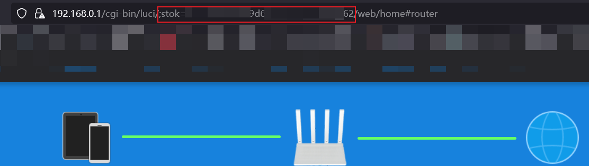
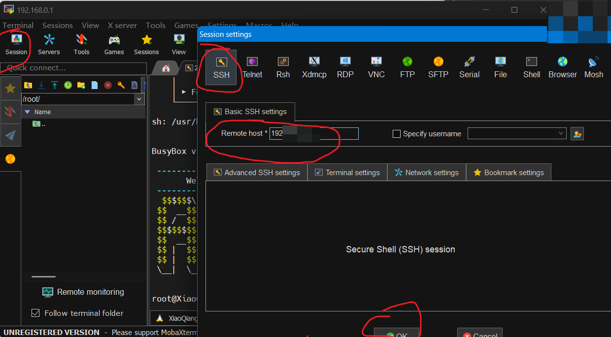
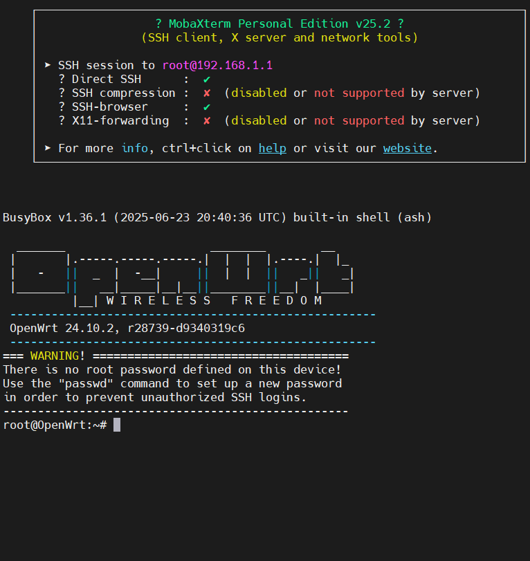

## 购买注意

- 注意挑选能软件刷机的，硬破感觉我还没到那个地步
- 注意 红米 AX3000T 有三个版本，只有老版本 v1 v2 （官方v1）可以刷机，参见[确认完全缩水！新版小米AX3000T的详细变化，小米这操作简直作 ](https://post.smzdm.com/p/a0zw2de0/)
- - 区别是 v1 v2 为 联发科芯片，v3 为高通芯片
- - 可通过以下方式判断：
- - - 缩水版条形码末尾为`330 `
- - - 缩水版 SN 号开头为`645`，满血版 SN 号开头为`498`

## 刷机

### 参考

- [小米 AX3000T 保姆级免拆刷 openWrt 教程以及排坑指南](https://blog.csdn.net/jgw2008/article/details/135645594)
- [小米 AX3000T 路由器刷入使用官方原版 OpenWrt / ImmortalWrt 固件](https://note.okhk.net/xiaomi-ax3000t-router-install-openwrt-immortalwrt)
- [小米 AX3000T Openwrt 官方介绍](https://openwrt.org/inbox/toh/xiaomi/ax3000t)
- [openwrt 支持硬件列表](https://toh.openwrt.org/)
- [小米路由器固件系统 v1.0.47](https://cdn.cnbj1.fds.api.mi-img.com/xiaoqiang/rom/rd03/miwifi_rd03_firmware_ef0ee_1.0.47.bin)
- - `sha256sum miwifi_rd03_firmware_ef0ee_1.0.47.bin
77bf35b27b6ec29fbfe2c3f4280618cd70bade5e9998d407b634ce8a12825cc6`
- [SN 码查询 ssh 密码](https://miwifi.dev/ssh)
- [MobaXterm Portable v25.2](https://download.mobatek.net/2522025040602403/MobaXterm_Portable_v25.2.zip)
- [小米路由器修复工具](https://www.miwifi.com/wap_download.html)

### 回退固件版本(1.0.47)

根据网友反馈，最新固件版本无法刷入 openwrt ，需要回退到 1.0.47 版本。

1. 使用网线连接电脑和路由器(从左至右第二个接口)

2. 关闭防火墙等安全软件，下载官方[小米路由器修复工具](https://www.miwifi.com/wap_download.html)及[小米路由器固件系统 v1.0.47](https://cdn.cnbj1.fds.api.mi-img.com/xiaoqiang/rom/rd03/miwifi_rd03_firmware_ef0ee_1.0.47.bin)

- 使用`sha256sum miwifi_rd03_firmware_ef0ee_1.0.47.bin
77bf35b27b6ec29fbfe2c3f4280618cd70bade5e9998d407b634ce8a12825cc6`校验固件完整性

3. 打开小米路由器修复工具，选择下载的固件（注意文件路径中不要有中文），点击下一步。

4. 选择网卡，注意不要选错网卡。

5. 按照提示操作，拔掉电源，按住 reset 键不放，插上电源，等待 10 秒至指示灯闪烁后松开 reset 键。

6. 等待刷机完成，指示灯蓝灯闪烁后拔电源重启即完成降级。

### 连接 SSH

1. 登录路由器管理后台，获取 URL 中的 `stok` 参数



2. 打开命令行（注意是 CMD 命令提示符），输入以下命令解锁 SSH （注意替换`<stok>`和`<sn>`）

```bash

curl -X POST http://你的管理后台地址/cgi-bin/luci/;stok=你的值/api/misystem/arn_switch -d "open=1&model=1&level=%0Anvram%20set%20ssh_en%3D1%0A"

curl -X POST http://你的管理后台地址/cgi-bin/luci/;stok=你的值/api/misystem/arn_switch -d "open=1&model=1&level=%0Anvram%20commit%0A"

curl -X POST http://你的管理后台地址/cgi-bin/luci/;stok=你的值/api/misystem/arn_switch -d "open=1&model=1&level=%0Ased%20-i%20's%2Fchannel%3D.*%2Fchannel%3D%22debug%22%2Fg'%20%2Fetc%2Finit.d%2Fdropbear%0A"

curl -X POST http://你的管理后台地址/cgi-bin/luci/;stok=你的值/api/misystem/arn_switch -d "open=1&model=1&level=%0A%2Fetc%2Finit.d%2Fdropbear%20start%0A"
```

每条命令输入回车后会弹出 `{code：0}` 即解锁成功。

3. 使用 SN 码查询 SSH 密码

在[SN 码查询 ssh 密码](https://miwifi.dev/ssh) 输入路由器管理界面的 SN 码，获取 SSH 密码。


4. 使用 [MobaXterm Portable v25.2](https://download.mobatek.net/2522025040602403/MobaXterm_Portable_v25.2.zip) 连接路由器

- 打开 MobaXterm，点击 Session
- 选择 SSH，Remote host 填写路由器 IP 地址
- 账号 `root` 密码为上一步查询到的密码
- 看到 `ARE U OK` 即连接成功



### 备份

```bash
cat /proc/mtd 

# 备份全部

# ！！！重要！！！请一行行执行命令，不要一次性复制粘贴执行，每备份一个，下载一个，删除一个

dd if=/dev/mtd1 of=/tmp/BL2.bin

dd if=/dev/mtd2 of=/tmp/Nvram.bin

dd if=/dev/mtd3 of=/tmp/Bdate.bin

dd if=/dev/mtd4 of=/tmp/Factory.bin

dd if=/dev/mtd5 of=/tmp/FIP.bin

dd if=/dev/mtd6 of=/tmp/crash.bin

dd if=/dev/mtd7 of=/tmp/crash_log.bin

dd if=/dev/mtd8 of=/tmp/ubi.bin

dd if=/dev/mtd9 of=/tmp/ubi1.bin

dd if=/dev/mtd10 of=/tmp/overlay.bin

dd if=/dev/mtd11 of=/tmp/date.bin

dd if=/dev/mtd12 of=/tmp/KF.bin

# 注意使用鼠标中键粘贴

```

- 注意下图的内存很小，`tmp` 目录下的文件储存在 RAM 中，重启后会丢失，且一次性生成太多会撑爆内存。


### 第一次刷入 openwrt initramfs-factory

1. 下载 [openwrt initramfs-factory](https://downloads.openwrt.org/releases/24.10.2/targets/mediatek/filogic/openwrt-24.10.2-mediatek-filogic-xiaomi_mi-router-ax3000t-initramfs-factory.ubi)

2. 使用 MobaXterm 上传到路由器 `/tmp` 目录下

3. 查看硬件信息：`cat /proc/cmdline`，视情况执行下面的命令

- firmware = 0 时

```bash
ubiformat /dev/mtd9 -y -f "/tmp/openwrt-24.10.2-mediatek-filogic-xiaomi_mi-router-ax3000t-initramfs-factory.ubi"
nvram set boot_wait=on
nvram set uart_en=1
nvram set flag_boot_rootfs=1
nvram set flag_last_success=1
nvram set flag_boot_success=1
nvram set flag_try_sys1_failed=0
nvram set flag_try_sys2_failed=0
nvram commit
reboot
```

- firmware = 1 时(我的情况)

```bash
ubiformat /dev/mtd8 -y -f "/tmp/openwrt-24.10.2-mediatek-filogic-xiaomi_mi-router-ax3000t-initramfs-factory.ubi"
nvram set boot_wait=on
nvram set boot_wait=on
nvram set uart_en=1
nvram set flag_boot_rootfs=0
nvram set flag_last_success=0
nvram set flag_boot_success=1
nvram set flag_try_sys1_failed=0
nvram set flag_try_sys2_failed=0
nvram commit
reboot
```

4. 重启后，等待路由器指示灯变为蓝色常亮，重新 SSH 登录，管理页面 IP 为 `192.168.1.1`，账号为 `root`,密码为空。



### 随后刷入 openwrt squashfs-sysupgrade

1. 下载 [openwrt squashfs-sysupgrade](https://downloads.openwrt.org/releases/24.10.2/targets/mediatek/filogic/openwrt-24.10.2-mediatek-filogic-xiaomi_mi-router-ax3000t-squashfs-sysupgrade.bin)

2. 使用 MobaXterm 上传到路由器 `/tmp` 目录下

3. 执行以下命令刷入

```bash
sysupgrade -n -v "/tmp/openwrt-24.10.2-mediatek-filogic-xiaomi_mi-router-ax3000t-squashfs-sysupgrade.bin"
```


4. 重启后，等待路由器指示灯变为蓝色常亮，重新 SSH 登录，管理页面 IP 为 `192.168.1.1`，账号为 `root`,密码为空。


## openwrt 使用

- 根据首页提示配置管理密码，ssh 密码与管理密码相同

### 1. 配置互联网连接（PPPoE）

1. 进入管理页面-network-interfaces，编辑 WAN
2. 选择 PPPoE，填写宽带账号密码
3. 保存应用，等待连接成功

- 注意，每次更改配置后，需重新进入管理页面以防配置回退

### 2. 配置无线网络

1. 进入管理页面-network-wireless，编辑 SSID
2. 根据信道频率分别配置 2.4G 和 5G，加密选择 mixed WPA2/WPA3 PSK，填写密码
3. 保存应用，等待连接成功

### 3. 安装常用软件包

1. 进入管理页面-system-software，点击更新列表 `update lists`

- 注意使用网线连接电脑和路由器(从左至右第二个接口)

2. 搜索并安装以下软件包

- luci-i18n-base-zh-cn （中文界面）
- luci-i18n-firewall-zh-cn （防火墙中文）
- luci-i18n-opkg-zh-cn （软件包管理中文）

### 4. openclash