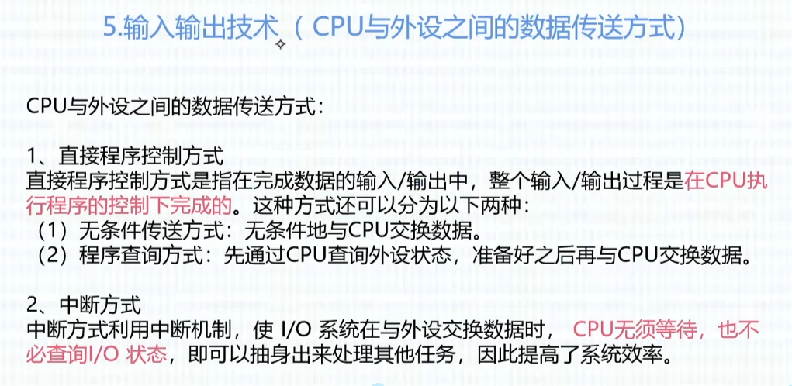
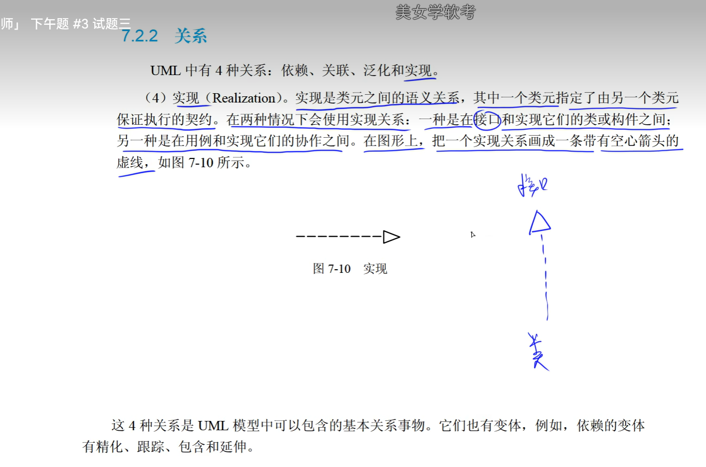

## 中级软件设计师

## 上半场

软考通app刷题记录

1. 浮点数的存储格式

- 符号位（数符）：符号位用来表示该数的正负性，一般用0表示正数，1表示负数。

- 阶码：阶码用来表示浮点数的数量级，通常采用带符号的二进制表示。阶码的取值范围是有限的，一般在单精度浮点数中为-126到127，在双精度浮点数中为-1022到1023。

- 尾数：尾数用来表示浮点数的有效数字部分，通常采用二进制小数的形式表示。尾数的位数在不同的计算机中可以不同，一般为单精度浮点数中的23位，双精度浮点数中的52位。

- 阶符：阶符用来表示阶码的正负性，一般用0表示正数，1表示负数。阶符通常与符号位一起表示浮点数的符号   

- 补码加减法直接加减不用管符号位，因为并入了；补码的相反数为按位取反加1；

2. 校验码 海明码

3. 计算机组成

3.1 主存储器（内存）RAM

3.2 中央处理器 CPU-运算器

3.3 中央处理器 CPU-控制器

4. 计算机体系架构 Flynn分类法 

5. 指令

6. 指令系统

7. 输入输出技术 IO

8. 存储系统

## 下半场

### 1. 数据流图

### 2. E-R图

主键 下划线实线；外键 下划线虚线

### UML图

