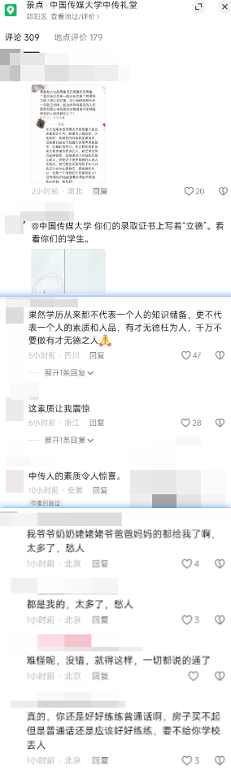

## 偶遇丁真以及随想

丁真是疫情初期官方生造的偶像，感觉跟现在的天水麻辣烫、淄博烧烤一个味道。官方没操作好，惹怒了所谓小镇做题家群体，因而丁真风评我一直以为是很差的。
昨天在国重hvv时候，听说楼下有丁真，赶紧冲下去了，好家伙一群人，都是来看乐子的(现在想来，也许有真粉丝吧，我说怎么会有那么多女生)。
丁真一出来，好家伙大家都在口嗨，丁真倒也看得开，笑笑没说啥就走了，我也蹭了个高糊合影。
重点是，找乐子的同学把视频照片发抖音，用了略带嘲讽的文案，好家伙评论区给丁真粉丝(基本是女粉)冲烂了。

说实话，是不小的世界观冲击，丁真真有这么多粉丝啊好家伙！更离谱的，真有人现在还堂而皇之的炫富来秀优越感。

一直以来，我自觉一直努力避开信息茧房，b站、知乎、贴吧以及各个视角的键政人都有关注，这样看来，信息茧房真不可避免啊，抖音要多刷哈哈。

想来，知乎都是理工男、贴吧都是下头男、b站都是宅男，抖音反倒各种层次各种人都有，确实是观察世界的好地方。

## 考研

经历了无数次失败的计划后，我屈服了，去图书馆学吧，略有成效，不知道能不能坚持下来。

## 其他

马克思、区块链、小提琴...好多好多想学的，呜呜呜

