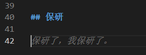

```
你住的 巷子里
我租了一间公寓
为了想与你不期而遇
高中三年 我为什么
为什么不好好读书
没考上跟你一样的大学
————等你下课 周杰伦
```

## 末2低rank无竞赛科研保研记录

- rank1/xxx(前3%)
- 海外学习交流经验：
- xx暑校一段
- xx暑研
- 论文若干篇
- - xx一区二作（一作是导师）
- - xx二区一作
- 竞赛若干项
- - 美赛
- - 建模
- - 互联网+
- - 此处省略一万项
- 英语六级600+

↑以上跟我一点关系没有，太离谱了，刷个知乎，全是这种，专业第二就低 rank 了是吧，没国家级金牌就是无竞赛是吧，无 sci 1区就是无科研了是吧，绷不住了。

## 保研

好了，认真写了。

↓刚敲完标题，VSCode 的 GithubCopilot 就给我推荐了这行文案，笑死我了，气氛一下子欢快起来了。



今天是2024年9月30日，距离研招网的保研拟录取确认刚过去一天，距离考研报名10月9日还有10天，距离考研12月21日，还有不到三个月。
刷知乎时候，看到了一篇文章，分享保研的经历，其中提到了一个特别的词：**冒名顶替综合征**

```

冒名顶替综合征：
患有冒名顶替综合征的人，无法将自己的成功归因于自己的能力，他们坚信自己的成功是凭借着运气或时机，或者是别人误以为他们能力很强、很聪明，并总是担心有朝一日他人会识破自己的能力不行。

```

这个词放在我身上十分合适，我并不觉得这在我身上是一种病态，因为实际上我就是这样的。

刚上大学的时候，信心满满，因为很早就对计算机感兴趣了，初升高我爸就抽空教了我 C 和 C++ 的一点基础，上大学前，自己跟着网课学了点 HTML CSS 和 JS。当时自知高中没好好学习，觉得上了大学，还是喜欢的专业，学校也并非传统理工院校，自己这不得好好学习，力压群雄哈哈。没想到，山外有山，人外有人，班级内有不少厉害的大佬。当然更重要的还是自己又又又又开摆了。

上大学前，家父与我谈购置笔记本电脑的事宜，我想自己玩了三年手机游戏，玩腻了，电脑游戏自己也不感兴趣，大学就不用买游戏本了，搞个 CPU 和内存好的移动工作站就行了。然而，上了大学，很快就下载了 ，从文明6到无人深空，再到一堆单机联机游戏，现在 Steam 时长已接近 3000 小时，库存 12000+￥，真是玩麻了，还不算原神和其他不在 steam 上的游戏。

所以到大二，我以为自己基本认清了现实，完全不幻想保研了，想着一门心思等大三开始学考研，上个北邮 武大 华科。有了这样的想法，我就更加放心的开摆了，日常打游戏、打羽毛球。幻想着自己能够像高考一样，只要学半年多就可以短期创造奇迹。期间，门门课程都是考前一天复习，甚至下午考上午才复习，所幸运气好，没有挂科，也顺利靠老底过了46级。每年就混个蓝桥杯省三和校级的计算机比赛，成绩排名一直在班级接近50%的样子。

到了大三，告别了谈了两年的前女友，有时间思考自己的人生，感觉确实太摆了，开始尝试制定学习计划（关于学习计划，似乎从小到大制定了无数个，唯一执行了超过20%的就是高考的女娲补天计划了），刚开始还好，确实做了点成绩，比如这个博客网站，还有一些奇奇怪怪的技术，虽然和课内课程没太大关系，但多少还是学了点。然而，随着时间的推移，又点了。之后更是一塌糊涂，一次又一次点了一次又一次的新计划。哦对了，大三开学前，上任班长卸任，我变成了新班长。

到了大三下学期，一次偶然，和同专业的师哥师姐打完羽毛球，师姐问起我的毕业意向，听到我说在专业前50%也没挂科，就说有希望保研，虽然当时没讲几句，但确实是给我心中第一次埋下了保研的种子。

大三期间的寒暑假，回到武汉和lcy玩，本科期间，他那边的学习氛围确实比我这边好，他也比较努力，早早就有了保研的打算。和他的交流中（其实是单方面听他传授经验），学习了解了很多很多考研出国，尤其是保研的经验，这也为之后的保研做了铺垫。

到了大三下学期，自知考研希望渺茫，虽然仍然没有放弃希望，但还是开始了二手准备，考了雅思，但两次都是 6.0 ，跟爸妈商量润香港。但忽然一天，消息灵通的前班长把我拉到了一旁，告诉我有可能保研的消息。虽然我至今不知道他是凭什么得出这个结论的，但确实他这一席话让我第一次感受到有望保研。

于是典中典地，虽然嘴上一直说我不可能，希望渺茫，但是心里其实一直抱有保研的希望，为此，我跟着lcy一起申请夏令营，申请预推免，交保研材料。

夏令营期间，我申请了几个学校，其实没抱希望，但是在截止日期时收到了帝都某顶尖211的入营通知。后来翻看另一个邮箱，其实还收了一个不错的学校的入营通知，但是我没看邮箱，错过了。

稀里糊涂地入营，报了三个组，一个机考算法，发挥一半，排名中间g了；一个读论文，一塌糊涂g了；一个面试，稀里糊涂居然混了个优营。

至此，我对保研的希望是越来越大，信心也越来越足，加上得知专业保研20%，甚至可能再增加后，更加有希望了。这样的幻想一直持续到了交保研材料前，我第一次认真看了我的“对手”们的情况，认清了自己的能力（说实话不是对手太强，主要是我自己太菜），正好大病一场，躺在床上，已经不太抱有希望了。

然而转机出现了，还在病床上的我给老师们发送了中秋祝福，其中一个老师对我表达了恭喜，可以说，我当时真的是心脏猛地一跳，我意识到了自己可能保研了，但是一直以来的习惯让我不敢打包票，免得空欢喜一场。直到保研名单正式公布，我意识到真的保研了。

拿到了学校的保研名额，又有之前的优营，我本想着应该是稳了，于是兴奋地向之前面试优营的导师发邮件。现在想来，确实是这个夏令营太水了，也是我自己太菜了，连发了三四封邮件，导师都没回，用我的话说：“我都要 ddos 他邮箱了！”。此时的我慌忙地做新的准备，在这个时间，学校本来名额就出的晚，预推免已经进行到中后期，我赶紧过了本校的预推免并另外加急申请了三个学校，被拒了一个，没回音一个，另一个总算是过了。

最终，凭着99%的运气和1%的实力（还是有点实力的哈哈），预推免过了，虽然是专硕，但总算有985的研究生读了。其实928 929那两天也挺折磨，今年的新政策，学生928填，学校929才开始发offer，当时是9.开始发offer，朋友圈铺天盖地的拟录取截图，我一看我靠11.了真的人麻了，我以为只能上本校了，不过最终还是给我发来了offer。

回头来看，高中同学不少都逆袭了清北c9，对比起来我的成绩仍然不是很好看的，但对比起自己的努力，确实是很满足了，无论 **冒名顶替综合征** 是真是假，提升自己的实力让自己更安心地去迎接研究生阶段的学习总是好的。

## 之后的打算

谈到保研后的安排。网上无非是两个观点：gapyear要么提前进组开卷，要么好好玩一年。提前进组，导师我还没联系，其实学学看做学术到底是什么样子，我也很有兴趣，但对玩我的兴趣更胜一筹哈哈。对于学习，无非三点：1.好好学学考研的几门课包括提升英语，不然真的o都不会；2.继续练练计算机技术，做点东西；3.联系研究生导师看跟着学点什么。

大学三年，电脑游戏已经可以说玩够了，户外活动我感兴趣的无非是羽毛球，桌游。羽毛球随时可以打，桌游大学期间关系好的同学里同好并不多。除此之外，我总想再找点什么玩。网上说，游戏玩多了容易“电子阳痿”，我感觉自己几乎什么玩的都“娱乐阳痿”了。我向来在意的是和人玩，玩什么其实不重要，互动性高就行了。What's more，研究生的学校地处偏远，娱乐的地方并不多，所以之后的一年里，玩什么确实值得我好好想想。

其实还有一个想法，就是再谈场恋爱，大学期间，没有lcy这样的朋友在身边，真的感觉自己需要一个可以依靠的肩膀，呸，一个可以倾诉和分享的人，出去吃喝玩乐学习都能在一起陪我。（又想起来wsq当年的判断：ldy就是从小缺爱。绷不住了。）不过这真的只能看运气了，再说吧。

## 再往后

对于毕业后的打算，我从来没考虑过就业，我不想步入社会，进入企业，干自己不相干的事情。我的想法是读完硕士读博士，然后去做研究或者当教授。也许以后我的想法会变，谁知道呢。

对了，你是不是还忘了一些重要的事情...


