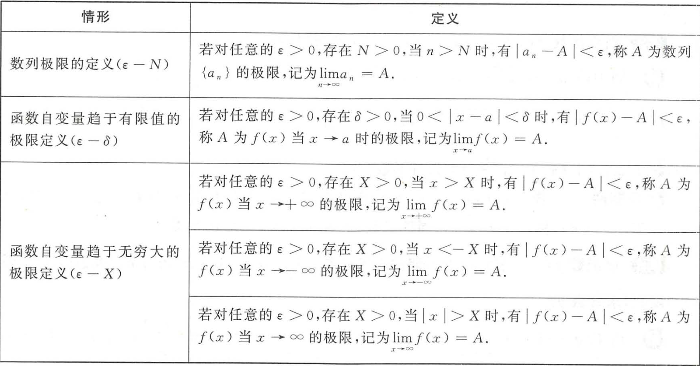

# 高等数学学习笔记

## 第一章 极限与连续

### 1.1 函数

#### 1.1.1 基本概念

1. 函数: 定义域内总有唯一的y对应x
2. 复合函数: 设$u=φ(x)(x∈D_1)$,$y=f(u)(u∈D_2)$,对于任意$x∈D_1$,有$φ(x)∈D_2$,则y为x的复合函数，记作$y=f(φ(x))$
3. 反函数: 设$y=f(x)$为单调函数,$x∈D$,$y∈R$,若对于任意$y∈R$,有唯一的$x∈D$,使得$f(x)=y$,则称x是y的反函数，记作$x=f^{-1}(y)$

4. 基本初等函数:
- 幂函数: $y=x^a(a∈R)$
- 指数函数: $y=a^x(a>0,a≠1)$
- 对数函数: $y=log_a x(a>0,a≠1)$
- 三角函数: $y=sin x,y=cos x,y=tan x,y=cot x,y=sec x,y=csc x$
- 反三角函数: $y=arcsin x,y=arccos x,y=arctan x,y=arccot x,y=arcsec x,y=arccsc x$

- - - 

`三角函数复习`

1. 三角函数图象和性质

| 函数 | $y=cotx$ | $y=secx$ | $y=cscx$ |
| ---- | ---- | ---- | ---- |
| 图象 |  |  |  |
| 定义域 | $x≠kπ(k∈Z)$ | $x≠\frac{π}{2}+kπ(k∈Z)$ | $x≠kπ(k∈Z)$ |
| 值域 | $(-∞,∞)$ | $(-∞,-1]∪[1,∞)$ | $(-∞,-1]∪[1,∞)$ |
| 周期性 | $π$ | $2π$ | $2π$ |
| 奇偶性 | 奇函数 | 偶函数 | 奇函数 |
| 单调性 | $(kπ,kπ+π)$为减 | $[2kπ,2kπ+\frac{π}{2})∪(2kπ+\frac{π}{2})$为增，$(2kπ+π,2kπ+\frac{3π}{2})∪[2kπ+\frac{3π}{2}，2π+2kπ)$为减 | $[2kπ+\frac{π}{2},2kπ+π)∪(2kπ+π,2kπ+\frac{3π}{2})$为增，$[2kπ-\frac{π}{2},2kπ)∪(2kπ，\frac{π}{2}+2kπ)$为减 |
| 对称中心 | $(\frac{kπ}{2},0)$ | $(\frac{π}{2}+kπ,0)$ | $(kπ,0)$ |

2. 三角函数公式

- 基本公式

- - $sec^2x=tan^2x+1$
- - $csc^2x=cot^2x+1$
- - $sin^2x+cos^2x=1$
- - $tanx=\frac{sinx}{cosx}$
- - $cotx=\frac{cosx}{sinx}$
- - $secx=\frac{1}{cosx}$
- - $cscx=\frac{1}{sinx}$
- - $sinx+cosx=√2sin(x+\frac{π}{4})$
- - $sinx-cosx=√2sin(x-\frac{π}{4})$

- 诱导公式

| 角\函数 | sin | cos | tan | cot |
| ---- | ---- | ---- | ---- | ---- |
| -x | -sinx | cosx | -tanx | -cotx |
| $\frac{π}{2}-x$ | cosx | sinx | cotx | tanx |
| $\frac{π}{2}+x$ | cosx | -sinx | -cotx | -tanx |
| π-x | sinx | -cosx | -tanx | -cotx |
| π+x | -sinx | -cosx | cotx | tanx |
| $\frac{3π}{2}-x$ | -cosx | -sinx | cotx | tanx |
| $\frac{3π}{2}+x$ | -cosx | sinx | -cotx | -tanx |
| 2π-x | -sinx | cosx | -tanx | -cotx |
| 2π+x | sinx | cosx | tanx | cotx |

- - $sin(π±t)=∓sint$
- - $cos(π±t)=-cost$
- - $sin(\frac{π}{2}±t)=cost$
- - $cos(\frac{π}{2}±t)=∓sint$

- 降幂公式

- - $sin^2x=\frac{1-cos2x}{2}$
- - $cos^2x=\frac{1+cos2x}{2}$
- - $tan^2x=\frac{1-cos2x}{1+cos2x}$

- 倍角公式

- - $sin2x=2sinxcosx$
- - $cos2x=cos^2x-sin^2x=2cos^2x-1=1-2sin^2x$
- - $tan2x=\frac{2tanx}{1-tan^2x}$
- - $tan\frac{x}{2}=\frac{sinx}{1+cosx}=\frac{1-cosx}{sinx}=cscx-cotx$

- 和差公式

- - $sin(x±y)=sinxcosy±cosxsiny$
- - $cos(x±y)=cosxcosy∓sinxsiny$
- - $tan(x±y)=\frac{tanx±tany}{1∓tanxtany}$
- - $cot(x±y)=\frac{cotxcoty∓1}{coty±cotx}$

- 和差化积公式

- - $sin\alpha+sin\beta=2sin(\frac{\alpha+\beta}{2})cos(\frac{\alpha-\beta}{2})$
- - $sin\alpha-sin\beta=2cos(\frac{\alpha+\beta}{2})sin(\frac{\alpha-\beta}{2})$
- - $cos\alpha+cos\beta=2cos(\frac{\alpha+\beta}{2})cos(\frac{\alpha-\beta}{2})$
- - $cos\alpha-cos\beta=-2sin(\frac{\alpha+\beta}{2})sin(\frac{\alpha-\beta}{2})$

- 积化和差公式

- - $sin\alpha sin\beta=\frac{1}{2}[cos(\alpha-\beta)-cos(\alpha+\beta)]$
- - $cos\alpha cos\beta=\frac{1}{2}[cos(\alpha-\beta)+cos(\alpha+\beta)]$
- - $sin\alpha cos\beta=\frac{1}{2}[sin(\alpha+\beta)+sin(\alpha-\beta)]$

- 万能公式

- - $sinx=\frac{2tan\frac{x}{2}}{1+tan^2\frac{x}{2}}$
- - $cosx=\frac{1-tan^2\frac{x}{2}}{1+tan^2\frac{x}{2}}$
- - $tanx=\frac{2tan\frac{x}{2}}{1-tan^2\frac{x}{2}}$

- - -

`常见不等式与数列`

1. 常见不等式
- 三角不等式:
- - $||a|-|b||≤|a±b|≤|a|+|b|$
- 算数不等式:
- - $a^2+b^2≥2ab$
- - $|ab|≤\frac{a^2+b^2}{2}$
- - a≥0时:
- - $\frac{a_1+a_2+...+a_n}{n}≥^n√{a_1a_2...a_n}$
- 柯西不等式:
- - $(a_1^2+a_2^2+...+a_n^2)(b_1^2+b_2^2+...+b_n^2)≥(a_1b_1+a_2b_2+...+a_nb_n)^2$

2. 常见数列

- - -

#### 函数的初等特性

1. 有界性: 设$y=f(x)$,若存在常数M>0,使得对于定义域D内的任意x,有$|f(x)|≤M$,则称f(x)在D上有界

- 有界的充分必要条件是函数的值域有上界和下界

2. 单调性：设$y=f(x)$,若对于定义域D内的任意$x_1,x_2$,当$x_1 < x_2$时,有$f(x_1) < f(x_2)$,则称f(x)在D上单调递增；若对于定义域D内的任意$x_1,x_2$,当$x_1 < x_2$时,有$f(x_1) > f(x_2)$,则称f(x)在D上单调递减

3. 奇偶性：设$y=f(x)$,定义域D关于原点对称，若对于定义域D内的任意x,有$f(-x)=-f(x)$,则称f(x)为奇函数；若对于定义域D内的任意x,有$f(-x)=f(x)$,则称f(x)为偶函数

4. 周期性：设$y=f(x)$,若存在常数T>0,使得对于定义域D内的任意x和$x±T$，有$f(x)=f(x±T)$,则称f(x)为周期函数，T为函数f(x)的周期

### 1.2 极限

#### 1.2.1 极限的定义

`极限`

- x → a ：x趋于a,不能等于a，且从左右两侧趋近
- $lim_{x→a}f(x)与f(a)$无关
- 0<|x-a|<δ是一个去心邻域
- |f(x)-A|<ε就是ε可以要取多小就取多小，要多接近A就有多接近A

`左极限 右极限`

若对任意的$ε>0$,存在$δ>0$,使得当$x∈(a-δ,a)$时,有$|f(x)-A|<ε$,则称A为f(x)在x=a的左极限,记作$f(a-0)$

若对任意的$ε>0$,存在$δ>0$,使得当$x∈(a,a+δ)$时,有$|f(x)-B|<ε$,则称B为f(x)在x=a的右极限,记作$f(a+0)$

- $lim_{x→a}f(x)=A$的充分必要条件是$f(a-0)=f(a+0)=A$
- 对于$lim_{x→b}f(x)$,若表达式中含有$a^{\frac{h(x)}{x-b}}$或$a^{\frac{h(x)}{b-x}}$时，一定要讨论左、右极限
- 对于$lim_{x→a}arctan\frac{1}{x-a}$时，一定要讨论左、右极限

`无穷小`

若$lim_{x→a}f(x)=0$,则称f(x)是x→a时的无穷小

- 设$a→0$,$b→0$
- - 若$lim\frac{b}{a}=0$,则称b是a的高阶无穷小,记作$b=o(a)$
- - 若$lim\frac{b}{a}=k(k≠0,∞)$,则称b是a的同阶无穷小,记作$b=O(a)$
- - 特别地，若$lim\frac{b}{a}=1$,则称b是a的等价无穷小,记作$a∼b$

