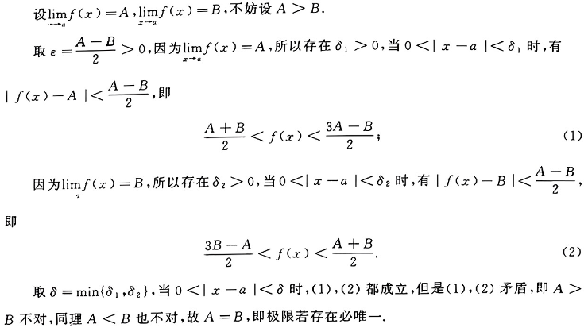

# 高等数学学习笔记

## 第一章 极限与连续

### 1.1 函数

#### 1.1.1 基本概念

1. 函数: 定义域内总有唯一的y对应x
2. 复合函数: 设$u=φ(x)(x∈D_1)$,$y=f(u)(u∈D_2)$,对于任意$x∈D_1$,有$φ(x)∈D_2$,则y为x的复合函数，记作$y=f(φ(x))$
3. 反函数: 设$y=f(x)$为单调函数,$x∈D$,$y∈R$,若对于任意$y∈R$,有唯一的$x∈D$,使得$f(x)=y$,则称x是y的反函数，记作$x=f^{-1}(y)$

4. 基本初等函数:
- 幂函数: $y=x^a(a∈R)$
- 指数函数: $y=a^x(a>0,a≠1)$
- 对数函数: $y=log_a x(a>0,a≠1)$
- 三角函数: $y=sin x,y=cos x,y=tan x,y=cot x,y=sec x,y=csc x$
- 反三角函数: $y=arcsin x,y=arccos x,y=arctan x,y=arccot x,y=arcsec x,y=arccsc x$

- - - 

`三角函数复习`

1. 三角函数图象和性质

| 函数 | $y=cotx$ | $y=secx$ | $y=cscx$ |
| ---- | ---- | ---- | ---- |
| 图象 |  |  |  |
| 定义域 | $x≠kπ(k∈Z)$ | $x≠\frac{π}{2}+kπ(k∈Z)$ | $x≠kπ(k∈Z)$ |
| 值域 | $(-∞,∞)$ | $(-∞,-1]∪[1,∞)$ | $(-∞,-1]∪[1,∞)$ |
| 周期性 | $π$ | $2π$ | $2π$ |
| 奇偶性 | 奇函数 | 偶函数 | 奇函数 |
| 单调性 | $(kπ,kπ+π)$为减 | $[2kπ,2kπ+\frac{π}{2})∪(2kπ+\frac{π}{2})$为增，$(2kπ+π,2kπ+\frac{3π}{2})∪[2kπ+\frac{3π}{2}，2π+2kπ)$为减 | $[2kπ+\frac{π}{2},2kπ+π)∪(2kπ+π,2kπ+\frac{3π}{2})$为增，$[2kπ-\frac{π}{2},2kπ)∪(2kπ，\frac{π}{2}+2kπ)$为减 |
| 对称中心 | $(\frac{kπ}{2},0)$ | $(\frac{π}{2}+kπ,0)$ | $(kπ,0)$ |

2. 三角函数公式

- 基本公式

- - $sec^2x=tan^2x+1$
- - $csc^2x=cot^2x+1$
- - $sin^2x+cos^2x=1$
- - $tanx=\frac{sinx}{cosx}$
- - $cotx=\frac{cosx}{sinx}$
- - $secx=\frac{1}{cosx}$
- - $cscx=\frac{1}{sinx}$
- - $sinx+cosx=√2sin(x+\frac{π}{4})$
- - $sinx-cosx=√2sin(x-\frac{π}{4})$

- 诱导公式

| 角\函数 | sin | cos | tan | cot |
| ---- | ---- | ---- | ---- | ---- |
| -x | -sinx | cosx | -tanx | -cotx |
| $\frac{π}{2}-x$ | cosx | sinx | cotx | tanx |
| $\frac{π}{2}+x$ | cosx | -sinx | -cotx | -tanx |
| π-x | sinx | -cosx | -tanx | -cotx |
| π+x | -sinx | -cosx | cotx | tanx |
| $\frac{3π}{2}-x$ | -cosx | -sinx | cotx | tanx |
| $\frac{3π}{2}+x$ | -cosx | sinx | -cotx | -tanx |
| 2π-x | -sinx | cosx | -tanx | -cotx |
| 2π+x | sinx | cosx | tanx | cotx |

- - $sin(π±t)=∓sint$
- - $cos(π±t)=-cost$
- - $sin(\frac{π}{2}±t)=cost$
- - $cos(\frac{π}{2}±t)=∓sint$

- 降幂公式

- - $sin^2x=\frac{1-cos2x}{2}$
- - $cos^2x=\frac{1+cos2x}{2}$
- - $tan^2x=\frac{1-cos2x}{1+cos2x}$

- 倍角公式

- - $sin2x=2sinxcosx$
- - $cos2x=cos^2x-sin^2x=2cos^2x-1=1-2sin^2x$
- - $tan2x=\frac{2tanx}{1-tan^2x}$
- - $tan\frac{x}{2}=\frac{sinx}{1+cosx}=\frac{1-cosx}{sinx}=cscx-cotx$

- 和差公式

- - $sin(x±y)=sinxcosy±cosxsiny$
- - $cos(x±y)=cosxcosy∓sinxsiny$
- - $tan(x±y)=\frac{tanx±tany}{1∓tanxtany}$
- - $cot(x±y)=\frac{cotxcoty∓1}{coty±cotx}$

- 和差化积公式

- - $sin\alpha+sin\beta=2sin(\frac{\alpha+\beta}{2})cos(\frac{\alpha-\beta}{2})$
- - $sin\alpha-sin\beta=2cos(\frac{\alpha+\beta}{2})sin(\frac{\alpha-\beta}{2})$
- - $cos\alpha+cos\beta=2cos(\frac{\alpha+\beta}{2})cos(\frac{\alpha-\beta}{2})$
- - $cos\alpha-cos\beta=-2sin(\frac{\alpha+\beta}{2})sin(\frac{\alpha-\beta}{2})$

- 积化和差公式

- - $sin\alpha sin\beta=\frac{1}{2}[cos(\alpha-\beta)-cos(\alpha+\beta)]$
- - $cos\alpha cos\beta=\frac{1}{2}[cos(\alpha-\beta)+cos(\alpha+\beta)]$
- - $sin\alpha cos\beta=\frac{1}{2}[sin(\alpha+\beta)+sin(\alpha-\beta)]$

- 万能公式

- - $sinx=\frac{2tan\frac{x}{2}}{1+tan^2\frac{x}{2}}$
- - $cosx=\frac{1-tan^2\frac{x}{2}}{1+tan^2\frac{x}{2}}$
- - $tanx=\frac{2tan\frac{x}{2}}{1-tan^2\frac{x}{2}}$

- - -

`常见不等式与数列`

1. 常见不等式
- 三角不等式:
- - $||a|-|b||≤|a±b|≤|a|+|b|$
- 算数不等式:
- - $a^2+b^2≥2ab$
- - $|ab|≤\frac{a^2+b^2}{2}$
- - a≥0时:
- - $\frac{a_1+a_2+...+a_n}{n}≥^n√{a_1a_2...a_n}$
- 柯西不等式:
- - $(a_1^2+a_2^2+...+a_n^2)(b_1^2+b_2^2+...+b_n^2)≥(a_1b_1+a_2b_2+...+a_nb_n)^2$

2. 常见数列

- - -

#### 函数的初等特性

1. 有界性: 设$y=f(x)$,若存在常数M>0,使得对于定义域D内的任意x,有$|f(x)|≤M$,则称f(x)在D上有界

- 有界的充分必要条件是函数的值域有上界和下界

2. 单调性：设$y=f(x)$,若对于定义域D内的任意$x_1,x_2$,当$x_1 < x_2$时,有$f(x_1) < f(x_2)$,则称f(x)在D上单调递增；若对于定义域D内的任意$x_1,x_2$,当$x_1 < x_2$时,有$f(x_1) > f(x_2)$,则称f(x)在D上单调递减

3. 奇偶性：设$y=f(x)$,定义域D关于原点对称，若对于定义域D内的任意x,有$f(-x)=-f(x)$,则称f(x)为奇函数；若对于定义域D内的任意x,有$f(-x)=f(x)$,则称f(x)为偶函数

4. 周期性：设$y=f(x)$,若存在常数T>0,使得对于定义域D内的任意x和$x±T$，有$f(x)=f(x±T)$,则称f(x)为周期函数，T为函数f(x)的周期

### 1.2 极限

#### 1.2.1 极限的定义

1. `极限`

- x → a ：x趋于a,不能等于a，且从左右两侧趋近
- $lim_{x→a}f(x)与f(a)$无关
- 0<|x-a|<δ是一个去心邻域
- |f(x)-A|<ε就是ε可以要取多小就取多小，要多接近A就有多接近A

2. `左极限 右极限`

若对任意的$ε>0$,存在$δ>0$,使得当$x∈(a-δ,a)$时,有$|f(x)-A|<ε$,则称A为f(x)在x=a的左极限,记作$f(a-0)$

若对任意的$ε>0$,存在$δ>0$,使得当$x∈(a,a+δ)$时,有$|f(x)-B|<ε$,则称B为f(x)在x=a的右极限,记作$f(a+0)$

- $lim_{x→a}f(x)=A$的充分必要条件是$f(a-0)=f(a+0)=A$
- 对于$lim_{x→b}f(x)$,若表达式中含有$a^{\frac{h(x)}{x-b}}$或$a^{\frac{h(x)}{b-x}}$时，一定要讨论左、右极限
- 对于$lim_{x→a}arctan\frac{1}{x-a}$时，一定要讨论左、右极限

3. `无穷小`

若$lim_{x→a}f(x)=0$,则称f(x)是x→a时的无穷小

- 设$f(a)→0$,$f(b)→0$
- - 若$lim\frac{f(b)}{f(a)}=0$,则称f(b)是f(a)的高阶无穷小,记作$f(b)=o(f(a))$
- - 若$lim\frac{f(b)}{f(a)}=k(k≠0,∞)$,则称f(b)是f(a)的同阶无穷小,记作$f(b)=O(f(a))$
- - 特别地，若$lim\frac{f(b)}{f(a)}=1$,则称f(b)是f(a)的等价无穷小,记作$f(a)∼f(b)$

- 无穷小的性质
- - 一般性质:
- - - 0是与自变量趋向无关的无穷小
- - - $f(x)=3(x-1)^2$,当$x→1$时为无穷小，当$x→a(a≠1)$时不是无穷小
- - - 有限个无穷小的和差是无穷小
- - - 有界函数或常数与无穷小的乘积是无穷小
- - - 无穷大:若$lim_{x→a}\frac{1}{f(x)}=0$，则称f(x)是x→a时的无穷大
- - 等价性质:
- - - a~a_1,b~b_1,且$lim\frac{b_1}{a_1}=A$,则$lim\frac{b}{a}=A$
- - 常见等价无穷小:

#### 1.2.2 极限的性质

##### 一般性质

1. `唯一性` 若极限存在，则极限一定唯一

- 证明:

- 典型例题:

2. `保号性` 设$lim_{x→a}f(x)=A>0(A<0),则存在$δ>0$,使得当$0<|x-a|<δ$时，有$f(x)>0(f(x)<0)$

- 证明:

- 典型例题:
> $f'(x)=0,lim_{x→a}\frac{f'(x)}{(x-1)^3}=-2,问x=1是极值点吗？$
> 解: $\because lim_{x→a}\frac{f'(x)}{(x-1)^3}=-2$
$\therefore \exists \delta>0,当0<|x-1|<\delta时，\frac{f'(x)}{(x-1)^3}<0$
$$
\begin{cases} 
    f'(x)>0 & , x \in (1-\delta,1) \\
    f'(x)<0 & , x \in (1,1+\delta)
\end{cases}
$$
$ \therefore x=1是f(x)的极大值 $

3. `有界性` 

`数列极限的有界性` 若数列极限存在，则数列必有界，反之不成立
`函数极限的局部有界性` 若$lim_{x→a}f(x)=A$，则存在\delta>0,M>0,使得当$0<|x-a|<\delta$时，有$|f(x)|<M$

- 证明:
取$ε=1$,则存在$δ>0$,使得当$0<|x-a|<δ$时，有$|f(x)-A|<1$,则$|f(x)|<|A|+1$，(||f(x)|-|A||≤|f(x)-A|<1)
取$M=|A|+1$，则有$|f(x)|≤M$
- - ε是极限定义中的任意小正数

- 典型例题:

4. `数列极限与子列极限的关系`

>若数列有极限，则数列的任意子列都有相同的极限
>若某一子列有极限，则该数列不一定有极限

##### 存在性质

1. `夹逼定理(迫敛定理)` 

$$
设
\begin{cases} 
    f(x)≤g(x)≤h(x) , \\
    limf(x)=limh(x)=A ,
\end{cases}
则limg(x)=A 
$$

- 证明:

- 典型例题:

> 1. 存在数列，求$lim_{n→∞}\frac{n^2}{2^n}$?
> 解: $n充分大时，2^n=(1+1)^n=C^{0}_{n}+C^{1}_{n}+...+C^{n}_{n}≥C^{3}_{n}=\frac{n(n-1)(n-2)}{6}$
$ \therefore 0<\frac{n^2}{2^n}≤\frac{6n^2}{n(n-1)(n-2)}$
$ \because lim_{n→∞}\frac{6n^2}{n(n-1)(n-2)},lim_{n→∞}0=0$
$ \therefore lim_{n→∞}\frac{n^2}{2^n}=0$

> 2. $f(x)=lim_{n→∞}\sqrt[n]{x^n+x^{2n}}(x>0)$,求f(x)?
> x可以看作正常数，n是变量
> 解: $当0<x≤1时，x^n≤x^n+x^{2n}≤2x^{n}$
$ \therefore x≤\sqrt[n]{x^n+x^{2n}}≤2^{\frac{1}{n}}x$
$ \because lim_{n→∞}x=lim_{n→∞}2^{\frac{1}{n}}x=x$
$ \therefore lim_{n→∞}\sqrt[n]{x^n+x^{2n}}=x$
$ 当x>1时，x^{2n}≤x^n+x^{2n}≤2x^{2n}$
$ \therefore x^2≤\sqrt[n]{x^n+x^{2n}}≤2^{\frac{1}{n}}x^2$
$ \because lim_{n→∞}x^2=lim_{n→∞}2^{\frac{1}{n}}x^2=x^2$
$ \therefore lim_{n→∞}\sqrt[n]{x^n+x^{2n}}=x^2$
$$
综上所述，
\begin{cases} 
    x & , 0<x≤1 \\
    x^2 & , x>1
\end{cases}
$$

> 3. $求lim_{n→∞}(\frac{1}{\sqrt{n^2+1}}+\frac{1}{\sqrt{n^2+2}}+...+\frac{1}{\sqrt{n^2+n}})$
> 解: $ \frac{n}{\sqrt{n^2+n}}<\frac{1}{\sqrt{n^2+1}}+\frac{1}{\sqrt{n^2+2}}+...+\frac{1}{\sqrt{n^2+n}}<\frac{n}{\sqrt{n^2+1}}$
$ \because lim_{n→∞}\frac{n}{\sqrt{n^2+n}}=lim_{n→∞}\frac{1}{\sqrt{1+\frac{1}{n}}}=1$,同理$lim_{n→∞}\frac{n}{\sqrt{n^2+1}}=1$
$ \therefore lim_{n→∞}(\frac{1}{\sqrt{n^2+1}}+\frac{1}{\sqrt{n^2+2}}+...+\frac{1}{\sqrt{n^2+n}})=1$

2. `单调有界定理` 单调有界的数列必有极限

- 证明:不用证明，记着就行

- 典型例题:

3. note:
- 1. ${a_n}有界⇔a_n有上界，有下界$
- 2. ${a_n}单调递增$
- - case 1：${a_n}无上界$ $⇒lim_{n→∞}a_n=+∞$
- - case 2：$\exists M_0,a_n≤M_0$ $⇒lim_{n→∞}a_n \exists$
- 3. ${a_n}单调递减$
- - case 1：${a_n}无下界$ $⇒lim_{n→∞}a_n=-∞$
- - case 2：$\exists m_0,a_n≥m_0$ $⇒lim_{n→∞}a_n \exists$
- 4. 重要不等式:
- - 1. $当x≥0时，sinx≤x$
- - 2. $当x≥-1时，ln(1+x)≤x$
- - 3. $当x>0时，e^x≥1+x$

- 5. 小结论：
- - 设a,b,c>0则$lim_{n→∞}(a^n+b^n+c^n)^{\frac{1}{n}}=max(a,b,c)$

#### 1.2.3 重要极限

1. $lim_{\triangle→0}\frac{sin\triangle}{\triangle}=1$

2. $lim_{\triangle→0}(1+\triangle)^{\frac{1}{\triangle}}=e$

3. $0<a<\pi/2时，sina<α<tana$

#### 1.2.4 points

- 极限趋于∞，则不属于存在极限

### 1.3 连续与间断

#### 1.3.1 连续与间断的定义

1. `连续`

- case 1: $f(x)$在$x=a$连续
如果$lim_{x→a}f(x)=f(a)$或$f(a-0)=f(a+0)=f(a)$，则称f(x)在x=a连续
- - 如果 f(a+0)=f(a),则称f(x)在x=a右连续
- - 如果 f(a-0)=f(a),则称f(x)在x=a左连续
- case 2: $f(x)$在$[a,b]$连续：
若满足:
- - 1. f(x)在(a,b)上任意一点连续
- - 2. f(a)=f(a+0)
- - 3. f(b)=f(b-0)
则称f(x)在$[a,b]$连续,记作$f(x)∈C[a,b]$

2. `间断`

若$f(a)≠lim_{x→a}f(x)$，则称f(x)在x=a处不连续,x=a称为间断点

- 间断点的分类:
- - 1. **第一类间断点**:
$f(a-0),f(a+0)$存在,其中:
- - - 1 $f(a-0)=f(a+0)≠f(a)$,称为**可去间断点**
- - - 2 $f(a-0)≠f(a+0)$,称为**跳跃间断点**

- - 2. **第二类间断点**:
$f(a-0),f(a+0)$至少有一个不存在，其中:
- - - 1 $f(a-0),f(a+0)$至少有一个为无穷大,称为**无穷间断点**

- 典型例题:

> 1. $f(x)=\frac{x^{\frac{1}{x}}}{1+2^{\frac{1}{x}}}·\frac{x^2+x-2}{x^2-1}$
> 解: $f(x)=\frac{x^{\frac{1}{x}}}{1+2^{\frac{1}{x}}}·\frac{x^2+x-2}{x^2-1}=\frac{x^{\frac{1}{x}}(x+2)(x-1)}{(1+2^{\frac{1}{x}})(x+1)(x-1)}$
$\therefore x=0,x=1, x=-1为间断点$
$\because lim_{x→-1}f(x)=∞$
$\therefore x=-1为第二类间断点$
$\because f(0-0)=0 ≠ f(0+0)=2$
$\therefore x=0 为 跳跃间断点$
$\because lim_{x→1}f(x)=1$
$\therefore x=1 为 可去间断点$

#### 1.3.2 闭区间上连续函数的性质

1. `最值定理`: 若f(x)在闭区间[a,b]上连续，则f(x)在[a,b]上有最大值和最小值

2. `有界定理`: 若f(x)在闭区间[a,b]上连续，则f(x)在[a,b]上有界

3. `零点定理`: 若f(x)在闭区间[a,b]上连续，且$f(a)·f(b)<0$，则在(a,b)内至少有一点x_0，使得f(x_0)=0

4. `介值定理`: 若f(x)在闭区间[a,b]上连续，对任意的$\eta\in [m,M],其中,m,M分别为f(x)在[a,b]上渠道的最小值和最大值，则存在\xi\in [a,b]，使得f(\xi)=\eta$

- 典型例题:

>1. $f(x)\in C[0,2],f(0)+2f(1)+3f(2)=12，求证:
\exists\xi\in[0,2],f(\xi)=2$
>证:$\because f(x)\in C[0,2]$
$\therefore \exists m,M
6m≤f(0)+2f(1)+3f(2)≤6M$
$m≤2≤M$
$\therefore \exists \xi \in [0,2] ,使f(\xi)=2$
>(介值定理)

>2. 
