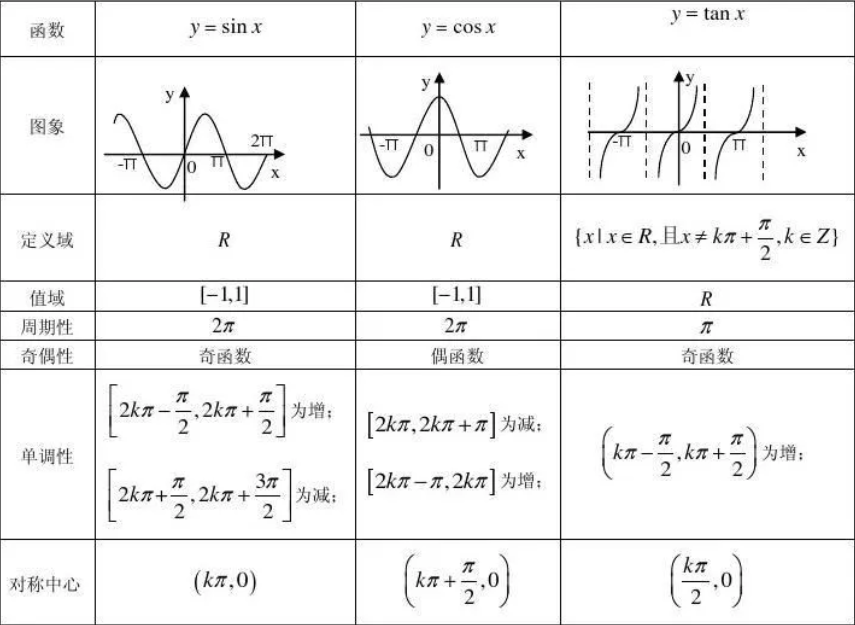

# 高等数学学习笔记

## 第一章 极限与连续

### 1.1 函数

#### 1.1.1 基本概念

1. 函数: 定义域内总有唯一的y对应x
2. 复合函数: 设$u=φ(x)(x∈D_1)$,$y=f(u)(u∈D_2)$,对于任意$x∈D_1$,有$φ(x)∈D_2$,则y为x的复合函数，记作$y=f(φ(x))$
3. 反函数: 设$y=f(x)$为单调函数,$x∈D$,$y∈R$,若对于任意$y∈R$,有唯一的$x∈D$,使得$f(x)=y$,则称x是y的反函数，记作$x=f^{-1}(y)$

4. 基本初等函数:
- 幂函数: $y=x^a(a∈R)$
- 指数函数: $y=a^x(a>0,a≠1)$
- 对数函数: $y=log_a x(a>0,a≠1)$
- 三角函数: $y=sin x,y=cos x,y=tan x,y=cot x,y=sec x,y=csc x$
- 反三角函数: $y=arcsin x,y=arccos x,y=arctan x,y=arccot x,y=arcsec x,y=arccsc x$

- - - 

`三角函数复习`

1. 三角函数图象和性质

| 函数 | $y=cotx$ | $y=secx$ | $y=cscx$ |
| ---- | ---- | ---- | ---- |
| 图象 |  |  |  |
| 定义域 | $x≠kπ(k∈Z)$ | $x≠π/2+kπ(k∈Z)$ | $x≠kπ(k∈Z)$ |
| 值域 | $(-∞,∞)$ | $(-∞,-1]∪[1,∞)$ | $(-∞,-1]∪[1,∞)$ |
| 周期性 | $π$ | $2π$ | $2π$ |
| 奇偶性 | 奇函数 | 偶函数 | 奇函数 |
| 单调性 | $(kπ,kπ+π)$为减 | $[2kπ,2kπ+π/2)∪(2kπ+π/2)$为增，$(2kπ+π,2kπ+3π/2)∪[2kπ+3π/2，2π+2kπ)$为减 | $[2kπ+π/2,2kπ+π)∪(2kπ+π,2kπ+3π/2)$为增，$[2kπ-π/2,2kπ)∪(2kπ，π/2+2kπ)$为减 |
| 对称中心 | $(kπ/2,0)$ | $(π/2+kπ,0)$ | $(kπ,0)$ |

2. 三角函数公式

- 基本公式

- - $sec^2x=tan^2x+1$
- - $csc^2x=cot^2x+1$
- - $sin^2x+cos^2x=1$
- - $tanx=sinx/cosx$
- - $cotx=cosx/sinx$
- - $secx=1/cosx$
- - $cscx=1/sinx$
- - $sinx+cosx=√2sin(x+π/4)$
- - $sinx-cosx=√2sin(x-π/4)$

- 诱导公式

| 角\函数 | sin | cos | tan | cot |
| ---- | ---- | ---- | ---- | ---- |
| -x | -sinx | cosx | -tanx | -cotx |
| π/2-x | cosx | sinx | cotx | tanx |
| π/2+x | cosx | -sinx | -cotx | -tanx |
| π-x | sinx | -cosx | -tanx | -cotx |
| π+x | -sinx | -cosx | cotx | tanx |
| 3π/2-x | -cosx | -sinx | cotx | tanx |
| 3π/2+x | -cosx | sinx | -cotx | -tanx |
| 2π-x | -sinx | cosx | -tanx | -cotx |
| 2π+x | sinx | cosx | tanx | cotx |

- - $sin(π±t)=∓sint$
- - $cos(π±t)=-cost$
- - $sin(π/2±t)=cost$
- - $cos(π/2±t)=∓sint$

- 降幂公式

- - $sin^2x=(1-cos2x)/2$
- - $cos^2x=(1+cos2x)/2$
- - $tan^2x=(1-cos2x)/(1+cos2x)$

- 倍角公式

- - $sin2x=2sinxcosx$
- - $cos2x=cos^2x-sin^2x=2cos^2x-1=1-2sin^2x$
- - $tan2x=(2tanx)/(1-tan^2x)$
- - $tan(x/2)=sinx/(1+cosx)=(1-cosx)/sinx=cscx-cotx$

- 和差化积公式

- - $sin(x±y)=sinxcosy±cosxsiny$
- - $cos(x±y)=cosxcosy∓sinxsiny$
- - $tan(x±y)=(tanx±tany)/(1∓tanxtany)$
- - $cot(x±y)=(cotxcoty∓1)/(coty±cotx)$

- 万能公式

- - $sinx=2tan(x/2)/(1+tan^2(x/2))$
- - $cosx=(1-tan^2(x/2))/(1+tan^2(x/2))$
- - $tanx=2tan(x/2)/(1-tan^2(x/2))$

- - -

#### 函数的初等特性

1. 有界性: 设$y=f(x)$,若存在常数M>0,使得对于定义域D内的任意x,有$|f(x)|≤M$,则称f(x)在D上有界

- 有界的充分必要条件是函数的值域有上界和下界

2. 单调性：设$y=f(x)$,若对于定义域D内的任意$x_1,x_2$,当$x_1 < x_2$时,有$f(x_1) < f(x_2)$,则称f(x)在D上单调递增；若对于定义域D内的任意$x_1,x_2$,当$x_1 < x_2$时,有$f(x_1) > f(x_2)$,则称f(x)在D上单调递减

3. 奇偶性：设$y=f(x)$,定义域D关于原点对称，若对于定义域D内的任意x,有$f(-x)=-f(x)$,则称f(x)为奇函数；若对于定义域D内的任意x,有$f(-x)=f(x)$,则称f(x)为偶函数

4. 周期性：设$y=f(x)$,若存在常数T>0,使得对于定义域D内的任意x和$x±T$，有$f(x)=f(x±T)$,则称f(x)为周期函数，T为函数f(x)的周期

### 1.2 极限

#### 1.2.1 极限的定义

- x → a ：x趋于a,不能等于a，且从左右两侧趋近
- $lim_{x→a}f(x)与f(a)$的不同
- 0<|x-a|<δ是一个去心邻域
- |f(x)-A|<ε就是ε可以要取多小就取多小，要多接近A就有多接近A

